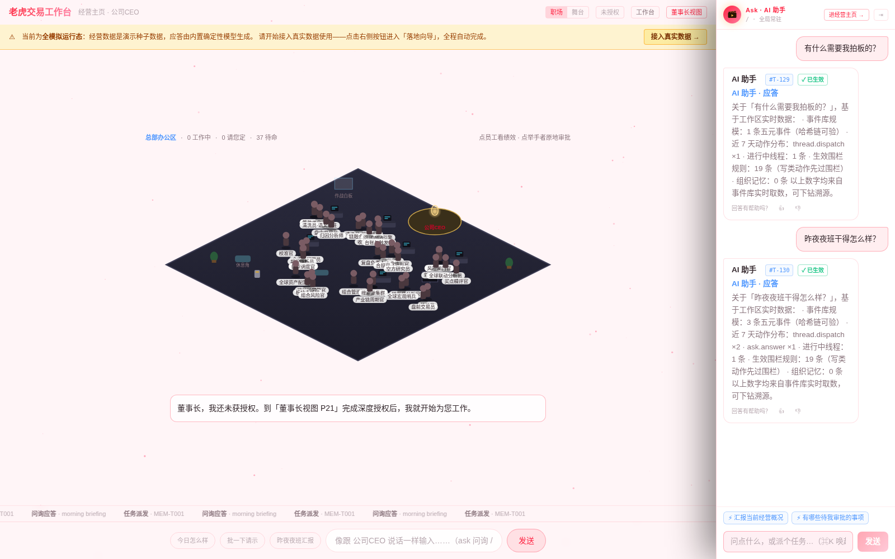
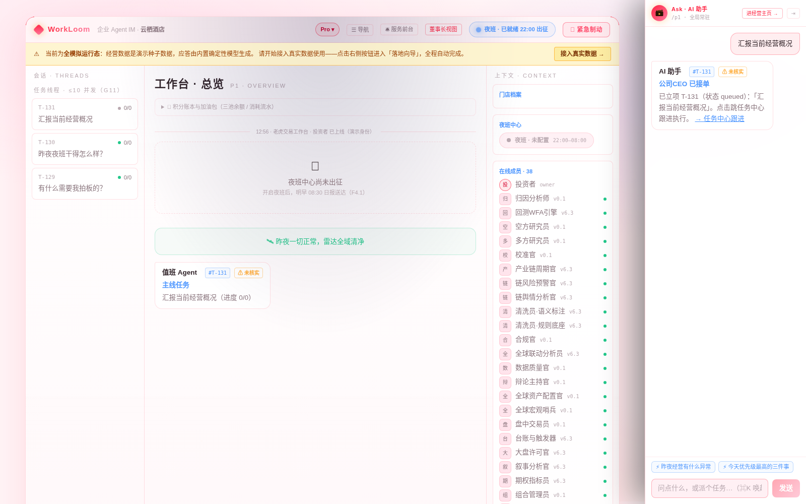
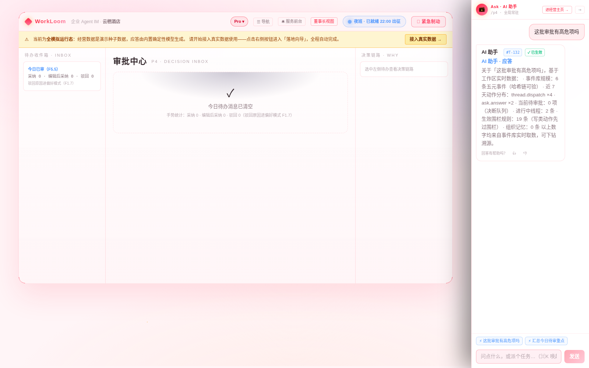
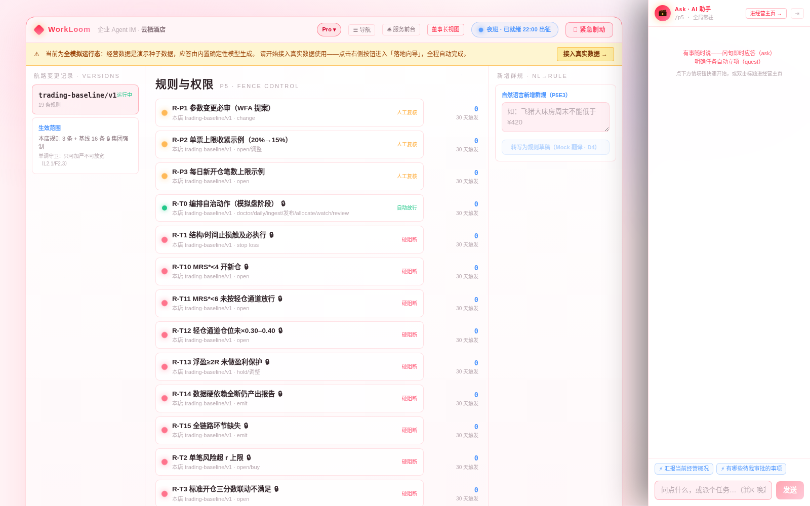
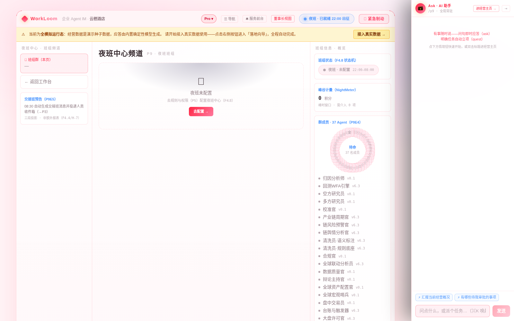
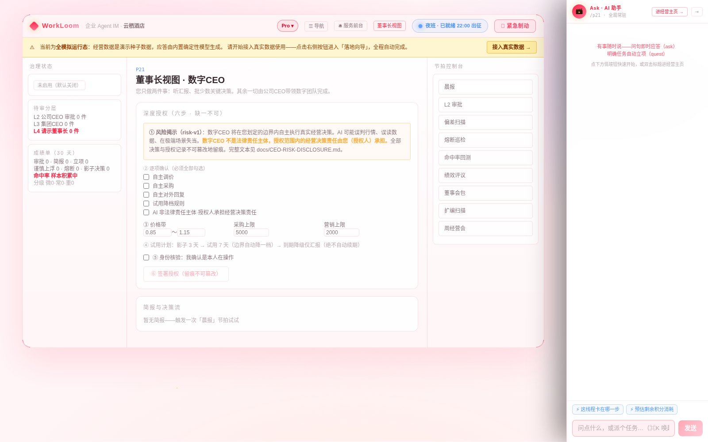
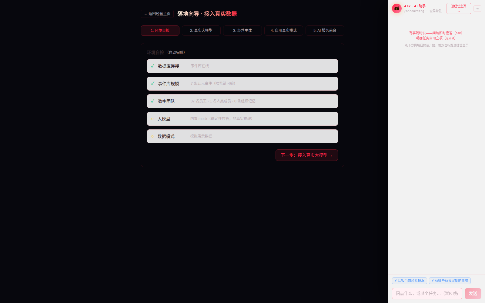
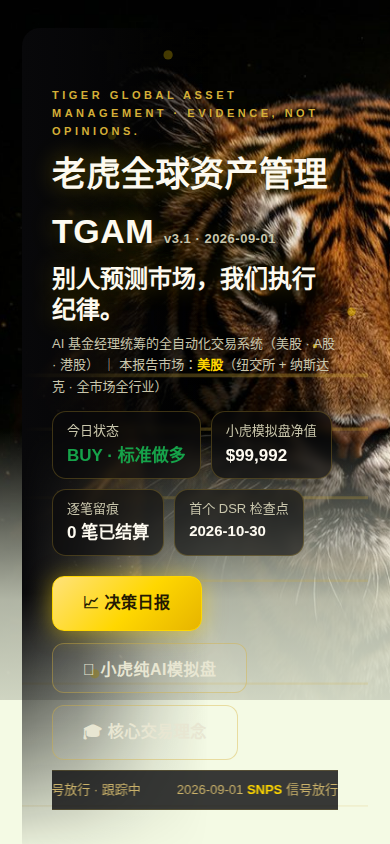
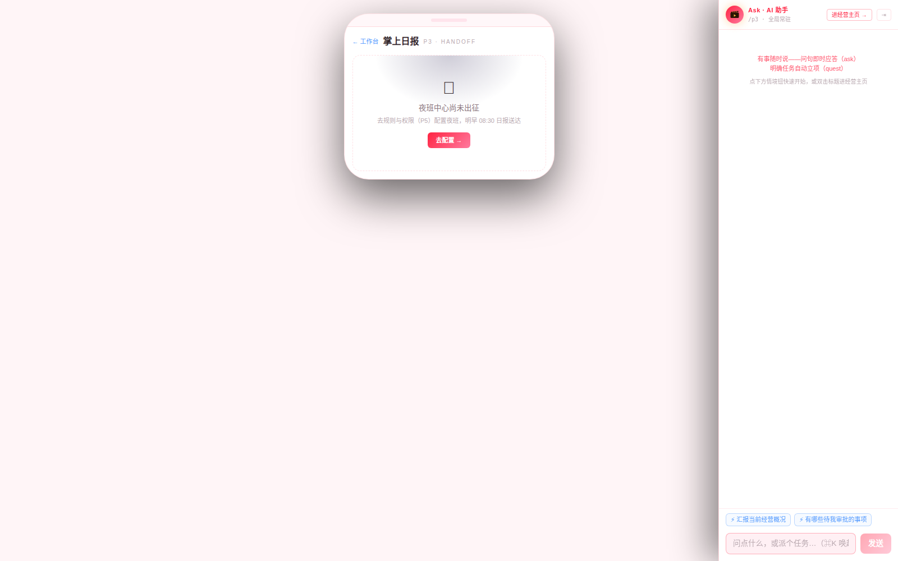
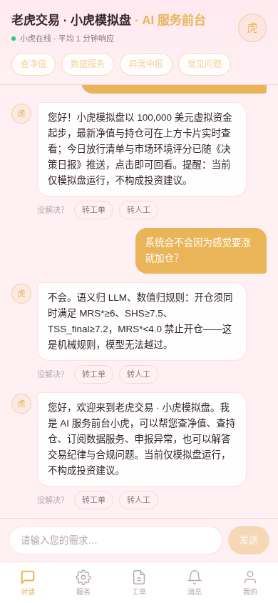

<div align="center">

# 老虎全球资产管理（Tiger Global Asset Management）

**由 AI 基金经理统筹的全自动化资产管理系统——覆盖美股 / A股 / 港股，24 小时运行。**

**No prediction. Process, discipline, audit.（别人预测市场，我们执行纪律。）**

[](LICENSE)
[](https://github.com/geniusdapeng-collab/workroom-tiger)

</div>

> **本系统当前仅运行于模拟盘（paper trading），不构成任何投资建议，不承诺收益。**

---

## 产品定位

老虎交易是一套**机构级纪律机器化的资产管理系统**：一位 AI 基金经理统领 37 人数字投研班组，以自研 **21 环节管线 × 六层决策栈**为交易内核，以 [WorkLoom IM](governance/README.md) 为治理外壳，把[《AI 短线美股交易（1–15 天波段版）白皮书》](reports/AI短线美股交易白皮书_20260730.pdf)的每一条交易纪律编译成不可绕过的机器闸门。

过去两年，AI 炒股项目死法高度一致——**让大模型既当裁判又当运动员**：它预测涨跌，但预测不可证伪；它给出理由，但理由事后无法审计；它亏了钱，但没人说得清亏在哪一步。老虎交易从第一天就拒绝这条路，答案是把决策拆成三层并物理隔离：

- **语义归 LLM**：读新闻、评板块叙事、组织多空辩论——这是 LLM 擅长的；
- **数值归规则**：评分、阈值、仓位、止损——全部是确定性代码，同一输入永远同一输出；
- **闸门必须确定**：开不开仓，永远由硬阈值决定，模型再自信也推不开这扇门。

治理外壳再把每个动作变成可追责事件：**谁、何时、对什么、做了什么、触发了哪条规则**——全部落进 SHA-256 哈希链，任何一笔交易三年后仍能逐条重算。这不是一个"会炒股的模型"，这是一家**流程完全透明、纪律完全闭环的数字资产管理公司**。

```
┌──────────── WorkLoom IM 治理外壳（governance/，TypeScript）────────────┐
│ 五元事件库(哈希链留痕) · 围栏引擎(白皮书阈值→block级基线) · Quest 编排    │
│ night-shift 夜班值守 · 审批卡片 · 组织记忆 · site 官网(责任界面)          │
│ ┌────────── 交易内核（仓库根目录，Python）─────────────────────────────┐ │
│ │ 21 环节管线 · 六层决策栈(L0扫描/L1 MRS/L2 SHS/L2b ICS/L3 TSS/L4风控) │ │
│ │ SearchHub 6源 · 七环行情降级链 · 零基线纪律 · journal→WFA→DSR        │ │
│ │ 小G模拟盘 · 双页签HTML日报 · 复盘闭环(归因/体检/提案审批)             │ │
│ │ 工程红线(LLM不可逆/透传留痕/环节点名)                                │ │
│ └──────────────────────────────────────────────────────────────────────┘ │
└──────────────────────────────────────────────────────────────────────────┘
```

- **交易内核**：仓库根目录即交易内核（[完整文档](docs/CAISHEN_README.md)）。决策栈、阈值、风控公式以 `trading_system/config.py` 为 single source of truth。
- **治理外壳**：`governance/` 为 WorkLoom IM 底座，只做治理不做决策——把每个交易动作变成可追责事件，把白皮书红线变成机器级保险的第二道锁。接入设计见 [docs/GOVERNANCE.md](docs/GOVERNANCE.md)。
- **行业角色包**：`governance/bundles/trading/`——AI 基金经理班组 presets、三层围栏包、投资 skills。

---

## 投资哲学：为什么我们刻意不预测市场

任何一个在市场中活过两轮牛熊的专业投资者都会承认三件事：**预测胜率会均值回归，杠杆会放大运气，而纪律是唯一可复利的资产。** 老虎交易把这三件事写成了系统公理：

1. **期望值思维替代涨跌判断。** 系统不回答「明天涨还是跌」，只回答「当前这笔交易的风险回报比是否值得用 0.8% 的净值去交换」。MRS 许可、SHS 主线、ICS 景气、TSS 买点，四道闸门过滤的不是"会涨的股票"，而是**值得承担风险的机会**——MRS*<4 的市场，空仓本身就是收益。
2. **纪律的价值在于它不可被破坏。** 人类基金经理的纪律毁于情绪与疲劳，模型的"纪律"毁于幻觉与谄媚。本系统的纪律存在于代码与围栏引擎中：亏损 1R 必走、单票不超 20%、数据不实立即停手——没有例外通道，没有"这次听我的"。
3. **可审计性是机构化的入场券。** 桥水们真正的壁垒不是策略，是**流程**：每一步有依据、有留痕、可复盘、可迭代。老虎交易把这套流程开源化：21 个环节逐一验收点名，缺一环即运行事故；每个决策都能回放到当时的输入、数据版本与规则版本。
4. **承认不知道，比假装知道更值钱。** LLM 不可用时透传披露，行情源断供时诚实失败，参数不显著时保持默认——系统为「不知道」设计了正式出路，而不是用编造掩盖。**宁可不答，不可错答；宁可不交易，不用假数据交易。**

---

## 核心能力

### 交易内核：21 环节管线，环环相扣缺一即事故

每日全市场决策不是一次模型调用，而是一条 **21 环节的可验收流水线**：搜索采集 → 规则清洗 → LLM 语义清洗 → 交叉验证 → 数据备料 → 技术监测 → 周期联动 → 舆情评估 → 风险评估 → 融合 → 板块叙事 → L1 市场许可 → L2 主线确认 → L2b 链景气 → L0 全市场扫描 → L3 买点评分 → L4 风控闸门 → 多空辩论 → 校准迭代 → 报告生成 → 日复盘。运行报告对每个环节逐一「点名」验收（✅ 通过 / 🔁透传 / ❌事故），**任何一个环节缺席即视为运行事故**，杜绝"静默降级"。

### 六层决策栈：顺序不可颠倒的漏斗

| 层 | 职责 | 闸门 | 不通过意味着什么 |
|---|---|---|---|
| L0 全市场扫描 | 数千只标的初筛，锁定候选池 | 流动性与数据完整性 | 不值得占用算力 |
| L1 MRS 市场许可 | 判断当前市场是否允许承担风险 | MRS*≥6 方可标准开仓；**MRS*<4.0 全面禁开仓** | 空仓等待，强做即违规 |
| L2 SHS 主线确认 | 确认资金主线所在板块 | SHS≥7.5 | 逆主线不开仓 |
| L2b ICS 链景气 | 确认产业链景气度与传导方向 | 链上关键节点状态达标 | 景气不明不重仓 |
| L3 TSS 买点评分 | 个股级买点精评 | TSS_final≥7.2 | 不是好买点，继续观察 |
| L4 风控闸门 | 仓位、止损、组合暴露终审 | 1R / 单票 / 组合上限 | 物理拒绝执行 |

生产模式下每日漏斗：**全市场数千只 → 初筛数百只 → 精评数十只 → 放行个位数**。绝大多数股票被拒绝——**拒绝本身就是纪律的产出**。

### 风控体系：把机构风控公式写成物理约束

- **1R = 净值 0.8%**：任何一笔交易的最大计划亏损锁死在净值的 0.8%，止损位在开仓瞬间确定，不容盘中协商；
- **单票 ≤20% + 轻仓通道**：标准仓位之外，信号强度不足时仓位自动按 ×0.30–0.40 折减；
- **双轨止损**：结构止损（跌破关键结构位即离场）+ 时间止损（持仓超时未达预期即离场），盈利 ≥2R 自动上移保护线锁定利润；
- **Kill Switch 急停**：触发后全系统只许平仓与留痕；治理侧「紧急制动」60 秒内全端生效，恢复后断点续跑；
- **组合视角**：回撤、暴露、相关性按日体检，组合风险官对组合层面异常有一票叫停权。

### 数据工程：先证真，再决策

- **SearchHub 六源采集 + 七环行情降级链**：主源故障逐级降级，每轮记录「实际拉取源、降级次数、失败原因」——你可以逐轮审计系统当时看到的世界；
- **绝不回退合成数据**：全部源不可用 → 立即诚实失败并告警。演示模式的合成数据在日报显著位置标注「离线合成」，与真实行情物理隔离；
- **零基线纪律**：每轮评分从零开始，杜绝「因为昨天看好所以今天继续看好」的惯性误判；
- **数据卫生五条**：来源可溯、口径一致、异常申报、合成隔离、留痕可验（[docs/DATA_HYGIENE.md](docs/DATA_HYGIENE.md)）。

### AI 分工与工程红线：幻觉永远碰不到交易按钮

- **5 个 LLM 环节全部登记在案**：clean.llm_semantic / tech.sentiment / tech.risk / sector.narrative / decision.debate，由 `scene_policy.py` 启动期校验覆盖——**环节未登记即配置事故，不进运行期**；
- **LLM 不可逆**：没有任何"模型挂了就用规则编一个语义分"的回退分支。失败唯一出路是**透传披露**（🔁透传 + 原因留痕），`main.py --demo` 实测可见全部 LLM 环节如实透传而非伪造分数；
- **盘中零 LLM**：秒级交易决策 100% 纯规则确定性执行，LLM 负载全部落在盘前 / 盘后批量窗口（谷时算力 ×0.2，成本与稳定性的双赢）；
- **多空辩论只影响语义分**：多方/空方研究员同证据辩论，主持官汇总分歧——辩论再激烈，开仓权仍在规则闸门手里。

### 迭代诚实：WFA + DSR，向回测过拟合宣战

量化系统最大的自欺是**回测过拟合**：在历史数据上调出漂亮曲线，实盘一塌糊涂。老虎交易的免疫系统：

- **WFA 滚动前推校正**：参数优化必须在前推样本上验证，而非全样本拟合；
- **DSR 缩减夏普比率**：用 Deflated Sharpe Ratio 校正多重检验偏差——试了 100 组参数总有一组"显著"，DSR 专门拆穿这种假显著；
- **首个 DSR 检查点设在运行满 60 天**：不显著？**保持默认参数，拒绝为调而调**；
- **提案审批制**：任何参数变更走「WFA 提案 → 人类审批 → 次日生效并披露」，每次变更都可回放对比。

### 复盘闭环：每笔亏损都必须教会系统一件事

诸葛复盘条线：每笔已结算交易**逐笔归因**（赚在哪、亏在哪、是流程问题还是概率问题）→ 参数体检 → 生成 WFA 提案 → 人类审批 → 次日生效并披露。命令行 `main.py --review-list / --review-approve / --review-reject` 全流程留痕，治理外壳同步生成审批卡。

### 治理外壳：监管级的可追责性

- **五元事件库**：每个动作（谁 / 何时 / 对什么 / 做了什么 / 规则影响）append-only 落库，SHA-256 哈希链逐条锁定——包括系统自己的操作也不可篡改，`pnpm db:verify-chain` 可当着任何人的面逐条重算；
- **围栏引擎**：白皮书阈值编译为 block 级基线，突破红线的动作**系统物理上无法执行**；基线只可收紧不可放宽；
- **五级权限**：L2 日常微调自主，L3 跨组合归集团层，L4 涉大钱 / 对外承诺 / 围栏放宽必须人类批准，L5 安全禁区物理熔断；
- **夜班值守**：盘后批量作业（复盘 / 归因 / 体检 / 参数校验）落在免打扰时段，清晨 08:30 交付三段式决策包（已完成 / 待审批 / 需介入）；北京时间 22:00–08:00 恰为美股盘中，夜班班组跨时区值守。

### AI 基金经理与数字 CEO

37 名数字员工组成完整投研班组：多方 / 空方研究员、链景气 / 链舆情分析官、数据质量官、辩论主持官、全球宏观哨兵、盘中交易员、组合风险官、校准官、合规官……数字 CEO 统领班组但**出厂默认关闭**：启用须在「董事长视图」完成六步深度授权（风险揭示 / 逐条确认 / 边界三滑杆 / 试用计划 / 身份核验 / 签署留痕），先当 3 天「影子」只模拟不执行，再 7 天试用（权限减半），到期不自动续期。**AI 的每一项权力都来自于你逐条签署过的授权书。**

### 通用模型路由：金融降级铁律

金融场景的成本与可靠性双重要求，由底座通用模型路由承载：

- **金融场景路由表**（`governance/bundles/trading/model-policy.yml`）：新闻标注 / 科技舆情 L2 盘前谷时批量；板块叙事评分 / 多空辩论 L3 旗舰档（`noDowngrade` + `fallback: passthrough-disclose`）；
- **金融降级铁律**：语义归 LLM，数值归规则；LLM 失败唯一出路是透传披露，**禁止降档重答**——宁可不答，不可错答；
- **成本可审**：每一次模型调用按场景定档、按倍率计量、按事件留痕，月度模型开支可逐场景审计。

### 白皮书十条铁律（全系统最高纪律，任何升级不得违反）

1. **Edge 不是预测是流程**：先许可(MRS)→再主线(SHS)→确认链景气(ICS)→最后买点(TSS)
2. **刻意不赚的钱**：不赌财报；MRS*<4 不硬做；数据地基不实立即诚实失败
3. **开仓硬逻辑**：标准做多 MRS*≥6 且 SHS≥7.5 且 TSS_final≥7.2；轻仓通道仓位 ×0.30–0.40；MRS*<4.0 禁开仓
4. **风控机械化**：1R=净值 0.8%；单票≤20%；结构/时间止损；≥2R 盈利保护；Kill Switch
5. **数据工程**：多源降级链绝不回退合成数据；零基线纪律每轮从零开始
6. **工程红线**：21 环节点名缺一即事故；LLM 不可逆（无规则回退分支）；异常透传留痕
7. **迭代诚实**：WFA+DSR 校正，不显著保持默认参数
8. **模拟盘公开验证**：全 AI 掌控、赚亏如实、禁止粉饰
9. **AI 分工**：语义归 LLM，数值归规则，闸门必须确定
10. **一致性**：同输入同输出，回测/复盘/迭代的前提

---

## 真实运行实录

以下不是效果图，是 `python3 main.py --demo`（离线合成数据，端到端 21 环节）在本仓库的**真实运行输出**：

- **21 环节点名验收**：规则环节全部 ✅；5 个 LLM 环节（clean.llm_semantic / tech.sentiment / tech.risk / sector.narrative / decision.debate）在无密钥环境下全部「🔁透传：LLM 不可用」——**如实披露，无一伪造**；
- **当日决策日报**（`reports/日报_20260901.html` 随仓归档）：市场环境综合评分 **7.98**（健康趋势），主线板块锁定科技 / 半导体，最热赛道晶圆代工链；全市场扫描后**仅放行 6 只**（TEAM / GTLB / ESTC / HPE / SNPS / DELL），每只附逐层评分卡与数据源、降级次数留痕；
- **小G模拟盘**：净值 **$99,992**（$100,000 起步），双页签日报（决策日报 + 个股深度 + 策略验证）逐笔可回放；
- **治理外壳**：老虎交易工作台 37 名员工在线、19 条生效围栏、数字 CEO 未授权默认关闭——权力边界一目了然。

---

## 系统截图（模拟运行态实拍）

以下截图均来自系统**模拟运行态**：治理外壳为种子演示数据 + 离线确定性模型（页面顶部琥珀色横幅「当前为全模拟运行态」为系统原生标识）；交易内核日报为 `main.py --demo`（离线合成演示数据，端到端 21 环节）真实运行产物。

### PC 端 · 治理外壳与交易内核

| 经营剧场 · 老虎交易工作台（默认首页） | 工作台 · 总览 |
|---|---|
|  |  |

| 审批中心 | 规则与权限 |
|---|---|
|  |  |

| 夜班中心频道 | 董事长视图 · 数字 CEO |
|---|---|
|  |  |

| 落地向导（接入真实数据） | 交易内核 · 双页签决策日报 |
|---|---|
|  |  |

### 移动端

| 交易内核 · 决策日报（移动视口） | 治理外壳 · 掌上日报（手机壳页） | C 端 · AI 服务前台（对话） | C 端 · 服务大厅 |
|---|---|---|---|
|  |  |  |  |

---

## 使用方式

### 快速开始（交易内核）

```bash
bash scripts/setup.sh                # 一键安装+自检（或 pip install -r requirements.txt）
python3 -m pytest tests/ -q          # 272 项测试
python3 main.py --demo               # 离线演示（合成数据，端到端 21 环节）
python3 main.py --universe full --top 30 --picks 8   # 生产模式（每日全市场）
bash scripts/stack_setup.sh          # 全栈：+ WorkLoom 治理底座（Node≥24/Docker）

# S6 复盘闭环与审批流
python3 main.py --review-list                            # 查看 WFA 参数提案
python3 main.py --review-approve <id>                    # 批准 → 次日生效并披露
python3 main.py --review-reject <id> --reason "..."      # 驳回（原因必填）
```

LLM 双模驱动：自有 API（`LLM_BACKEND=api`，任何 OpenAI 兼容端点）或本地 Agent 模型（`LLM_BACKEND=local`，自动探测 Ollama / LM Studio）；不配则红线透传、绝不伪造语义分。详见 [docs/QUICKSTART.md](docs/QUICKSTART.md)。

### 治理外壳三端（模拟运行态）

```bash
cd governance
pnpm setup && pnpm preview:all
```

| 端 | 地址 | 说明 |
|---|---|---|
| PC 端 · 治理工作台 | http://localhost:3000 | 经营剧场（老虎交易工作台，默认工作区）/ 审批中心 / 夜班中心 / 董事长视图 |
| 移动端 · C 端 | http://localhost:3002 | 老虎交易 AI 服务前台 H5（查净值 / 数据服务 / 异常申报，演示直登） |

> 治理外壳默认进入 `tiger-trading` 老虎交易工作区；如需切换其他演示工作区，启动 web 时设置 `VITE_DEMO_WORKSPACE` / `VITE_DEMO_MEMBER` 覆盖。

### 从模拟运行态到真实数据

治理外壳种子完成后即进入**全模拟运行态**（演示数据 + 内置确定性模型，零外部依赖），页面顶部常显琥珀色横幅提示。点击「接入真实数据 →」进入**落地向导**（`/onboarding`）：① 环境自检（自动）→ ② 接入真实大模型（DeepSeek / Kimi / 智谱 / OpenAI 预设一键填，真实试调通过才落盘，保存即全链生效免重启）→ ③ 登记经营主体 → ④ 启用真实模式（横幅熄灭，全程五元事件留痕）。

---

## 面向 AI Coding Agent

治理外壳对 AI Coding Agent 原生友好（继承 WorkLoom IM 底座约定）：

1. 进仓先读 [`governance/README.md`](governance/README.md)；全量能力清单见 `governance/docs/capability-map.md`；
2. **首启必跑 `pnpm preview:all`**（governance 目录下），未完成视为环境初始化未完成；
3. **一键能力巡游 `pnpm agent:tour`**：环境 + 数据 + 服务 + 浏览器四层自检；
4. **本仓自带「操作电脑」能力**（`governance/packages/base/computer-use/`，65 动作三层感知：L1 浏览器 DOM 级 / L2 全 GUI 语义树 / L3 截图像素级，不依赖任何沙箱）：`pnpm computer:preflight && pnpm computer:smoke` 即验；可装到生产专用工作站，HTTP / MCP 远程驱动见 `governance/docs/computer-use-production.md`；
5. **验证纪律**：改完代码必跑 `pnpm suite`；发布前必跑 `pnpm release:gate`；改事件 / 号源后跑 `pnpm db:verify-chain`；UI 改动必须用浏览器能力实际打开页面截图核对。

---

## 文档地图

| 文档 | 说明 |
|---|---|
| [docs/CAISHEN_README.md](docs/CAISHEN_README.md) | 交易内核完整文档 |
| [reports/AI短线美股交易白皮书_20260730.pdf](reports/AI短线美股交易白皮书_20260730.pdf) | 交易理念白皮书（最高纪律） |
| [docs/GOVERNANCE.md](docs/GOVERNANCE.md) | WorkLoom 治理外壳接入设计 |
| [docs/PROJECT_INTRO.md](docs/PROJECT_INTRO.md) / [docs/PROJECT_INTRO_EN.md](docs/PROJECT_INTRO_EN.md) | 项目介绍（中文详细版 / English） |
| [README_EN.md](README_EN.md) | English README |
| [research/UPGRADE_PLAN_v3.md](research/UPGRADE_PLAN_v3.md) | 升级方案（已确认） |
| [research/01_benchmark.html](research/01_benchmark.html) | 调研一：行业标杆竞品深度调研（桥水 AIA 等 9 家） |
| [research/02_frontline.html](research/02_frontline.html) | 调研二：投资团队一线作业与 know-how 调研 |
| [docs/AGENT_CENSUS.md](docs/AGENT_CENSUS.md) | Agent 普查（20 个 Agent/模块分类） |
| [docs/DATA_HYGIENE.md](docs/DATA_HYGIENE.md) | 数据卫生纪律 |
| [docs/PUBLIC_VERIFICATION.md](docs/PUBLIC_VERIFICATION.md) | 模拟盘公开验证章程 |

## 合规声明

本系统为技术研究与模拟验证项目：**仅模拟盘，不做真实下单**；不构成投资建议；免费行情源存在延时（已在报告中标注）。实盘交易需另行接入持牌券商并满足各市场监管要求（美股 SEC 15c3-5、A股程序化交易报备、港股 SFC）。

## 许可证

Apache-2.0。
