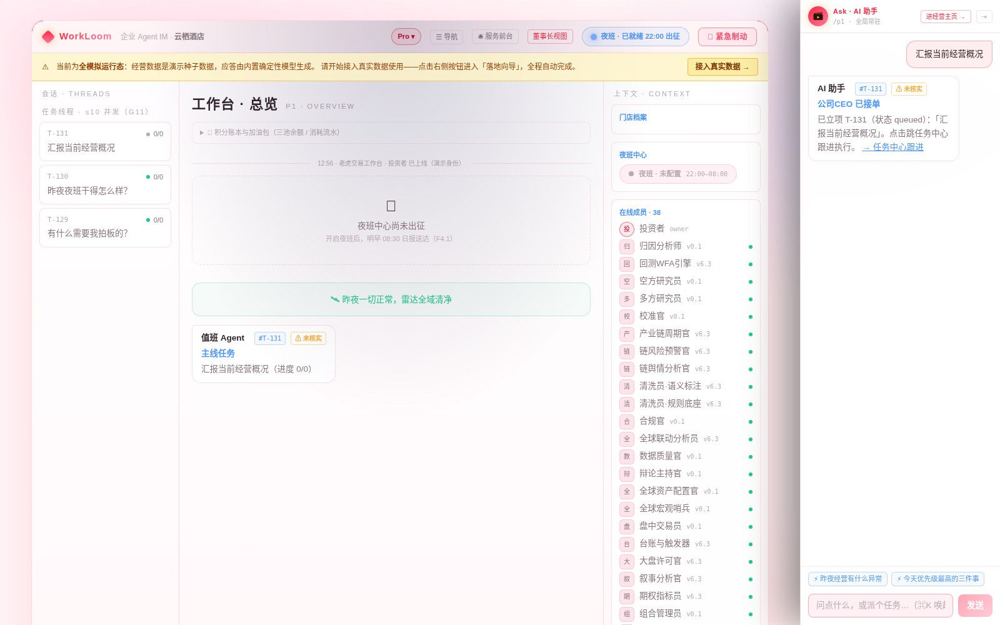
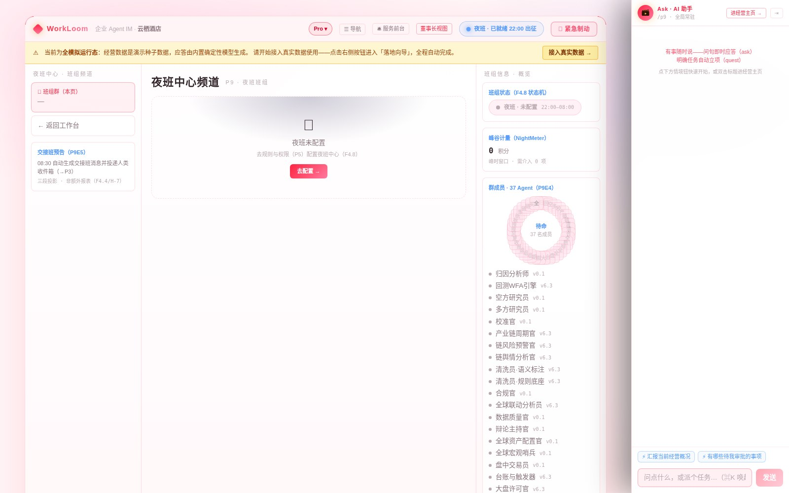
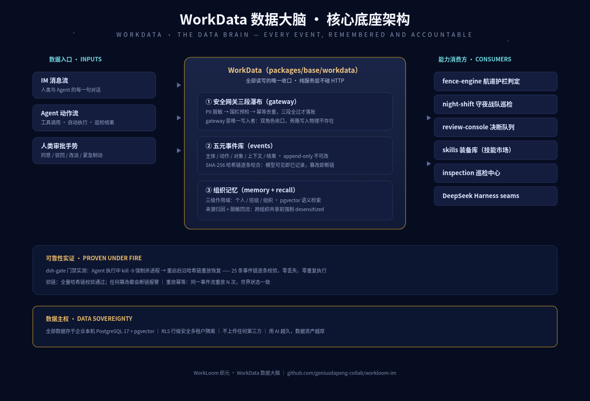
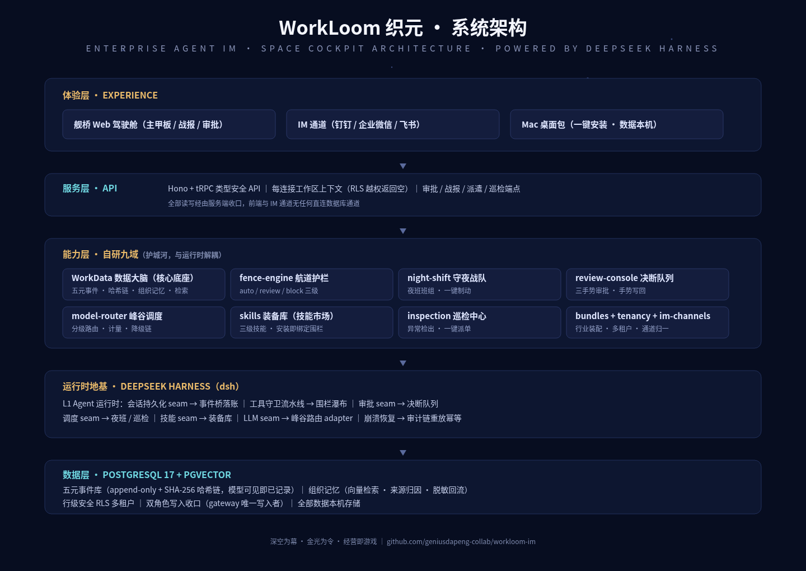
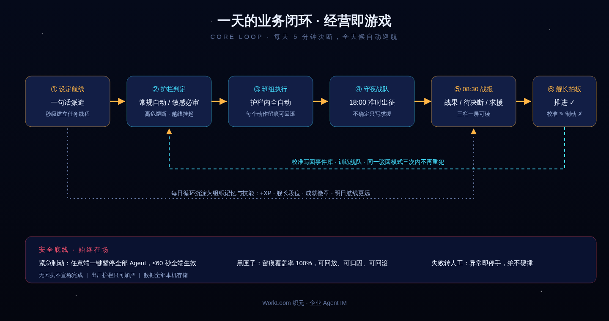

<div align="center">

# WorkLoom 织元 · DeepSeek Harness 企业级 Agent IM

**面向 AI 时代人机共存的新形态组织协作底座 · Enterprise Agent IM powered by DeepSeek Harness**

传统软件给人一堆扳手，WorkLoom 给业务负责人一座**太空驾驶舱**。

**[English](README_EN.md)** · 简体中文

### 🌐 官网 · Official Website：[workloom.ok.kimi.link](https://workloom.ok.kimi.link)

> 想更直观地了解这个项目？官网有完整的产品故事、系统架构、技能市场案例与实机截图。


[](https://github.com/geniusdapeng-collab/workloom-im/releases)
[](LICENSE)
[](https://github.com/geniusdapeng-collab/workloom-im/releases)
[](https://github.com/deepseek-ai/dsh)
[]()
[]()
[](https://workloom.ok.kimi.link)

</div>

> **Keywords**: Enterprise Agent IM, DeepSeek Harness, dsh, AI Agent 协作, 多智能体 Multi-Agent, 人机共存 Human-in-the-loop, 数码员工 Digital Workforce, 事件溯源 Event Sourcing, 组织记忆 Organizational Memory, pgvector, 本地优先 Local-first, 数据主权 Data Sovereignty, Hono, tRPC, React 19, PostgreSQL 17, 企业 IM, Agent 技能市场 Skill Marketplace, WorkData


<!-- CAPABILITIES:BEGIN -->
<!-- 本区块由 scripts/generate-capabilities.mjs 自动生成（2026-09-02），请勿手改；重跑 pnpm capabilities 更新 -->

## 🧩 系统能力速览（自动生成 · 与代码同步）

- 🖥 **三端应用（开箱即看）**：PC 端 · B 端工作台 · 移动端 · B 端高保真 · 移动端 · C 端 AI 服务前台
- 🏨 **行业 Bundle（垂直能力包）**：bundles/hotel/ · bundles/trading/
- 🖐 **操作电脑能力（本仓自带 · 可装生产工作站）**：computer-use 三层感知（65 动作） · HTTP 远程驱动 + MCP server
- 🤖 **AI 自动化引擎（系统内置能力）**：围栏 DSL 引擎 · L2 编排（ASK/QUEST） · 夜班自动运行 · 模型路由 · 五元事件 + RLS 隔离 · IM 渠道 等 9 项
- ✅ **验证与质量（工程纪律）**：一键安装（bootstrap） · 主测试套件 · 发布门禁 · 五元事件验链 · Agent 能力巡游 · 环境自检
- 🎁 **演示与交付资产**：官网静态站 · 自带技能 ×4

> 📖 完整能力导览（含截图与体验路径）：[docs/capabilities.auto.md](docs/capabilities.auto.md) ｜ 🤖 AI Agent 入口：[AGENTS.md](AGENTS.md) ｜ 🎯 首启必跑：`pnpm preview:all`
<!-- CAPABILITIES:END -->

---

## 这是什么

WorkLoom 织元是一台**企业级 Agent IM（Enterprise Agent IM）**——以「即时通讯」为人机共存的统一界面，把 AI Agent 班组（数码员工）与人类员工编进同一个通讯录、同一套会话、同一份组织记忆里协作。运行时地基采用 **DeepSeek Harness（dsh）**，是企业场景下 dsh 的深度最佳实践。

它不是又一个聊天机器人，也不是又一个 Copilot 侧边栏。它回答的是一个更根本的问题：

> **当大模型成为新的生产力引擎，企业的「生产关系容器」应该长什么样？**

WorkLoom 的答案是：**大模型是蒸汽机，企业 Agent IM 是织机。** 蒸汽机本身不织布——织机才把动力变成布匹。同样，大模型本身不产生经营结果，Agent IM 才把模型能力变成可度量、可治理、可沉淀的经营产出。

<p align="center">
  
  
</p>

---

## 一、行业创新：首款企业级专业 Agent IM

### 1.1 企业引入 AI 的五道断层

企业不缺模型，缺的是让模型「进组织、上产线、可问责」的最后一公里。五道断层横在中间：

| 断层 | 现象 | WorkLoom 的接法 |
|---|---|---|
| **上下文断层** | AI 不知道企业是谁、业务到哪一步 | WorkData 五元事件库沉淀组织记忆，Agent 与员工共享同一份上下文 |
| **执行断层** | AI 只会说不会做，或做了没人敢认 | Quest 任务卡 + 围栏三级授权，动作全部落在事件链上 |
| **治理断层** | 出了错没人知道是谁、哪一步 | 黑匣子式全量审计：谁发起、谁批准、谁执行、结果如何，逐条可回放 |
| **度量断层** | AI 的产出无法换算成经营语言 | 经营目标（Quest）驱动，早八点战报用 KPI 口径汇报 |
| **数据安全断层** | 数据上云不放心，权限边界说不清 | 本地优先 PostgreSQL + 行级安全（RLS），数据主权在企业自己手里 |

### 1.2 AI 原生：第一公民不是消息，而是「可追责的动作」

传统 IM 把「沟通」数字化了，但没有把「行动」数字化——消息发出去，事还得人去办。Agent IM 是 AI 原生（AI-native）的协作底座：**它的第一公民不是消息，而是「可追责的动作」**——每一个动作都有主体、有授权、有结果、有留痕。

最直观的分水岭是审批卡片：**飞书里的审批卡片是外挂的 OA 插件**，点一下就跳出 IM、跳进另一个系统；**WorkLoom 里的审批卡片是原生消息类型**——它本身就是事件流里的一环，批准手势直接写回事件库成为校准样本。这个差别，就是两个时代的差别。

**服务对象也换了：传统 IM 服务人，Agent IM 服务 AI**——主体换了。在 WorkLoom 里，人和 AI 在同一个 workspace 协作，IM 的每个原生概念都被重新定义：

| IM 概念 | Agent IM 重定义 |
|---|---|
| 消息 | = 事件（五元结构，append-only，可审计） |
| 通讯录 | = 人机混编班组（人类员工与数码员工同册） |
| 群 | = 任务线程（三态：进行中 / 待裁决 / 已归档） |
| 审批 | = 原生消息类型（不是外挂插件） |
| 在线时长 | = 无人值守经营时长（7×24 夜班不打烊） |

### 1.3 IM 本体正名：为什么底座是 IM

市面上把 AI 塞进 IM 的产品不少，但把 IM 作为**人机共存操作系统**来正经设计的，WorkLoom 是第一款：

| 能力域 | IM 原生语义的重新诠释 |
|---|---|
| M1 消息即事件 | 每条消息都是五元事件（主体/动作/对象/上下文/结果），天然 append-only、可审计 |
| M2 围栏即行动权限 | 「群公告」式围栏：Agent 能做什么动作，由权限三级（自动/审批/禁止）精确控制 |
| M3 三态会话 | 会话即工单：进行中 / 待裁决 / 已归档，业务状态一目了然 |
| M4 夜班永不下线 | Agent 数码员工 7×24 值守，夜班班组自动巡检，人类下班业务不下班 |
| M5 审批原生消息 | 审批不是跳转外链，是 IM 里的一张卡片：同意 / 驳回 / 改派，一键完成 |
| M6 人机混编通讯录 | 人类员工与 Agent 数码员工同册并列，按部门、技能、可调度性编排 |
| M7 组织记忆 | 会话沉淀为可检索的组织知识，pgvector 语义召回 |
| M8 塔台管制 | 紧急制动：一键暂停全场 Agent，控制权永远在人类手里 |
| M9 经营仪表 | KPI 巡检、阈值告警、早八点战报，IM 首页就是经营驾驶舱 |

### 1.4 人机共存的新形态：人只做三件事

在 WorkLoom 组织的协作里，人类从「操作者」升格为「主理人」，只做三件机器替代不了的事：

- **供给**：提供目标、素材、预算与业务判断（设定航线）
- **裁决**：在围栏审批点上拍板（同意 / 驳回 / 改派）
- **沉淀**：把一次好的协作固化成班组 SOP 与技能，下次自动复用

其余一切——执行、巡检、对账、夜班值守、写战报——交给 Agent 班组。

---

## 二、业务模式创新：给老板一座太空驾驶舱

WorkLoom 的购买决策人不是 IT 部门，而是**业务负责人**——酒店店长、门店老板、运营总监。产品的一切设计都对着他们的语言：

### 2.1 太空驾驶舱六条公理

| 太空驾驶舱 | WorkLoom 对应 | 业务含义 |
|---|---|---|
| **目的地** | 经营目标（Quest） | 不说「功能」，说「本月 RevPAR 提升 8%」这类可验收目标 |
| **自动驾驶** | Quest + 夜班自动执行 | 设定目标后，班组自动拆解、执行、巡检，夜班不打烊 |
| **禁飞区** | 围栏三级（自动/审批/禁止） | 涉及钱、合同、客户数据的动作，未经批准一律不得执行 |
| **仪表盘** | KPI + 巡检告警 | 经营指标实时可视，异常自动亮红灯并 @ 负责人 |
| **黑匣子** | WorkData 五元事件库 | 每一步操作留痕，可回放、可审计、可归责 |
| **塔台** | IM 卡片 + 一键暂停 | 老板在手机上就能审批、改派、紧急制动 |

### 2.2 业务价值的三个「不再是」

- **投入不再是买软件**：不再是按账号付年费买一堆用不起来的功能，而是按经营目标雇佣一支「数码班组」——先定目标，再看产出。
- **产出不再是过程指标**：WorkLoom 汇报的不是「AI 调用了多少次」，而是「昨夜 OTA 差评全部响应、本周渠道价差收敛、本月夜班挽回 N 笔流失订单」——经营口径，老板语言。
- **数据不再是代价**：组织记忆沉淀在企业自己的数据库里（本地 PostgreSQL + pgvector），不喂给任何第三方。用 AI 越久，企业自己的数据资产越厚——这是复利的方向。

### 2.3 目标：重构服务业。首个落地代表：酒店

**WorkLoom 的目标是重构服务业。** 今天的服务业（酒店、餐饮、零售门店）也好，以销售为主的电商行业也好，有一个共同的低效结构：企业买了大量平台和工具，员工在十几个系统之间切来切去，大量时间耗在机械化的操作上——查数、对账、抄单、回消息；更贵的是，人在机械操作的间隙里还要不断做判断，注意力和决策力被反复切碎。这个结构里的每一件事，AI 能力今天都已经被验证可以承担；缺的不是 AI 能力，而是一个让 AI 进组织、上产线、可问责的容器。

WorkLoom 就是来解这个问题的。`bundles/hotel` 是服务业的首个落地代表：收益经理（revenue-manager）、渠道对账（channel-reconciler）、差评危机处置（review-crisis）三个预制数码员工技能随包附赠，新客户从下载到正式使用约 30 分钟（详见[新客户首次接入完整流程](docs/02-新客户首次接入完整流程.md)）。同一底座可复用到任何「有明确经营指标 + 有大量重复处置动作」的服务业场景。

---

## 三、与通用 AI 办公的本质区别

通用 AI 办公助手（如腾讯 **WorkBuddy**、阿里**千问办公**、**QoderWork** 等）解决的是「帮员工把活干完」——数字化的是**个人办公任务**。WorkLoom 解决的是「让组织里的人与 AI 一起把生意跑起来」——数字化的是**组织经营动作**。这不是功能多寡的差别，是品类差别：

| 维度 | 通用 AI 办公助手（WorkBuddy / 千问办公 / QoderWork） | WorkLoom 织元 |
|---|---|---|
| **服务对象** | 服务「人」：个人/员工的桌面提效助手 | **服务「AI 与组织」**：AI 是组织成员，人升格为主理人 |
| **数字化对象** | 个人办公任务：文档、表格、纪要、资料整理 | 组织经营动作：每一个动作可追责、可审计、可回放 |
| **产品形态** | 桌面客户端 / 个人工作台，一人一助手 | 企业级 IM 底座：人机混编班组在同一个 workspace 协作 |
| **与 IM 的关系** | IM 是远程遥控入口（手机发指令指挥电脑） | IM 是本体：消息=事件、审批=原生消息类型 |
| **协作粒度** | 单人任务拆解执行 | 目标 → 步骤 → 技能装配的组织级流水线，夜班班组 7×24 |
| **数据归属** | 个人账号 / 云端为主 | 企业本机：数据主权 + RLS 多租户隔离 |
| **产出口径** | 交付文档、表格等个人产物 | 经营口径：RevPAR、差评响应时长、挽回的订单 |

一句话：**通用 AI 办公让员工的 8 小时更高效；WorkLoom 让企业的 24 小时自动运转。** 二者不冲突——员工可以继续用 WorkBuddy 写文档，而 WorkLoom 在组织层把 AI 编成一支可治理、可度量、可归责的数码班组。

---

## 四、WorkData 数据大脑：核心底座

**WorkData（`packages/base/workdata`）是 WorkLoom 的核心底座**——企业的「数据大脑」与「黑匣子」。九域能力、DeepSeek Harness 运行时、工作台前端的所有读写，都经由 WorkData 唯一收口。

<p align="center"></p>

### 4.1 三段核心机制

| 机制 | 做什么 | 为什么重要 |
|---|---|---|
| **① 安全网关三段瀑布（gateway）** | PII 脱敏 → 围栏预检 → 幂等去重，三段全过才落账 | gateway 是唯一写入者，双角色收口——旁路写入在物理上不存在 |
| **② 五元事件库（events）** | 主体/动作/对象/上下文/结果，append-only + SHA-256 哈希链 | 「模型可见即已记录」：Agent 看到的每一条上下文都已留下不可篡改的痕 |
| **③ 组织记忆（memory + recall）** | 三级作用域（个人/班组/组织）+ pgvector 语义检索 + 来源归因 + 脱敏回流 | 企业用 AI 的每一天都在积累自己的数据资产，而不是替别人训练模型 |

### 4.2 可靠性实证：敢让 Agent 碰生产业务的前提

- **kill -9 崩溃测试**：Agent 执行到一半强制杀进程，重启后沿哈希链重放恢复——25 条事件链逐条校验，**零丢失、零重复执行**
- **验链**：全量哈希链校验，任何篡改都会断链报警
- **重放幂等**：同一事件流重放 N 次，世界状态必须一致

### 4.3 数据主权

全部数据存于企业本机 PostgreSQL 17 + pgvector，RLS 行级安全隔离多租户，不上传任何第三方。

---

## 五、技能市场：目标如何自动拆解为步骤，步骤如何装配技能

WorkLoom 的**装备库（skills）**就是技能市场：技能分三级——**official**（随行业 Bundle 官方分发）、**team**（工作区自建）、**industry**（脱敏后跨组织共享）。用户可以安装现成技能，也可以用自然语言自建。

### 5.1 真实案例（服务业代表 · 酒店）：店长说「差评响应要做到 2 小时内」

```
店长一句话目标
   │
   ▼ 意图路由（intent）——LLM 分类 + 规则兜底，判定为 Quest（经营目标）
   │
   ▼ 自动拆解为任务卡步骤
   │
   ├─ 步骤 1 差评监测  ── 装配技能 review-crisis（official，酒店 Bundle 自带）
   │        └─ 夜班班组 7×24 巡检 OTA 渠道，新差评 5 分钟内检出
   │
   ├─ 步骤 2 安抚草稿  ── Agent 基于组织记忆（该客人历史入住记录）起草回复
   │        └─ 调用 WorkData recall 检索相似历史差评的处置经验
   │
   ├─ 步骤 3 主理人审批  ── 围栏判定：对外发送 = review 级 → 审批卡片发给店长
   │        └─ 店长点「同意」，手势写回事件库（校准样本 +1）
   │
   ├─ 步骤 4 回复发布  ── 批准后自动执行，全程留痕进五元事件链
   │
   └─ 步骤 5 复盘沉淀  ── 意识系统（awareness）发现「同类差评每周 ≥3 次」
            └─ 自动建议固化为新技能 → 店长一键确认 → forge 生成技能草稿
                → dry-run 回放最近 10 条历史动作预览效果 → 正式上线
```

### 5.2 技能市场的安全铁律

- **安装即绑定围栏，卸载即撤销**：技能声明自己能做什么动作，安装时与现有围栏冲突的一律进审批，不静默放行
- **industry 层上架前必须脱敏**（desensitized=true），否则拦截，禁止降级
- **生产仅签名白名单**：首版只认 official + team，其余来源拒绝并留痕
- **自建技能生效前必须 dry-run**：回放真实历史动作预览效果，没有预览留痕就拒绝安装

### 5.3 零代码自建技能（forge）

用自然语言说清三要素——**触发**（什么时候做）、**步骤**（怎么做）、**边界**（不能做什么）——系统自动生成标准 SKILL.md 技能草稿，进版本管理，同名再生成自动递增版本号。

---

## 六、运行时地基：DeepSeek Harness 行业应用最佳实践

WorkLoom 没有重复造 Agent 运行时的轮子，而是**站在 DeepSeek Harness（dsh）的肩膀上**，把全部工程火力集中在企业级护城河上——这可能是 dsh 发布以来最深入的一次行业化落地。

### 6.1 双轨架构：地基用 dsh，护城河自研

```
┌─────────────────────────────────────────────────┐
│  L2  自研九域护城河（WorkData / fence-engine /    │
│       im-channels / inspection / model-router /   │
│       night-shift / review-console / skills /     │
│       bundles / tenancy）                         │
├─────────────────────────────────────────────────┤
│  L1  DeepSeek Harness（vendor/dsh，MIT）          │
│       Agent 运行时地基：loop / 工具 / 模型路由 /    │
│       会话 / 持久化 / 插件（cordis）               │
└─────────────────────────────────────────────────┘
```

**为什么不自研地基？** Agent 主循环、工具调度、模型适配是会快速商品化的通用能力，跟开源社区共建远比闭门造车划算——dsh 由 DeepSeek 团队维护，迭代速度和质量都有保障。**为什么九域必须自研？** WorkData、围栏、审计、夜班调度这些能力直接贴着企业的钱和数据，是 WorkLoom 的价值所在，必须完全掌控。

### 6.2 dsh 的消费方式：seam 精确对接

WorkLoom 通过 `packages/runtime` 对 dsh 做了一整层 seam 适配，只消费稳定接口：

| 能力 | dsh 组件 | WorkLoom 用法 |
|---|---|---|
| Agent 主循环 | dsh-agent-loop | 班组执行引擎的底层循环 |
| 工具呈现 | dsh-agent-tool-presentation | 围栏拦截点在工具调用前生效 |
| 模型适配 | dsh-agent-default-model + model-router | 多模型路由：成本/时延/任务类型三维权衡 |
| 插件系统 | cordis | 通道插件（dsh-im）以插件形态挂载 |
| 指令体系 | dsh-agent-instructions | 班组 SOP 注入 Agent 上下文 |
| 持久化 seam | dsh session 持久化 | 事件桥落账到 WorkData 五元事件库 |

### 6.3 回馈社区：dsh-im 通道插件

WorkLoom 把 IM 通道适配层抽成了独立的 dsh 插件 [`vendor/dsh-im`](vendor/dsh-im)（MIT），任何 dsh 应用都可以用它把 Agent 接入 IM 通道——这是我们对 dsh 生态的回赠。

---

## 系统架构

<p align="center"></p>

五层结构自上而下：**体验层**（工作台 Web 端 / IM 通道 / Mac 桌面包）→ **服务层**（Hono + tRPC v11，PG 行级安全）→ **能力层**（自研九域护城河，WorkData 数据大脑为核心底座）→ **运行时地基**（DeepSeek Harness seam 适配）→ **数据层**（PostgreSQL 17 + pgvector，五元事件 append-only + hash chain）。

## 业务闭环

<p align="center"></p>

**设定航线 → 护栏判定 → 班组执行 → 夜班班组 → 08:30 战报 → 主理人拍板**，六节点闭环；「校准写回」与「沉淀」两条回路让每一次协作都让系统更懂这家企业。底部安全底线带（紧急制动 / 黑匣子 / 失败转人工）兜住一切异常。

---

## 三分钟启航（Mac 用户）

1. **下载**：到 [Releases](https://github.com/geniusdapeng-collab/workloom-im/releases) 下载 `WorkLoom-macOS.zip`（约 208 MB，sha256 随附可校验）。
2. **解压拖入应用程序**：首次打开如遇 Gatekeeper 提示，在「系统设置 → 隐私与安全性」点一次「仍要打开」即可——这是唯一一次需要手动授权。
3. **双击 WorkLoom.app**：启动器自动完成一切——内嵌 PostgreSQL 17 + pgvector 初始化、数据库迁移、服务拉起、工作台打开。无需安装任何依赖，无需命令行。

> 系统要求：macOS 13 Ventura +，Apple Silicon（M 系列）。Intel 版后续推出。

## 用户文档（随代码一起下载）

| 文档 | 适合谁 | 内容 |
|---|---|---|
| [酒店店长使用指南](docs/01-酒店店长使用指南.md) | 酒店店长 / 门店负责人 | 下载安装 → 配置 → 日常使用，全程无技术术语 |
| [新客户首次接入完整流程](docs/02-新客户首次接入完整流程.md) | 任意行业新客户 | 从下载到正式使用的通用接入流程（约 30 分钟） |
| [功能清单（用户版）](docs/03-功能清单-用户版.md) | 所有人 | 全部功能按使用场景分类，业务语言描述 |

## 开发者快速开始

```bash
git clone https://github.com/geniusdapeng-collab/workloom-im.git
cd workloom-im
corepack enable && pnpm install

# 开发环境（需要本机 PostgreSQL 17 + pgvector）
pnpm dev          # 起 server + web
pnpm typecheck    # 全仓类型检查
pnpm test         # 单元测试（157 例）
pnpm demo         # 端到端演示（44 步全绿）

# dsh-gate 门禁（崩溃重放 / 验链 / 幂等）
RUN_DB_TESTS=1 DATABASE_APP_URL=postgres://... DATABASE_GATEWAY_URL=postgres://... pnpm test
```

仓库结构：`apps/{server, web, site, desktop}` + `packages/{shared, db, base, runtime}` + `bundles/hotel` + `vendor/{dsh, dsh-im}`，pnpm monorepo。核心底座：**`packages/base/workdata`（WorkData 数据大脑）**。

## 安全设计

- **数据主权**：local-first，全部业务数据存于企业本地 PostgreSQL，RLS 行级安全隔离多租户
- **WorkData 五元事件库**：append-only + hash chain，审计不可篡改
- **围栏三级授权**：自动 / 审批 / 禁止，碰钱碰数据的动作默认需人工批准
- **一键紧急制动**：塔台随时可暂停全场 Agent
- **依赖合规**：vendor 内 dsh / dsh-im 均为 MIT，主仓库 Apache-2.0

## 路线图

- ✅ v1.1.0：Mac 桌面包一键启航 + 官网 + CI 冒烟门禁
- 🔜 Intel Mac 包 / Windows 包
- 🔜 技能市场 industry 层开放（脱敏审核流水线 + 跨组织安装）
- 🔜 更多行业 bundles（餐饮、零售、物业）
- 🔜 dsh 上游版本跟进与 seam 自动兼容测试

## 致谢

- [DeepSeek Harness](https://github.com/deepseek-ai/dsh) — Agent 运行时地基（MIT）
- [pgvector](https://github.com/pgvector/pgvector) — 组织记忆的语义检索
- Hono / tRPC / React / Vite — 优秀的工程基座

## License

[Apache-2.0](LICENSE) © WorkLoom 织元。vendor/dsh 与 vendor/dsh-im 遵循其各自 MIT 许可。
