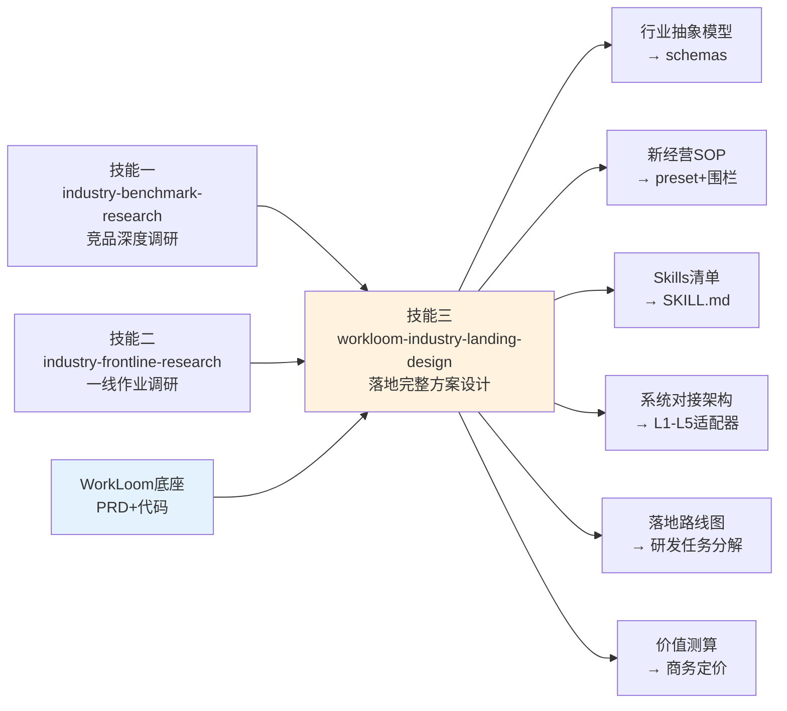

# WorkLoom行业落地完整方案设计方法论

## 一、技能定位

### 1.1 这个技能解决什么问题

当WorkLoom完成行业竞品调研（技能一）和行业一线作业调研（技能二）后，最后一个要回答的问题是：**基于这些调研结论，结合WorkLoom本身的产品设计思想和技术架构，如何设计一个完整的、可交付研发团队的行业落地方案？**

这个技能就是回答这个问题的"元方法论"。它不是简单地把技能一和技能二的结论拼在一起，而是**以WorkLoom的产品哲学为骨架，以竞品调研和一线调研为血肉，设计出一个完整的行业落地方案**——从行业抽象模型，到新经营SOP，到Skills开发清单，到系统对接架构，到落地路线图，到价值增量测算，无一遗漏。

**核心理念**：WorkLoom的行业落地不是"给行业加几个AI功能"，而是"用Agent IM重新铺设行业经营的神经系统"。这个技能就是把这句话变成可执行方案的设计方法论。

### 1.2 何时调用

- 技能一（竞品调研）和技能二（一线作业调研）均完成后
- WorkLoom决定正式进入一个新行业，需要输出可交付研发团队的方案时
- 已有行业Bundle需要重大升级（如从MVP升级到全盘覆盖）时
- 需要向投资方/合作伙伴展示行业落地计划时

### 1.3 调用者

- 行业交付工程师（负责行业Bundle开发）
- 产品架构师（负责WorkLoom底座与行业Bundle的架构对接）
- 研发团队（负责Skills开发和系统对接）
- 商务团队（负责落地路线图和价值测算）

### 1.4 与其他技能的关系

本技能是WorkLoom行业进入的**第三步**（也是最后一步）。技能一与技能二并行独立，两者的产出与WorkLoom底座共同构成本技能的输入：

```
技能一（竞品调研）──┐
                   ├──→ 技能三（落地完整方案设计）──→ 可交付研发团队的方案
技能二（一线调研）──┘         ↑
                             │
                        WorkLoom底座（代码为主事实源+PRD兜底）
```

- 输入 ← 技能一（竞品调研）：差异化竞争点、行业趋势判断、对WorkLoom的启示
- 输入 ← 技能二（一线作业调研）：AI替代可行性矩阵、工作流程拆解、行业know-how、痛点与流失点
- 输入 ← **WorkLoom代码（主事实源，动态摸排）**：Base Bundle九域能力、行业Bundle装配机制（六装配槽）、Agent preset配置、Skill标准格式、五元事件schema冻结范围——方案中的每个能力引用必须有代码路径锚点
- 输入 ← WorkLoom PRD（兜底/背景参考）：当代码不可得或需理解设计意图时参考；PRD与代码冲突时**以代码为准**并标注差异

- 输出 → 研发团队：Skills开发清单、系统对接架构、落地路线图
- 输出 → 商务团队：价值增量测算、定价模式、成功指标
- 输出 → 行业Bundle：行业抽象模型、SOP设计、围栏规则、一店一档Schema

## 二、适用场景

### 2.1 典型场景

**场景一：新行业完整落地方案设计**
WorkLoom完成餐饮行业的竞品调研和一线作业调研后，需要设计餐饮行业Bundle的完整落地方案——从抽象模型到SOP到Skills到架构到路线图到价值测算。

**场景二：已有行业Bundle全盘升级**
酒店行业Bundle从MVP升级到全盘覆盖，需要重新设计完整方案（如从3个Skills扩展到13个Skills）。

**场景三：跨行业抽象适配**
酒店行业跑通后，需要把酒店的经验抽象适配到餐饮/美业/教培，设计这些新行业的落地方案。

### 2.2 不适用场景

- 未完成技能一和技能二就调用（本技能依赖前两个技能的产出）
- 单个Skill的设计（用Skill开发方法论即可，不需要完整落地方案）
- 纯技术架构设计（本技能是行业落地方案，不是技术架构文档）

## 三、方法论：六模块完整方案设计

### 3.1 核心原则

**原则一：全盘重构，不是单点功能。** WorkLoom的行业落地不是"给行业加几个AI功能"，而是"对行业的全部经营业务进行底层业务流重构"。方案必须覆盖行业的全部经营业务，不能只做几个点。

**原则二：以WorkLoom产品哲学为骨架。** 方案的核心架构必须基于WorkLoom的产品哲学——五元事件模型、围栏引擎、夜班班组、执行面五级分层、三态协作、技能市场。不能脱离WorkLoom底座另搞一套。

**原则三：高屋建瓴又深入细节。** 方案既要有战略高度（通用抽象模型、改变行业愿景），又要有执行细节（67个SOP环节、13个Skills规格、五级分层对接策略）。

**原则四：可交付研发团队。** 方案必须可执行——Skills有详细规格、架构有对接策略、路线图有明确的阶段依赖与任务清单、价值有测算依据。不能是空泛的"战略文档"。

**原则五：抽象适配。** 方案在深度聚焦目标行业的同时，每个模块必须说明"如何抽象适配到其他服务业"，为WorkLoom的跨行业扩展铺路。

### 3.2 六模块设计框架

#### 模块一：行业抽象模型

**设计目标**：将目标行业的经营流程抽象为可复用的服务业模型，确保模型既能指导本行业落地，又能快速适配其他服务业。

**设计步骤**：
1. **核心判断**：看透这个行业经营的本质是什么？（如酒店经营的本质是"事件驱动的连续决策流"）
2. **五元事件建模**：将行业经营全盘映射到WorkLoom的五元事件模型（Who×Context×Object×Decision×RuleImpact）。识别行业的核心经营对象（如酒店的16类经营对象），扩展objects.json。
3. **经营阶段生命周期**：定义三层阶段模型——门店级阶段（如爬坡/稳定/旺季/淡季/调整）、客户级阶段（如预订/入住/在住/退房/离店后）、运营级阶段（如日/周/月/季）。扩展stages.json。
4. **一店一档完整结构**：设计一店一档的完整Schema——基础档案+业务档案+运营档案+治理档案+记忆档案五类。扩展archive.schema.json。
5. **通用服务业抽象模型**：提炼"四层闭环+两个横切"的通用模型（输入→处理→输出→反馈+治理+沉淀），确保可复用到其他行业。

**输出要求**：
- 核心判断陈述
- 经营对象图谱（Mermaid graph，标注已有/扩展）
- 三层阶段生命周期模型（Mermaid graph）
- 一店一档完整结构图（Mermaid graph）
- 通用服务业抽象模型图（Mermaid graph）

#### 模块二：新经营SOP设计

**设计目标**：设计覆盖行业全部经营业务的新经营SOP，明确"谁在何时做什么，标准是什么"。

**设计步骤**：
1. **SOP设计原则确立**：核心原则是"从人操作到人指挥"——人只做供给/裁决/沉淀三件事，其余全交Agent班组。
2. **业务域划分**：把行业经营划分为若干业务域（如酒店的七大业务域：预订/入住/在住/退房/离店后/收益管理/日常运营）。
3. **每个业务域的SOP设计**：对每个业务域，用统一表格格式设计SOP：
   - 环节 | 谁（Agent/人/人机协作）| 什么时候（触发条件与时间节点）| 做什么（动作清单）| 标准（验收标准）| 异常处理
   - **追溯链要求（v1.1新增）**：每个SOP环节必须可追溯到技能二调研的痛点/流失点编号（如"对应任务二流失点一：调价不及时"）。无追溯来源的环节需说明设计依据（如"合规要求驱动"）。这确保SOP不是凭空设计，而是"痛点驱动"。
4. **SOP全景流程图**：以Mermaid flowchart绘制所有业务域的全景流程，展示环节之间的流转关系。
5. **客群差异化配置**：针对目标行业的不同客群（如酒店的低星单体/民宿/无人酒店），设计差异化配置（通过客户级Patch实现）。

**输出要求**：
- SOP设计原则
- 每个业务域的SOP表格（统一格式）
- SOP全景流程图（Mermaid flowchart）
- 客群差异化配置表

#### 模块三：Skills开发清单与系统对接架构

**设计目标**：列出需要开发的全部Skills及其详细规格，设计系统对接架构。

**设计步骤**：
1. **Skills体系全景**：设计三层Skills体系——官方套件（随行业Bundle分发）+团队技能（单店自建）+行业共享（脱敏上架）。以Mermaid graph绘制Skills体系全景。
2. **每个Skill的详细规格**：对每个官方Skill，明确：
   - 功能描述
   - 触发条件
   - 输入数据
   - 输出动作
   - 对接系统
   - 围栏绑定
   - 关键约束
   - **验收测试（v1.1新增）**：该Skill上线前必须通过的验收用例（正常路径≥1条+异常路径≥1条+围栏触发≥1条），确保规格"可交付研发"而非停留在描述层
3. **Skills开发优先级**：基于"先验证后复制"原则，用Mermaid flowchart规划Skills开发先后依赖（MVP→试点→推广），不标注工期。
4. **系统对接架构**：设计五层系统对接架构（业务系统层+平台层+硬件设备层+外部服务层+竞对监控），以Mermaid graph绘制。
5. **对接方式五级分层**：基于WorkLoom的执行面五级分层（L1官方API→L2确定性适配器→L3确定性剧本→L4自主探索→L5人工接管），为每个系统选择对接方式。以Mermaid flowchart绘制五级分层策略。
6. **数据流向架构**：设计数据从来源→汇聚→消费→输出的完整流向。以Mermaid flowchart绘制。
7. **Agent班组协作拓扑**：设计多个Agent preset的协作关系（谁调用谁、数据如何流转）。以Mermaid graph绘制。

**输出要求**：
- Skills体系全景图（Mermaid graph）
- 每个Skill的详细规格表
- Skills开发先后依赖图（Mermaid flowchart，无时间轴）
- 系统对接架构图（Mermaid graph）
- 五级分层策略图（Mermaid flowchart）
- 数据流向架构图（Mermaid flowchart）
- Agent班组协作拓扑图（Mermaid graph）

#### 模块四：落地路线图（只输出"要做什么事"，禁止排期）

**设计目标**：规划分阶段的落地路线图，每阶段明确目标、任务清单、成功指标。

**排期禁令（v1.3新增，强制）**：本模块**只输出"要做什么事"，禁止输出任何排期、工期、周期、时间点**（如"X个月""X天""2027年Q2""第N周"）。理由：脱离资源与组织上下文的时间估计会对落地产生错误引导——排期是研发团队拿到任务清单后的独立决策，不是本方案的职责。阶段之间只允许表达**先后依赖关系**（谁先于谁、谁解锁谁），不允许表达时间长度。里程碑节奏类表述（如SOP中的"每日08:30""夜班22:00-08:00"）属于产品运行机制，不在禁令范围。

**设计步骤**：
1. **阶段划分**：通常分为四阶段——基座夯实→全盘覆盖→规模推广→抽象适配。以Mermaid **flowchart**绘制阶段依赖图（谁解锁谁），**禁止使用甘特图或任何带时间轴的图**。
2. **每阶段的关键任务**：明确每阶段要做什么（任务清单，**不含工期估计**）。
3. **每阶段的成功指标**：明确每阶段如何判断成功（可量化指标）。**里程碑验收标准必须量化且可机器/数据验证（v1.1强化）**——禁止"基本可用""体验良好"等不可验证表述，全部改为"成功率≥X%""准时交付率≥Y%""P95≤Z分钟"式指标。注意：验收指标中的时间（如"08:30准时交付率"）是产品运行SLA，不是项目排期，允许使用。
4. **风险与应对**：识别落地过程中的主要风险，设计应对策略。**风险表必须规范化（v1.1新增）**：每条风险包含 概率（高/中/低）× 影响（高/中/低）两个维度，并给出**触发信号**（什么现象出现说明风险正在发生，触发信号也不得用项目工期表述，改用可观测现象如"联调反复失败"）和**应对负责人角色**；高概率×高影响风险必须出现在路线图的关键路径上。

**输出要求**：
- 落地路线阶段依赖图（Mermaid flowchart，四阶段，无时间轴）
- 每阶段的关键任务表（无工期列）
- 每阶段的成功指标表
- 风险与应对表

#### 模块五：价值增量测算

**设计目标**：测算WorkLoom为目标行业带来的可量化价值，设计定价模式。

**设计步骤**：
1. **降本价值测算**：测算AI替代带来的降本价值（替代人力、节省时间）。**必须为区间估计（保守/中性/乐观三档）并附关键假设清单（v1.1强化）**，直接引用技能二的经济性测算口径并保持一致。
2. **增收价值测算**：测算AI增强带来的增收价值（挽回流失、提升转化）。同样要求区间估计+假设清单；对最敏感假设做敏感性说明。
3. **综合价值模型**：以Mermaid graph绘制降本+增收的综合价值模型。
4. **客群价值差异**：针对不同客群，测算价值差异（如酒店的三类客群价值不同）。
5. **定价模式设计**：基于WorkLoom的定价体系（社区版免费+专业版订阅+增量分成+资源置换），设计目标行业的定价模式。以Mermaid graph绘制定价与ROI模型。
6. **规模化收益预测**：预测规模化推广后的收益。

**输出要求**：
- 降本价值测算表
- 增收价值测算表
- 综合价值模型图（Mermaid graph）
- 客群价值差异表
- 定价与ROI模型图（Mermaid graph）
- 规模化收益预测表

#### 模块六：抽象适配与总结

**设计目标**：从目标行业抽象出可复用的资产，为跨行业扩展铺路。

**设计步骤**：
1. **可复用资产沉淀**：识别经过本行业落地后沉淀的可复用资产——模型资产、机制资产、行业资产、方法论资产。以Mermaid graph绘制。
2. **跨行业适配预览**：预览适配到下一个目标行业的映射关系（如酒店→餐饮的适配表）。
3. **战略愿景阐述**：阐明"改变行业、重塑经营"的终极愿景。
4. **全方案总结**：用一句话总结方案核心。

**输出要求**：
- 可复用资产图（Mermaid graph）
- 跨行业适配映射表
- 战略愿景图（Mermaid graph）
- 一句话总结

#### 模块七：平台能力反哺清单（v1.3新增，独立输出模块）

**设计目标**：在方案设计过程中，技能一（竞品调研）和技能二（一线调研）中会出现一些优质内容——竞品的已验证能力、一线的真实场景与know-how——它们在WorkLoom**当前能力范围（以代码摸排清单为准）内无法被沉淀和消化**。这些内容不应被丢弃或强行塞进方案，而应单独整理为"平台能力反哺清单"，用于辅助优化WorkLoom平台系统与技能体系本身。

**识别标准**（满足其一即纳入）：
1. 竞品有而WorkLoom代码中没有对应机制的能力（如竞品的某类工具环境、某类数据网络）
2. 一线场景需要而六装配槽无法承载的需求（如需要底座新增机制、新增通道、新增硬件适配类别）
3. 行业know-how需要新的沉淀形态（现有"记忆四类/Skill/围栏"无法表达的经验类型）
4. 方案设计中被迫标注"需新建"但超出行业Bundle范畴、属于底座级改动的项

**每条清单项的格式**：

| 字段 | 说明 |
|------|------|
| 编号/名称 | 如"反哺-01：AI语音接听通道" |
| 来源 | 技能一/技能二 + 具体章节 |
| 内容描述 | 这项能力/场景是什么，为什么有价值 |
| 无法消化的原因 | 对照《代码能力清单》的具体缺口（哪个包/哪个槽位缺失） |
| 平台改进建议 | 建议WorkLoom底座新增/扩展什么（新机制/新通道/新槽位/新包） |
| 预期受益场景 | 改进后哪些场景被解锁 |
| 优先级建议 | P0（卡脖子，不解锁则方案关键环节无法落地）/P1（显著增强竞争力）/P2（锦上添花） |

**设计步骤**：
1. 方案设计全程随手记录"无法消化"信号（凡写下"需新建""底座不支持""超出当前能力"处，都回看是否属于底座级缺口）
2. 六模块设计完成后，汇总去重，按上述格式整理成清单
3. 按优先级排序，P0项必须说明"卡住的是方案的哪个环节"

**输出要求**：
- 平台能力反哺清单表（按优先级排序）
- 每项含来源追溯（技能一/二+章节）
- 该清单是方案的**独立模块**（单独章节或附件），与行业Bundle方案正文分开——它服务于WorkLoom平台演进，不属于行业落地范围

### 3.3 设计方法

#### 方法一：WorkLoom代码摸排（主事实源，v1.2重制）

方案设计前必须对WorkLoom代码做**充分摸排**（比附录A的轻量读取更深），产出《WorkLoom代码能力清单与行业可配置范围》并作为方案的"底座事实附件"：

**摸排清单（按路径）**：

| 优先级 | 路径 | 摸排目标 |
|--------|------|----------|
| P0 | `README.md` + `CHANGELOG.md` | 当前版本状态、仓库地图、最近演进 |
| P0 | `bundles/<参考行业>/` 全目录 | 六装配槽实物：bundle.json资产清单、schemas（objects/stages/archive）、fences（规则明细与default_level）、presets（Agent与围栏绑定）、skills、ui |
| P0 | `packages/shared/src/event-schema.ts` + `enums.ts` + `constants.ts` | 五元事件schema冻结范围（v1冻结，仅context/object/decision可loose扩展）、全局枚举冻结清单、行业无关机制默认值 |
| P1 | `packages/base/` 九域包 | workdata（网关三段瀑布/哈希链/幂等/PII/记忆三级作用域）、fence-engine（三级判定/单调守卫/dry-run/对象写锁）、review-console（三手势/驳回回流）、night-shift（状态机/决策包三栏/一键暂停SLA）、inspection（只读巡检/异常分级/派单）、skills（三级市场/forge/意识系统）、tenancy（四版本能力矩阵）、model-router（峰谷/降级链/逐事件计量） |
| P1 | `packages/runtime/` | 意图路由（Ask/Agent/Quest）、Quest循环（装配三要素校验/断点续跑/回执未核实不得转完成） |
| P2 | `packages/base/bundles/assembly.ts` | 六装配槽装配契约、起飞前检查单、激活流程 |
| P2 | `scripts/` | migrate/seed/suite（371用例）/dsh-gate（崩溃重放/验链/幂等门禁）/verify-chain |
| P2 | `docs/DECISIONS.md`、`docs/03-功能清单-用户版.md` | ADR关键决策、用户版功能全表 |

**摸排产出（必须落盘为方案附件）**：
1. **底座能力清单**：能力名 → 代码路径 → 关键约束（如"围栏求值异常按block E2.1"）
2. **行业可配置范围表**：哪些可改（六装配槽内容、围栏阈值、写动作前缀registerWriteActions、任务分级表TASK_TIER_TABLE、降级链工作区覆盖）/ 哪些冻结不可改（五元事件v1 schema、全局枚举、append-only/RLS/网关相关）
3. **现有行业Bundle差距清单**：方案想要的 vs 代码已有的（如"想要16类对象，代码现有8类"），差距即研发工作量
4. **引用锚点表**：方案正文中每个WorkLoom能力引用 → 代码路径

**纪律**：方案中禁止引用代码中不存在的能力而不标注"规划中/需新建"；PRD与代码冲突时以代码为准并标注（如PRD称某能力而代码未实现，方案中列为"需新建"而非"已有"）。

#### 方法二：整合技能一和技能二的产出
- 技能一的差异化竞争点 → 指导落地方案的定位策略
- 技能二的AI替代可行性矩阵 → 指导围栏规则设计
- 技能二的工作流程拆解 → 指导SOP设计
- 技能二的行业know-how → 指导Skills方法论

#### 方法三：资深行业合作伙伴深度协作
- 与资深行业合作伙伴深度协作，验证方案的可行性
- 行业合作伙伴提供know-how输入和系统接口资源
- 方案设计要"放手大胆干"，因为资源丰厚

## 四、输入契约

### 4.1 必需输入

| 输入项 | 说明 | 来源 |
|--------|------|------|
| 技能一产出 | 行业标杆竞品深度调研文档 | 技能一输出 |
| 技能二产出 | 行业一线作业调研文档 | 技能二输出 |
| **WorkLoom代码摸排产出** | 《代码能力清单与行业可配置范围》（按方法一产出，主事实源） | 本技能前置摸排（仓库：github.com/geniusdapeng-collab/workloom-im） |

### 4.2 推荐输入

| 输入项 | 说明 | 来源 |
|--------|------|------|
| 行业合作伙伴know-how | 资深行业合作伙伴的行业经验和系统接口资源 | 行业合作伙伴提供 |
| 已有行业Bundle参考 | 已跑通的行业Bundle（如酒店Bundle）作为参考 | WorkLoom代码仓库 |
| 目标行业系统接口 | 目标行业的PMS/POS/预约系统等接口文档 | 行业合作伙伴提供 |
| WorkLoom PRD | 产品需求文档（理解设计意图的**背景参考**；与代码冲突时以代码为准；代码不可得时作为兜底事实源并标注） | WorkLoom团队提供 |

### 4.3 输入校验

- 必须有技能一和技能二的完整产出
- 必须完成WorkLoom代码摸排并落盘《代码能力清单与行业可配置范围》（代码不可得时使用附录A兜底摘要并显著标注"未经实时代码核验"）
- 必须有行业合作伙伴的know-how输入（或明确标注"基于公开信息推演"）

## 五、输出契约

### 5.1 输出物

**一份完整的行业落地方案文档**，Markdown格式，包含：

1. **方案定位声明**（全盘AI化重构的格局声明）
2. **第一章：行业抽象模型**（从行业经营到服务业经营操作系统）
3. **第二章：新经营SOP设计**（全盘业务流重构）
4. **第三章：Skills开发清单与系统对接架构**
5. **第四章：落地路线图与价值增量测算**
6. **第五章：抽象适配与总结**（从目标行业到全服务业）
7. **第六章：平台能力反哺清单**（独立模块：技能一/二中WorkLoom当前能力无法消化的优质内容 → 平台改进建议，v1.3新增）

### 5.2 输出规格

| 规格 | 要求 |
|------|------|
| 格式 | Markdown，使用Mermaid语法绘制所有图表 |
| 字数 | 不少于15000字（分5章输出） |
| Mermaid图表 | 至少10张（架构图、时序图、状态图、阶段依赖图等；禁止甘特图等带时间轴的图） |
| SOP格式 | 必须采用表格形式呈现（谁在何时做什么） |
| 抽象适配 | 每个模块结尾说明"如何抽象适配到其他行业" |

### 5.3 输出校验

- [ ] 是否有方案定位声明（全盘重构格局）？
- [ ] 是否有行业抽象模型（五元事件建模+三层阶段+一店一档）？
- [ ] 是否有新经营SOP（覆盖全部业务域，表格格式）？**每个环节是否有痛点追溯链？**
- [ ] 是否有Skills开发清单（每个Skill详细规格）？**每个Skill是否有验收测试用例？**
- [ ] 是否有系统对接架构（五层+五级分层）？
- [ ] 是否有落地路线图（四阶段依赖图，无时间轴）？**里程碑指标是否全部可量化验证？**
- [ ] 是否有价值增量测算（降本+增收+定价）？**是否为区间估计+假设清单？是否与技能二测算口径一致？**
- [ ] **风险表是否含概率×影响+触发信号+负责人？**
- [ ] 是否有抽象适配说明（跨行业映射）？
- [ ] **是否有平台能力反哺清单（独立模块，每项含来源追溯+无法消化原因+改进建议+优先级）？**
- [ ] **全文是否无任何排期/工期/时间点（甘特图、"X个月""X天""2027年Qx"等均禁止；SOP触发时间与产品SLA除外）？**
- [ ] Mermaid图表是否≥10张？**且在最终交付物中100%实际渲染为图形？**
- [ ] **文档头部是否标注信息截止日期？**
- [ ] 字数是否达标（≥15000字，融合模式下以"旧+新增补"合计信息量计）？
- [ ] **迭代融合模式下：是否包含新旧对比表、冲突裁决记录、融合结论？**

## 六、质量标准

### 6.1 深度标准

- **全盘覆盖**：方案必须覆盖行业的全部经营业务，不能只做几个点
- **以WorkLoom产品哲学为骨架**：核心架构必须基于WorkLoom底座，不能另搞一套
- **高屋建瓴又深入细节**：既有战略高度，又有执行细节
- **可交付研发团队**：Skills有规格、架构有策略、路线图有节点、价值有测算

### 6.2 可执行性标准

- SOP必须能转化为Agent preset配置和围栏规则
- Skills必须有详细规格（功能/触发/输入/输出/对接/围栏）
- 系统对接必须有五级分层策略
- 路线图必须有明确的阶段先后依赖、任务清单和可量化成功指标；**禁止包含任何排期/工期/时间点（v1.3）**
- 价值测算必须能支撑定价决策

### 6.3 抽象性标准

- 行业抽象模型必须可复用到其他服务业
- 每个模块必须有"抽象适配到其他行业"的说明
- 可复用资产必须明确识别（模型/机制/行业/方法论四类）

### 6.4 格式标准

- Mermaid图表必须可复制到支持Mermaid的编辑器直接渲染
- SOP必须采用表格形式（谁/何时/做什么/标准/异常）
- Skills规格必须采用表格形式
- 路线图必须采用阶段依赖图（flowchart），禁止甘特图与任何时间轴；SOP中的触发时间（如"每日08:30"）属产品运行机制，允许

## 七、抽象适配说明

### 7.1 本技能的复用性

本技能是**行业无关的元方法论**。六模块设计框架（抽象模型+SOP+Skills架构+路线图+价值测算+抽象适配）适用于任何行业的WorkLoom落地方案设计。

### 7.2 适配到其他行业的步骤

1. **获取技能一和技能二的产出**：完成目标行业的竞品调研和一线作业调研
2. **替换行业词汇**：把"酒店"替换为目标行业词汇
3. **保持六模块框架不变**：六模块设计框架完全复用
4. **行业特定调整**：根据行业特点，调整某些模块的设计重点（如餐饮的"系统对接"重点是POS和外卖平台，酒店的"系统对接"重点是PMS和OTA）
5. **复用已沉淀的资产**：从已跑通的行业（如酒店）复用模型资产、机制资产、方法论资产

### 7.3 已验证的行业

- ✅ 酒店行业（WorkLoom酒店行业版落地方案，已验证框架可行性）
- 🔜 餐饮行业（待技能一和技能二完成后调用）
- 🔜 美业行业（待技能一和技能二完成后调用）
- 🔜 教培行业（待技能一和技能二完成后调用）

### 7.4 跨行业复用资产参考

| 资产类型 | 酒店行业沉淀 | 可复用到 |
|----------|------------|---------|
| 模型资产 | 通用经营模型（四层闭环+两个横切） | 所有服务业 |
| 模型资产 | 16类经营对象图谱 | 替换对象后复用 |
| 机制资产 | 五元事件库+围栏引擎+夜班班组 | WorkLoom底座自带，所有行业复用 |
| 方法论资产 | AI替代可行性矩阵 | 所有服务业 |
| 方法论资产 | SOP设计模板 | 所有服务业 |
| 方法论资产 | 价值测算模型 | 所有服务业 |

## 八、调用示例

### 8.1 调用模板

```
调用技能：workloom-industry-landing-design
输入：
  - 目标行业：餐饮
  - 技能一产出：餐饮行业标杆竞品深度调研文档
  - 技能二产出：餐饮行业一线作业调研文档
  - WorkLoom代码摸排：克隆最新main分支，按方法一产出《代码能力清单与行业可配置范围》
  - WorkLoom PRD：背景参考（可选，兜底用）
  - 行业合作伙伴：餐饮行业资深合作伙伴
输出：
  - WorkLoom餐饮行业版落地方案（≥15000字，≥10张Mermaid图表且全部实际渲染，无任何排期）
  - 独立模块：平台能力反哺清单
  - 附件：《WorkLoom代码能力清单与行业可配置范围》（含引用锚点表）
```

### 8.2 与WorkLoom底座的集成

本技能作为"行业落地顶层设计"技能，建议：
- 归类为**official套件**（随WorkLoom底座分发）
- 安装后由**行业交付工程师Agent**或**产品架构师Agent**调用
- 输出的行业抽象模型 → 转化为行业Bundle的schemas（objects.json/stages.json/archive.schema.json）
- 输出的SOP → 转化为Agent preset配置和围栏规则
- 输出的Skills清单 → 转化为SKILL.md文件
- 输出的系统对接架构 → 指导L1-L5适配器开发
- 输出的路线图 → 指导研发任务分解（排期由研发团队独立决策）
- 输出的价值测算 → 指导商务定价

### 8.3 三个技能的协作流程



## 九、交付质量门禁与迭代融合规则（v1.1 新增）

### 9.1 交付质量门禁（Pre-Delivery Gate）

交付前必须逐项过门禁，任何一项不通过则禁止交付：

| 门禁项 | 标准 | 检查方式 |
|--------|------|----------|
| **图表渲染率** | 所有Mermaid图表在最终交付物中实际渲染为图形，渲染率100% | 逐张目检，禁止只交付代码块或空白占位 |
| **追溯链** | 每个SOP环节可追溯到技能二痛点/流失点 | 抽查≥20%环节 |
| **Skill可交付性** | 每个Skill规格含验收测试用例 | 逐项核对 |
| **测算一致性** | 价值测算与技能二口径一致、区间估计、假设清单完整 | 逐项核对 |
| **指标可验证** | 路线图里程碑全部可量化验证 | 逐项核对 |
| **无排期** | 全文无排期/工期/时间点表述，无甘特图 | 全文检索"个月/天/季度/20XX"等模式逐项人工确认（SOP触发时间与产品SLA除外） |
| **反哺清单** | 平台能力反哺清单存在且每项含六字段（编号/来源/描述/原因/建议/优先级） | 逐项核对 |
| **信息截止日期** | 文档头部标注技能一/二产出版本与信息截止日期 | 目检 |

> 教训来源：v1.0产出PDF中全部Mermaid图表丢失为空白；SOP与调研痛点之间无显式追溯；价值测算为单点估计。v1.1起"图表实际渲染"为一票否决项。

### 9.2 迭代融合模式（同一方案已有历史版本时）

当调用者提供同一主题的历史方案时，切换为**迭代融合模式**：

1. **对比（Diff）**：逐章对比历史方案与新方案，差异分为四类——旧内容仍有效/旧内容已失效/新内容增补/新旧冲突（如SOP环节数、Skills数量、路线图时间的口径差异必须显性裁决）。
2. **增补（Augment）**：新方案聚焦旧版缺失或过时部分——新增SOP环节/Skill、对接口变化的更新、测算口径修正、未渲染图表重绘。
3. **融合（Merge）**：产出单一整合文档——旧内容全文保留（失效内容标注"已被vX更新取代"并保留演进痕迹）、新内容以"【增补】"并入对应章节、每章结尾设"【融合结论】"、冲突时以"更近的调研数据+更完整的追溯链"优先裁决、卷首附"新旧对比一览表"。融合版的SOP环节数、Skills清单、路线图以融合结论为准，禁止同一文档出现两套互相矛盾的口径。

## 十、版本记录

| 版本 | 日期 | 变更 |
|------|------|------|
| v1.0 | 2026-08-20 | 初始版本，基于WorkLoom酒店行业版落地方案设计实践抽象 |
| v1.1 | 2026-08-21 | 新增：交付质量门禁（图表渲染率一票否决）、迭代融合模式、SOP痛点追溯链、Skill验收测试用例、里程碑指标可量化强制、风险表规范化（概率×影响+触发信号+负责人）、价值测算区间化与口径一致性要求 |
## 附录A：WorkLoom底座上下文（动态读取前置环节 + 兜底摘要）

> 本技能的产出需要频繁引用WorkLoom的定位与能力（差异化对比、AI替代映射、SOP/Skills设计）。WorkLoom是活的开源项目，**禁止凭记忆引用其功能**。执行前必须按 A.1 动态读取最新代码；代码不可得时按 A.2 兜底摘要执行并显著标注。

### A.1 前置环节：WorkLoom最新代码动态轻量读取（强制）

**读取目标**：WorkLoom开源仓库 `https://github.com/geniusdapeng-collab/workloom-im`（主干即可，无需全量clone历史）。

**轻量读取清单**（按优先级，预计10-20分钟）：

| 优先级 | 路径 | 提取什么 |
|--------|------|----------|
| P0 | `README.md` | 产品定位、仓库地图、最小跑通路径、当前版本状态 |
| P0 | `bundles/hotel/bundle.json`（或目标行业bundle） | 该Bundle提供的资产清单（presets/fences/skills/schemas/ui）与版本号 |
| P0 | `bundles/<行业>/fences/*.yml` | 基线围栏规则（rule_id/level/when表达式/default_level） |
| P1 | `bundles/<行业>/schemas/objects.json`、`stages.json` | 经营对象枚举、经营阶段枚举（现有多少类，扩展空间） |
| P1 | `bundles/<行业>/presets/*.yml` | Agent班组清单与各自围栏绑定 |
| P1 | `bundles/<行业>/skills/*/SKILL.md` | 已有官方Skill的功能边界（避免重复设计） |
| P2 | `packages/shared/src/event-schema.ts` | 五元事件schema字段（Who/Context/Object/Decision/RuleImpact）与冻结范围 |
| P2 | `packages/base/`各包文件头注释 | 九域能力的关键设计约束（围栏三级/哈希链/夜班状态机等） |
| P2 | `docs/03-功能清单-用户版.md`、`docs/DECISIONS.md` | 用户版功能全表、关键架构决策（ADR） |
| P3 | `CHANGELOG.md` | 最近变更（判断能力演进方向） |

**读取产出**（写入调研/方案文档的"WorkLoom底座上下文"小节）：
1. **底座能力清单**：本次读取确认存在的能力（标注代码路径）
2. **目标行业Bundle现状**：对象/阶段/围栏/Agent/Skill的数量与清单
3. **引用锚点表**：本报告引用的每个WorkLoom能力 → 对应代码路径或规则号
4. **读取时间戳**：如"代码快照：2026-08-21 main分支"

**代码不可得时的兜底**：使用 A.2 摘要，并在产出物头部标注："⚠️ 本报告的WorkLoom能力引用基于兜底摘要（PRD V2.5 + 2026-08-21代码快照），未经实时代码核验，关键结论建议复核。"

### A.2 WorkLoom定位与能力兜底摘要（PRD V2.5 + 2026-08-21代码快照提炼）

**一句话定位**：WorkLoom是企业级 Agent IM——以消息（五元事件）为唯一事实源、以规则围栏为行动权限边界、以三态会话（Ask/Agent/Quest）为人机分工范式的人机协作网络。不是工作台（工作台只是交互皮肤）、不是传统SaaS（它按意图动态组装能力）、不是单个智能体（Agent班组只是它雇佣的"数码员工"）。**人只做三件事：供给（定目标/给素材）、裁决（围栏审批拍板）、沉淀（固化SOP为技能）**，其余执行、巡检、对账、夜班值守全部交给Agent班组。

**架构分层**：L0 基础设施（PostgreSQL 17+pgvector，本地优先/数据主权）→ L1 运行时（DeepSeek Harness，vendor锁定rc.8）→ L2 Base Bundle（九域能力，底座不内置行业词汇）→ L3 行业Bundle（六装配槽填充）→ L4 客户Patch（只可收紧不可放宽）。

**九域能力清单（代码已实现）**：

| 域 | 包 | 关键能力 |
|----|-----|----------|
| 数据大脑 | workdata | 五元事件库（append-only + SHA-256哈希链 + 幂等）；安全网关三段瀑布（权限→PII脱敏→高危授权）；组织记忆（workspace/agent/run三级作用域，preference/pattern/sop/forbidden四类，pgvector语义检索） |
| 围栏引擎 | fence-engine | auto/review/block三级判定（deny优先、求值异常按block"宁可错杀"）；YAML围栏包DSL（沙箱表达式，禁eval）；基线单调守卫（is_baseline规则只可加严）；dry-run回放10条历史事件验证；对象级写锁 |
| 审批触达 | review-console | 统一审批队列；三手势（采纳/编辑后采纳/驳回，驳回必填原因）；审批卡片为IM原生消息（inapp/钉钉/企微/飞书/Slack）；高危项不过期自动放行；驳回回流为记忆校准样本 |
| IM通道 | im-channels | 入站消息五元化、幂等去重；外部通道经dsh-im插件 |
| 夜班班组 | night-shift | 18:00候选清单→22:00-08:00围栏内自治→08:30清晨决策包（已完成/待审批/需介入三栏，≤20条）；一键暂停≤60s；自研cron触发器；夜班动作100%过围栏（版本快照） |
| 巡检中心 | inspection | 只读巡检（工具集裁剪保证）；异常分级P0/P1/P2聚合推送防风暴；一键派单回链；检项由行业包定义 |
| 技能市场 | skills | official/team/industry三级（industry上架必须脱敏）；安装即绑定围栏、卸载即收缩；forge零代码自建（触发/步骤/边界三要素）；安装前必须dry-run；意识系统（同类动作≥3次/周产出固化建议） |
| 多租户 | tenancy | 四版本能力矩阵：community（无Quest/夜班/巡检）/pro/teams/vpc；越版访问403+升级提示 |
| 模型路由 | model-router | 记忆复用优先→确定性任务分级→峰谷窗口（22:00-08:00谷时费率≤20%）→降级链→熔断；逐事件计量（账单=事件投影）；降级写事件禁静默换模型 |

**五元事件模型**：Who（human/agent/system）× Context（tenant/workspace/time/channel/stage）× Object（行业化枚举）× Decision（action/before/after/basis/memory_refs）× RuleImpact[]（rule_id/version/result）。附加：Receipt回执（未核实不得转完成）、ModelTrace（逐事件模型计量）。schema v1冻结，行业仅可在context/object/decision内loose扩展。

**执行面五级分层**：L1官方API（零token主路径）→ L2确定性适配器 → L3确定性剧本（AI浏览器模拟，频次自律）→ L4自主探索（冷启动，探明后固化为L3）→ L5人工接管（进决策包"需介入"栏）。

**酒店行业Bundle现状（2026-08-21代码快照，`bundles/hotel` v1.0.0，演示Bundle）**：
- 7个Agent preset：pricing-agent / review-agent / reconcile-agent / inspection-agent / content-agent / competitor-agent / desktop-agent
- 基线围栏R1-R6（default_level=review）：R1房价涨幅≤8% auto；R2保底价¥380 block；R3新渠道首发改价/发布必审；R4退款≥¥500必审；R5担保订单异常block；R6差评必审
- 3个官方Skill：revenue-manager / review-crisis / channel-reconciler
- 经营对象8类：room_type/room_price/channel/order/guest/review/store/staff
- 经营阶段5个：ramp（爬坡）/stable（稳定）/peak（旺季）/off_season（淡季）/turnaround（调整）
- 一店一档Schema + UI用例（cases.json）

**行业可配置范围（六装配槽）**：①档案Schema（一X一档）②对象与阶段枚举 ③工具集（MCP优先，每动作标注读/写）④围栏包（阈值默认值行业定、客户patch只收紧）⑤Agent班组preset（未声明fence_bindings禁止写动作）⑥工作台UI。全局枚举与五元事件v1 schema冻结不可改；写类动作前缀可经registerWriteActions扩展；模型任务分级表与降级链可按工作区覆盖。

**质量与验收基线**：371条全场景测试套件（域A-Q）+ dsh-gate崩溃重放/验链/幂等门禁；全局验收口径G1-G11（如事件检索P95≤3s、夜班成本谷时≤20%、留痕100%）。

### 版本补充记录

| 版本 | 日期 | 变更 |
|------|------|------|
| v1.2 | 2026-08-21 | 输入契约重制：WorkLoom代码摸排升为主事实源（方法一重写为"代码摸排"，含P0-P2路径清单+四项摸排产出+引用锚点纪律），PRD降为兜底/背景参考且与代码冲突时以代码为准；技能关系图修正为"技能一/二并行→技能三←WorkLoom底座"；新增附录A（动态读取前置环节+兜底能力摘要） |

| 版本 | 日期 | 变更 |
|------|------|------|
| v1.3 | 2026-08-21 | ①排期禁令：路线图只输出"要做什么事"，禁止任何排期/工期/时间点与甘特图（改为阶段依赖图），排期属研发团队独立决策；②新增模块七"平台能力反哺清单"——技能一/二中WorkLoom当前能力无法消化的优质内容单独整理为平台改进建议（六字段格式+优先级），作为独立模块输出，用于辅助优化WorkLoom平台与技能体系 |
