# AI 投资与自动化交易系统行业标杆竞品深度调研报告

## ——主标杆：Bridgewater Associates（桥水）AIA Labs / AIA Macro 基金

---

## 调研说明

**调研目的**：为"老虎交易"项目（基于 WorkLoom Agent IM 底座 + 已有美股 AI 交易系统改造的全自动 AI 基金经理系统，覆盖美股/A股/港股，24 小时运行，先模拟盘后实盘）提供行业标杆拆解与差异化竞争输入。本报告是技能一（行业标杆竞品调研 v1.3）的产出，将直接作为技能三（落地完整方案设计）的输入。

**调研执行时间**：2026-08-29
**信息截止日期**：2026-08-29（本报告引用的最新公开信息为 2026-08-19 的 Trade Ideas 独立实测与 2026-08-04 的 Bridgewater AIA 深度报道）

**信息来源**：

| 类型 | 具体来源 |
|------|----------|
| 一线深度报道 | AI Street（Matt Robinson，前 Bloomberg 记者）2025-02-28 与 2026-08-04 两篇桥水 AIA 深度稿；Fortune 2024-07-01 桥水 20 亿美元 ML 基金首发报道；Fortune 2026-01-02 2025 年对冲基金业绩榜 |
| 通讯社/财经媒体 | Reuters（经 srnnews 转载）2025-12-31 Pure Alpha 年度业绩；财联社/腾讯新闻 2024-07 桥水 AIA 基金中文报道；新浪财经 2026-01-19 Greg Jensen 专访编译稿 |
| 券商研究报告 | 国信证券《AI 赋能资产配置（三十一）：对冲基金怎么用 AI 做投资》，2025-12-11，王开/陈凯畅 |
| 官方资料 | Trade Ideas 官网 Holly AI 产品页；Citadel 官网；Two Sigma 官网；QuantConnect 官网与文档；Alpha Arena（nof1.ai）官网与技术博客 |
| 独立实测 | insigtrade 2026-08-19 Trade Ideas Holly AI 四周实测（32 笔信号跟踪） |
| 企业数据库 | PrivCo QuantConnect 公司档案 |
| 监管文件 | 上交所/深交所/北交所《程序化交易管理实施细则》（2025-04-03 发布，2025-07-07 施行） |

**置信度分级说明**（竞品宣称数据强制标注）：

- **A 级**：有独立第三方来源交叉验证（如通讯社、多方报道互证、可核验的监管文件）
- **B 级**：仅企业官方口径或单一媒体/单一知情人士口径
- **C 级**：讲者现场引用、来源链条不明或二手编译，**不得单独作为决策依据**
- **推测**：基于公开信息的合理推演，无直接信源
- **信息不足**：公开渠道未获得可用信息，不做编造

**推测标注约定**：凡无直接信源的架构推演、定价推演、战略动机推演，均在该段落标注"（推测）"。

### WorkLoom 底座上下文小节

> 依据技能 v1.3 附录 A.1/A.2，本报告引用 WorkLoom 能力基于以下已核验事实快照，禁止凭记忆发挥。

**代码快照时间戳**：2026-08-21 main 分支（已核验）。

**底座能力清单（本次调研引用到的部分）**：

| 能力 | 代码锚点/规则号 |
|------|----------------|
| 五元事件（Who/Context/Object/Decision/RuleImpact）唯一事实源，append-only + SHA-256 哈希链，幂等 | packages/base（数据大脑 workdata 域） |
| 围栏引擎 auto/review/block 三级，deny 优先，求值异常按 block；YAML 围栏包 DSL；基线单调守卫；dry-run 回放；对象级写锁 | packages/base（fence-engine 域） |
| 统一审批队列，三手势（采纳/编辑后采纳/驳回），审批卡片为 IM 原生消息，高危项不过期自动放行，驳回回流为记忆校准样本 | packages/base（review-console 域） |
| Quest 任务循环（planQuest/runQuest，断点重放幂等） | packages/runtime（intent/assembly/loop/tools） |
| night-shift 夜班班组：22:00-08:00 围栏内自治，08:30 清晨决策包（已完成/待审批/需介入三栏，≤20 条），一键暂停 ≤60s | packages/base（night-shift 域） |
| inspection 只读巡检，P0/P1/P2 异常分级聚合推送 | packages/base（inspection 域） |
| skills 技能市场 official/team/industry 三级，安装即绑围栏，卸载即收缩，安装前 dry-run | packages/base（skills 域） |
| model-router：谷时窗口（22:00-08:00 费率 ≤20%）、降级链、熔断、逐事件计量，降级写事件禁静默换模型 | packages/base（model-router 域） |
| 组织记忆 pgvector 语义检索，workspace/agent/run 三级作用域 | packages/base（workdata 域） |
| bundles 六装配槽（档案 Schema/对象与阶段枚举/工具集/围栏包/Agent preset/工作台 UI）；演示 bundle `bundles/hotel`（7 preset + R1-R6 基线围栏 + 3 SKILL） | bundles/hotel/bundle.json |
| 服务端 Hono + tRPC；PostgreSQL 17 本地优先 | apps/server |
| 多租户四版本：community（无 Quest/夜班/巡检）/pro/teams/vpc | packages/base（tenancy 域） |

**目标行业 Bundle 现状**：截至 2026-08-21 快照，仓库内仅存在演示 Bundle `bundles/hotel`（酒店行业），尚无金融/交易行业 Bundle。"老虎交易"将是以六装配槽机制开发的第二个行业 Bundle，本报告第三章末尾的差异化竞争点将直接映射为 Bundle 装配清单建议。

**引用锚点表**：正文中每一处引用 WorkLoom 能力处，均以"（锚点：xxx）"形式标注上表对应行。

---

# 第一章 产品定位与核心卖点拆解

## 1.1 企业演进历程：从"原则驱动"到"原则×机器"

Bridgewater Associates 由 Ray Dalio 于 1975 年创立，近五十年演进可划分为四个阶段（来源：公开报道综合，A 级事实+推测的阶段划分）：

**第一阶段（1975–1990s）：宏观研究与"原则"体系成型。** 桥水的立身之本不是某个交易技巧，而是 Dalio 的"原则"（Principles）方法论——把投资决策写成可检验、可复用的规则，用极度求真（radical truth）和极度透明（radical transparency）的组织文化对抗人类认知偏差。这一阶段桥水的核心产品是 Pure Alpha 全球宏观策略，本质是"人写规则、人执行规则"。

**第二阶段（1990s–2015）：规则系统化。** Greg Jensen（1996 年达特茅斯学院经济学与应用数学专业毕业后加入桥水）主导将投资逻辑系统化、工程化，把"原则"从文字变成可执行的系统化策略。这一阶段桥水成为"人写规则、机器执行规则"的典范——Pure Alpha 的决策过程高度规则化，但规则本身仍由人类投资委员会产出。

**第三阶段（2015–2023）：机器学习探路与关键人物布局。** 2018 年桥水聘请耶鲁大学统计学家 Jasjeet Sekhon 担任首席科学家（A 级，多家媒体报道互证）。Jensen 本人研究机器学习超过 15 年，约 2016 年成为 OpenAI 早期投资人，并在 Anthropic 创立时开出其第一张外部支票（B 级，AI Street 2026-08-04 引述知情人士；该说法由 Jensen 本人多次公开背书）。Jensen 在 2010 年代初就向自己提问："机器什么时候能写规则，而不只是支持规则？什么时候机器的直觉会真正优于人类直觉？"（B 级，Jensen 公开发言）。当时的答案是：模式匹配很强，但没有"直觉"——推理能力、自我诊断能力、在小数据下工作的能力都还没到位。2022 年底 ChatGPT 出圈后，Jensen 判断缺失的拼图终于凑齐。

**第四阶段（2023 至今）：AIA Labs 与"人工投资者"。** 2023 年桥水成立 AIA Labs（Artificial Investment Associate，人工投资助理实验室），作为独立于 Pure Alpha 的研究与投资单元，初始团队仅 6 人（B 级，AI Street 2026-08-04）。隔离设计的意图有二：给团队空间围绕 AI 重建整个投资流程；防止新系统只是复刻桥水人类投资者已有的观点。Jensen 的原话是："我不想要一个我们的复制品。我们有太多缺陷，在太多事情上很糟糕。我想要比我们更好的东西。"（B 级，公开发言）。2023 年末桥水先在 Pure Alpha 内部以约 1 亿美元自有资金测试该策略（B 级，Fortune 2024-07 引述知情人士）；2024 年 7 月 1 日对外开放募资，起步规模近 20 亿美元（A 级，Fortune/Bloomberg/财联社多方互证）；截至 2026 年年中，AIA 策略管理规模约 45 亿美元，AIA 团队已超过 75 名科学家、工程师与投资者（B 级，AI Street 2026-08-04 引述知情人士）。2025 年 Dalio 退出所有权与董事会（B 级），CEO Nir Bar Dea 与联席 CIO Greg Jensen 完成"原则×机器"的换代交棒。

**转型动因推演（推测）**：桥水的转型不是追逐热点，而是其自身方法论的必然延伸——"原则"本来就是"把人的决策显性化为规则"，LLM/ML 提供的是"让机器自己生成并检验规则"的能力。Dalio 2024 年 10 月在 The Hedge Fund Journal 的表述印证了这一点："AI 将是投资决策中令人惊叹的思考伙伴，甚至在许多方面是思考领导者。只在脑子里做决策——大多数投资者至今仍是这样做的——已经过时了。"（B 级）

## 1.2 当前产品定位：一句话概括与多层含义

**一句话定位**：AIA Labs 是桥水内部孵化的"人工投资者"——一个以机器为投资决策主体、人类退居风险与数据治理岗位的完整投资流程重构，其产品化形态是 AIA Macro 基金。

这句话包含五层含义：

1. **从"AI 辅助投研"到"AI 主体决策"**。桥水官方口径明确：AI 是基金的"主要决策者"（primary decision-maker），人类负责风险管理、数据获取与交易执行的监督（B 级，AI Street 2025-02-28）。这与市面上 99% 的"AI 投研工具"（AI 出建议、人拍板）在责任结构上根本不同。
2. **从"单模型/单策略"到"体系化投资者"**。AIA 不围绕单一模型或单一交易策略构建，而是组合桥水的因果时序模型、专业化与前沿大语言模型、以及用于检验和诊断模型输出的系统（B 级，AI Street 2026-08-04）。它模仿的不是"一个分析师"，而是"一个投资机构"。
3. **从"复制人类观点"到"生成独立阿尔法"**。桥水刻意将 AIA 与 Pure Alpha 隔离，防止 AI 复刻人类观点。CEO Nir Bar Dea 2025 年 3 月确认：该基金正在产生"与人类所做之事不相关的独特阿尔法"（unique alpha that is uncorrelated to what our humans do）（A 级，Bloomberg 会议公开发言，多家媒体转载）。对资管机构而言，"不相关的阿尔法"是组合配置的圣杯——这正是 AIA 对 LP 的核心卖点。
4. **从"实验室"到"可收费产品"**。AIA Macro 是一只真实对外募资、真实收费的对冲基金，不是研究项目。规模从约 1 亿美元内测 → 20 亿美元起步 → 约 45 亿美元（2026 年中），年化收益 11.3%（成立以来），2026 上半年 +8.1%，与 Pure Alpha 同期收益完全一致（B 级，AI Street 2026-08-04 与 valuethemarkets 2026-07-01 两处独立报道数字互洽）。
5. **从"基金"到"集团级能力外溢"**。2026 年桥水已开始将 AIA 的系统用于 Pure Alpha 内部，加速研究并把投资想法系统化（B 级，AI Street 2026-08-04）。AIA 正在从"一只基金"演变为"桥水的第二投资引擎"。

## 1.3 核心卖点提炼

| # | 卖点表述 | 针对痛点 | 潜台词 |
|---|----------|----------|--------|
| 1 | "AI 是主要决策者，人类管风控" | 人类认知偏差、情绪化交易、委员会决策迟缓 | 我们把五十年的"原则"文化升级成了机器原生；你敢把决策权交给机器，是因为我们的规则化基因 |
| 2 | "与人类策略不相关的独特阿尔法" | LP 组合中策略高度同质、相关性内卷 | 买我们不是买"更好的桥水"，而是买一个新的收益来源，分散价值可量化 |
| 3 | "因果推理，不是模式匹配" | 纯数据挖掘策略过拟合、拥挤、失效快 | 我们的 AI 输出的是逻辑链而非预测点，面对从未出现过的市场环境更稳健 |
| 4 | "严格的时间戳管控与统计校准" | LLM 幻觉、先知偏差、过度自信 | 我们把 LLM 的不可靠性工程化地约束掉了，这是机构级与玩具级的分水岭 |
| 5 | "先用自己的钱跑了一年" | 对 AI 策略的信任缺口 | 20 亿美元之前先有 1 亿美元自有资金验证，我们与客户风险共担 |
| 6 | "75+ 跨学科团队，独立于 Pure Alpha 建制" | 大机构创新被主业扼杀 | 这是一个有独立预算、独立人才结构的新物种，不是老团队的副业 |

（卖点 1/2/5 为 A/B 级公开事实支撑；卖点 3/4 为国信证券 2025-12-11 报告与 AI Street 交叉支撑，B 级；卖点 6 为 B 级。）

## 1.4 定位的战略逻辑推演

**推演一：用"不相关性"而非"更高收益"做卖点，是资管行业最锋利的定位。** 对冲基金募资的真正约束不是绝对收益，而是与 LP 现有组合的相关性。2025 年 Pure Alpha 大涨 33–34%（A 级，Reuters）创纪录，而 AIA Macro 年化 11.3%（B 级）看似逊色，桥水却从不拿收益做主打——因为"不相关的 11%"对 LP 的配置价值可能高于"相关的 33%"。这揭示了 AI 基金的最优定位策略：不做"人类冠军的替代品"，做"组合中的新品种"。

**推演二：隔离建制（skunkworks）是颠覆性投资流程的必要组织条件。** AIA 与 Pure Alpha 物理与组织隔离，本质是在防止"抗体反应"——成熟投资组织会本能地把新工具驯化为旧流程的辅助（Copilot 化），从而扼杀范式级创新。桥水用 6 人起步、独立预算、独立招聘（数据科学家占比提升至投研团队 18%，C 级，新浪财经 2026-01-19 编译稿）的方式保护新范式。

**推演三：桥水的护城河不在模型，在"五十年规则化投研资产 + 因果方法论 + 机构级工程纪律"的复合。** 任何人都能调用 GPT/Claude，但没有人能在三年内复制桥水的因果时序模型库、宏观变量体系、时间戳管控纪律与统计校准工程。模型是商品，体系是壁垒。（推测，基于国信证券报告"数据治理与私有语境理解能力、工程化迭代机制、可解释与可审计体系正成为比单一模型性能更重要的护城河"的结论延伸）

**推演四：Jensen 对 OpenAI/Anthropic 的早期股权投资是战略卡位而非财务投资。** 这让桥水在 LLM 能力曲线上拥有"内部视角"，在 2022 年底就敢于下注成立 AIA Labs——时间点早于绝大多数金融机构 12–18 个月。（推测）

**推演五："人类退到风控与数据岗位"是责任设计而非能力设计。** 让 AI 做主要决策、人类管风控，同时满足了监管对"最终责任主体"的要求和 LP 对"有人兜底"的心理需求。这是机构级 AI 产品的合规化包装范式。（推测）

## 1.5 定位架构图

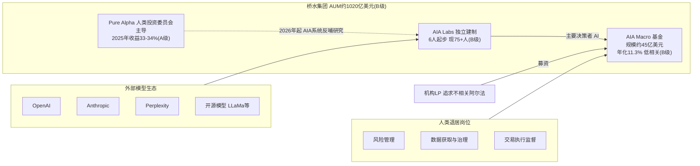

## 1.6 定位对比：AIA 与同类标杆的定位差异

| 标杆 | 一句话定位 | 决策主体 | 产品化形态 |
|------|-----------|----------|-----------|
| 桥水 AIA | 人工投资者，AI 主体决策 | AI 主决策，人类管风控 | 对冲基金（2/20 收费，推测） |
| Man Group AlphaGPT | 智能体驱动的策略创意闭环 | AI 出因子+解释，人类风控否决权 | 内部研究体系 |
| Citadel | AI 增强人类 PM 的信息处理 | 人类 PM，AI 是超级助手 | 内部平台 |
| Two Sigma | 数据科学平台 + 因子 SaaS | 模型驱动+人类治理 | 自营基金 + Venn 平台（已出售） |
| QuantConnect/LEAN | 量化策略的 GitHub+云工场 | 用户策略，平台中立 | 订阅 SaaS + 云服务 |
| Trade Ideas Holly | AI 信号产品化给散户 | AI 出信号，人手动/半自动执行 | 零售订阅 SaaS |

**对 WorkLoom/老虎交易的差异化启示**：桥水证明了"AI 主体决策+人类风控岗"的机构级责任结构可以被 LP 接受，这是老虎交易"全自动 AI 基金经理"定位的最权威背书。但桥水的定位是"服务机构 LP 的封闭基金"，留下了一个巨大空位：**面向更广泛资金方/交易者的"AI 基金经理即服务"**——把 AIA 式的完整决策管线以平台形态交付，而非以基金牌照形态封闭运营。老虎交易应把"不相关阿尔法"的表述改造为"可审计、可围栏、可复盘的 AI 决策流水线"，把桥水的"信任黑话"翻译成"工程证据"：每一次决策有五元事件留痕（锚点：workdata 域）、每一次自动执行过围栏（锚点：fence-engine 域）、每天清晨有可复核的决策包（锚点：night-shift 域）。

**如何抽象适配到其他行业**：定位拆解的通用方法是——先画企业演进时间线，找出每次转型"对抗的是什么威胁"；再把当前定位拆成"从X到Y"的多层句式（从记录到执行、从辅助到主体、从封闭到平台）；最后逐条卖点追问"潜台词"和"针对痛点"。任何行业标杆的卖点，本质上都是对"客户为什么不信任新品类"的逐条回应。

## 1.7 AIA 与桥水存量业务的协同、反哺与内部张力

主标杆分析不能只向外看产品，还要向内看组织——AIA 与桥水存量业务之间的关系，揭示了"老牌机构孵化 AI 原生业务"的完整动力学，对任何"在已有系统上改造出 AI 产品"的项目（包括老虎交易这类"已有交易系统+新底座"的改造）都有直接参照价值。

**协同面一：自有资金充当信任燃料。** 桥水没有让 AIA 直接对外募资，而是先在 Pure Alpha 内部以约 1 亿美元自有资金测试近一年（B 级，Fortune 2024-07 引述知情人士）。这一安排的精妙之处在于三重效果同时达成：其一，用真金白银的内部业绩替代了"PPT 募资"，2024 年 7 月开放时 LP 面对的是一段可尽调的运行记录；其二，内部测试期不受外部 LP 赎回压力干扰，团队可以按工程节奏迭代而非按净值曲线焦虑；其三，自有资金亏损的风险信号比任何风控文档都更能约束团队的行为。这一"自有资金先行"模式是机构级 AI 产品冷启动的标准动作。

**协同面二：品牌与渠道的零成本复用。** AIA Macro 起步即募到近 20 亿美元（A 级），不是因为 AI 概念本身——同期无数 AI 基金募资艰难——而是因为出资人是桥水五十年积累下来的 LP 网络，他们买的首先是"桥水"这张信任状，其次才是"AI"这个新品种。老牌机构孵化新业务的最大隐性资产是渠道信任，这一点在拆解任何转型标杆时都不应被技术叙事遮蔽。

**反哺面：AIA 系统回流 Pure Alpha。** 2026 年桥水开始把 AIA 的系统用于 Pure Alpha 内部，加速研究并把投资想法系统化（B 级，AI Street 2026-08-04）。这意味着 AIA 的角色正在从"一只独立基金"演变为"集团级的第二投资引擎"。反哺路径值得细看：Pure Alpha 是人类投资委员会主导的老系统，AIA 对它的价值不是替代决策，而是把人类委员会的研究产能放大——AI 先做信息拆解与初稿推演，人类聚焦核心判断（C 级方向性描述，新浪财经 2026-01-19 编译稿与 B 级信源互洽）。这是"新系统改造老组织"的标准剧本：先在隔离区证明范式，再以工具形态回流主航道，逐步改变主航道的工作方式，而非一次性替换。

**张力面一：刻意隔离与反哺之间的节奏难题。** AIA 成立时桥水刻意将其与 Pure Alpha 隔离，理由是防止 AI 复刻人类观点、防止老组织把新工具驯化为旧流程的辅助（B 级，Jensen 公开发言）。但反哺一旦开始，"隔离保护"就在事实上终结。节奏选择暴露了桥水的真实判断：先让 AIA 独立跑出两年实盘记录、长到 75 人建制，形成既成事实的组织重量之后再回流——此时它已强大到不会被老组织消化掉。反过来，如果成立第二年就急着反哺，大概率会被 Pure Alpha 的委员会流程吞没。（推测）

**张力面二：人才结构替换的隐性成本。** Jensen 公开表示新基金会改变桥水的招聘策略和员工构成，让更多数据科学家加入（B 级，Fortune 2024-07）；中文编译稿称数据科学家占投研团队比例已提升至 18%（C 级）。人才结构替换的隐性成本在于：传统宏观研究员的晋升通道收窄、组织内部两种话语体系（经济学因果语言 vs 机器学习语言）的摩擦、以及老牌员工对"机器写规则"的文化抵触。桥水用 Dalio 的"原则"文化部分化解了这一摩擦——既然组织的圣经本来就是"把决策显性化为可检验规则"，那么机器生成规则在文化叙事上是"原则"的延续而非背叛。（推测）这是桥水独有的文化红利，也是其他老牌机构模仿 AIA 模式时最难复制的软性条件。

**张力面三：业绩比较的双刃剑。** 2026 年上半年 AIA Macro 与 Pure Alpha 收益同为 +8.1%（B 级），这种"打平"对 AIA 是胜利（机器追平人类旗舰），对 Pure Alpha 团队却是微妙的心理压力。管理层对此的处理方式是把叙事重心放在"低相关性"而非"谁收益高"——两只基金被表述为互补的收益来源而非竞争对手。这一叙事管理技巧对所有"人机并存"组织都适用：永远把新系统定位为老系统的能力延伸与组合补充，避免零和叙事，否则内部政治会成为比技术更大的失败原因。（推测）

**小结**：AIA 的内部动力学可提炼为四步剧本——自有资金内测（信任燃料）→ 隔离建制（防抗体）→ 实盘记录（既成事实）→ 反哺主航道（范式扩散）。这四步的次序不可颠倒：跳过内测直接募资会死在信任关，不隔离会死在组织抗体，没有记录就回流会被主航道吞没。

**对 WorkLoom/老虎交易的差异化启示**：老虎交易"已有美股 AI 交易系统+新底座改造"的结构，与"Pure Alpha+AIA"的结构同构——已有交易系统相当于 Pure Alpha（老系统、有实绩、有惯性），WorkLoom 底座相当于 AIA 的工程范式（新责任结构、新留痕能力）。四步剧本的映射是：已有模拟盘与 HTML 日报充当"自有资金内测"的信任燃料；先以模拟盘公开账本跑出可验证记录（隔离期），再让新底座的夜班自治、围栏审批以工具形态逐步接管老系统的执行环节（反哺），而非一次性重写六层管线。改造次序错了，项目会死在"老系统团队觉得被否定"的组织关，而非技术关。

**如何抽象适配到其他行业**：任何"老业务+AI 新范式"的转型标杆都要拆解五对关系——信任从哪借（品牌/自有资金）、隔离怎么做（建制/预算/汇报线）、记录怎么攒（多长的可验证运行期）、反哺怎么回（工具形态而非替换形态）、叙事怎么讲（互补而非零和）。这五问在酒店行业对应"新 AI 系统与老店长的关系"，在餐饮行业对应"新系统与老师傅的关系"，结构完全同构。

## 1.8 核心卖点的传播学拆解：桥水如何讲述 AI 故事

定位不仅要回答"是什么"，还要回答"怎么讲"。桥水对 AIA 的对外叙事管理是教科书级的，值得逐条拆解（B/C 级素材，传播策略分析为推测）：

**叙事动作一：用"低调的首发"替代"盛大的发布"。** 2024 年 7 月 1 日基金开始交易，桥水没有召开发布会，消息由 Fortune/Bloomberg 以"知情人士"渠道放出（A 级）。低调首发的好处是把解释权握在自己手里：业绩好，故事自然发酵；业绩差，没有公开承诺需要收回。对照大量 AI 创业公司在产品未经验证时高调发布、随后被反噬的案例，桥水的选择体现了老牌机构对"叙事负债"的深刻理解——每一个公开承诺都是未来的负债。

**叙事动作二：用 CEO 之口说"不相关"，而非市场部说"颠覆"。** "Unique alpha uncorrelated to what our humans do"（A 级，2025 年 3 月 Bloomberg 会议）这句话的受众不是公众而是机构配置者——"不相关"是配置语言，只有管组合的人才能完整听懂它的分量。桥水从不对外说"AI 颠覆投资"这类公众语言，因为那样会吸引错误的资金（追逐热点的热钱）并惊醒错误的敌人（监管与媒体）。叙事分层是其精髓：对 LP 讲配置价值，对媒体讲探索精神，对人才讲使命召唤，三个声道互不污染。

**叙事动作三：用"比你更好"而非"替代你"化解内部与外部焦虑。** Jensen 说"我不想要我们的复制品……我想要比我们更好的东西"（B 级），这句话同时说给三类听众：对桥水内部员工——AI 不是来取代你们的，是来超越"我们共同的局限"的，把替代叙事转化为进化叙事；对 LP——新基金与你们持有的 Pure Alpha 不冲突；对公众——承认人类（包括自己）的局限，姿态谦逊反而增强可信度。同一句话完成三重安抚，是高密度的叙事设计。

**叙事动作四：让第三方替你下结论。** 桥水官方对 AI 努力"拒绝置评"（B 级，AI Street 2026-08-04），把深度报道的空间让给 AI Street 这类专业媒体。官方沉默加第三方深度报道的组合，比官方自述的可信度高一个量级——读者默认记者挖到的东西比公关稿真实。这是"信息克制"策略：说得越少，每一条流出的信息越被当作干货对待。

**对老虎交易的叙事启示**：其一，模拟盘期保持"低调运行加可验证公开账本"，让数据代替承诺；其二，对外叙事用配置语言与工程语言（"可审计""不相关""围栏"），禁用"颠覆""躺赚"类公众语言；其三，叙事分层——对资金方讲组合价值，对开发者讲管线工程，对监管语境讲合规自动化，三个声道统一事实、不同侧重；其四，早期主动邀请独立第三方实测（对标 insigtrade 对 Holly 的四周实测），用他者的尺子建立自己的可信度。

**如何抽象适配到其他行业**：标杆的叙事拆解要问四个问题——首发姿态是高调还是低调（叙事负债管理）、核心话术是公众语言还是买家语言（声道分层）、对焦虑的处理是回避还是转化（替代叙事转为进化叙事）、结论由谁说出（自证还是他证）。四个问题的答案构成该标杆的"传播资产负债表"，与产品能力同等重要。

---

# 第二章 功能模块深度拆解

## 2.1 AIA 功能全景脑图

基于公开信息（AI Street 2026-08-04、国信证券 2025-12-11、新浪财经 2026-01-19、Fortune 2024-07），AIA Labs 的功能体系可拆解为六大模块（除特别标注外均为 B 级；模块间的连接关系为推测）：

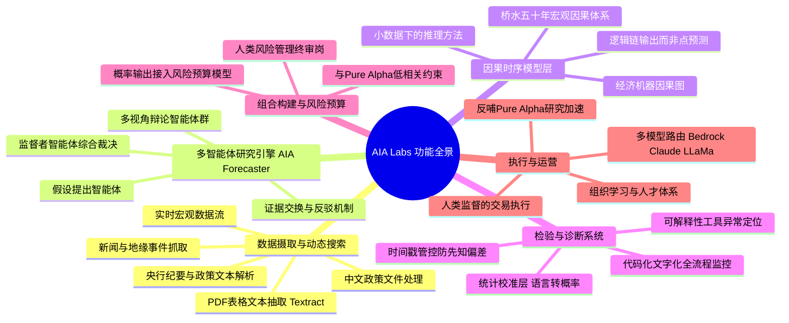

## 2.2 模块一：数据摄取与动态搜索

**工作机制**：AIA Forecaster 区别于静态 LLM 的第一原则是"动态搜索"——系统实时抓取央行会议纪要、通胀数据发布、地缘政治新闻，构建实时上下文环境，而不是依赖训练数据截止日之前的语料（B 级，国信证券）。在基础设施上，桥水使用亚马逊云 Bedrock 与 Textract 解析复杂 PDF 中的表格与文本，通过检索增强生成（RAG）匹配知识库答案，在无直接答案时基于现有数据推理新观点（C 级，新浪财经编译稿；AWS 与桥水的合作关系为 B 级，Business Insider 2025-02）。一个公开旁证是桥水曾公开招聘"中国政策 AI 研究助理"，职责是用 LLM 处理中文政策文件、提取核心信息、预测政策对资产的影响，年薪 16–22.5 万美元（C 级，新浪财经编译稿）。

**输入 → 处理 → 输出闭环**：原始非结构化信息（政策文本/纪要/新闻/数据发布）→ 解析与结构化（Textract/RAG/知识库）→ 带时间戳的语境包 → 供研究引擎消费。

**关键设计原则**：信息必须有严格时间戳，且只能以"该决策时点之前可得"的方式进入研究流程——这不是数据模块的局部设计，而是贯穿全链路的纪律（见模块四）。

**边界约束（什么不做）**：AIA 不做高频行情数据的毫秒级竞速——桥水是宏观策略机构，数据层的服务对象是"解释经济机器"，不是订单流博弈（推测）。

**如何抽象适配到其他行业**：任何行业的 Agent 数据层都可复用"动态搜索 + 严格时间戳 + 语境包"三件套。酒店行业对应物是 OTA 评价/竞对价格/本地事件的实时摄取；餐饮行业是外卖平台评价/食材行情/商圈事件。核心抽象是：**决策系统的数据层必须回答"这条信息在决策时点是否合法可得"，否则一切回测与复盘都被先知偏差污染**。

## 2.3 模块二：多智能体研究引擎（AIA Forecaster）

这是 AIA 最核心、也最被公开报道确认的模块。国信证券报告将其描述为"模拟投资委员会辩论过程的多智能体系统"（B 级）：

**工作机制流程**：

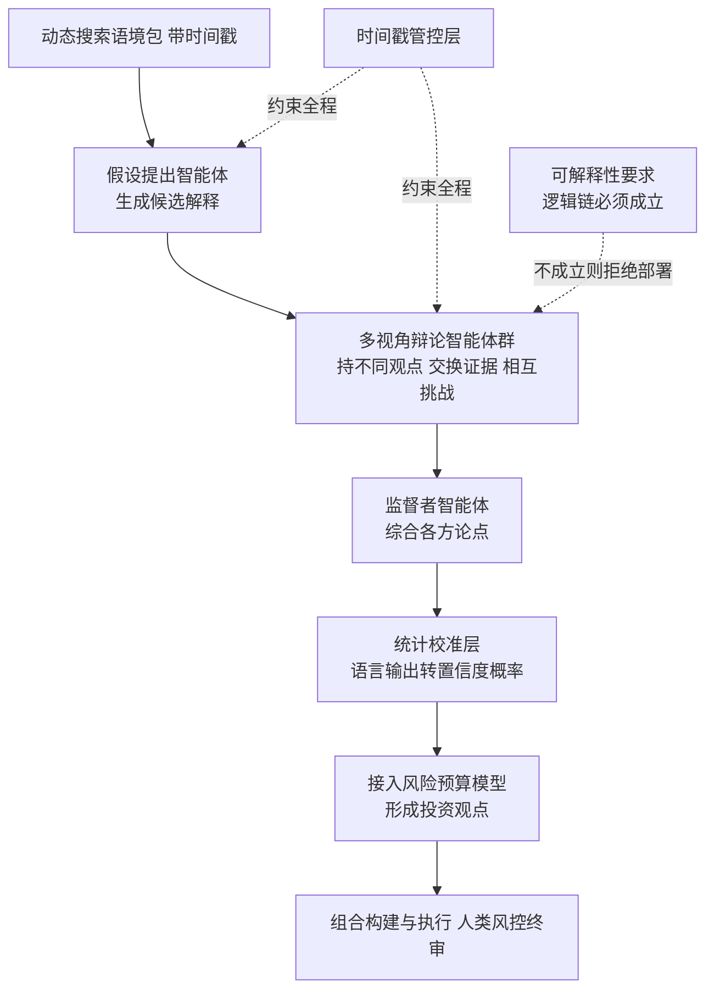

**关键设计原则**：

1. **辩论而非单答**。为避免大模型的幻觉与盲从，系统生成持有不同观点的智能体，通过证据交换相互挑战，最后由监督者智能体综合裁决（B 级）。这与 Man Group AlphaGPT 的实证发现互为印证：单次生成的 Alpha 因子初始 IC 仅 0.58%，引入"分析师"智能体多轮反馈后 IC 提升至 2.23%（B 级，国信证券引述 Man Group 内部检验）。
2. **解释是硬通货**。Man Group 的原则是"无法解释经济逻辑的信号，风控团队拒绝部署"（B 级）；桥水同样要求 AI 输出逻辑链条而非单一预测。解释性不是合规装饰，而是防过拟合的第一道防线。
3. **多轮迭代 > 单次生成**。单轮 LLM 产出质量平庸，角色分工+多轮自我修正才产生机构级质量——这是 2024–2025 年头部机构的共同实证结论。

**边界约束**：多智能体辩论服务于"形成对世界的解释"，不直接输出订单。研究引擎与执行之间有明确的风险预算与人类终审隔离（推测）。

**如何抽象适配到其他行业**：多智能体辩论模式可直接平移到任何"高代价判断"场景：酒店定价委员会的"收益经理 vs 渠道经理 vs 店长"辩论、医疗辅助诊断的多专科会诊、法律意见书的多律师交叉审阅。抽象要点：**用角色对立制造对抗性，用监督者角色收敛裁决，用解释性要求做准入门槛**。WorkLoom 的 Agent preset 机制（锚点：六装配槽之 Agent preset）天然支持这种班组化编排。

## 2.4 模块三：因果时序模型层

**工作机制**：桥水五十年的核心资产是对"经济机器如何运行"的因果理解——哪些宏观变量驱动哪些资产价格、传导链条是什么。AIA 不是抛弃这套资产改用纯 LLM，而是将桥水的因果时序模型与专业化、前沿语言模型组合（B 级，AI Street 2026-08-04 引述知情人士）。LLM 负责信息处理与推理，因果模型负责约束输出不违背经济学常识。

**关键设计原则**：因果律优先于统计相关性。国信证券报告指出，这种对因果的执着使桥水的 AI 系统在面对从未发生过的市场环境时，比纯粹依赖历史统计规律的模型更具稳健性（B 级）。这与 Two Sigma 的路径形成对照：Two Sigma 更推崇用深度学习捕捉极微弱非线性信号（单神经元深度学习、深度多任务学习、Transformer 时间序列改造，B 级，国信证券引述其 2024–2025 论文），两者代表了"因果白箱"与"模式黑箱"两条技术路线。

**边界约束**：因果模型层是桥水私有资产，不可外购——这也是 AIA 模式最难被复制的部分（推测）。

**如何抽象适配到其他行业**：每个成熟行业都有隐性的"因果体系"——酒店业的"RevPAR 驱动因子树"、餐饮业的"翻台率因果链"。Agent 系统进入行业时，应先把行业因果显性化为知识资产（WorkLoom 对应物：组织记忆 + 行业 Bundle 的档案 Schema，锚点：workdata 域与六装配槽之档案 Schema），再让 LLM 在因果约束内推理，而非裸奔。

## 2.5 模块四：检验与诊断系统

这是 AIA 体系中最具"机构级"成色、也最值得工程借鉴的模块：

1. **时间戳管控防先知偏差**。宏观预测最大的陷阱是"先知偏差"——模型在训练或回测时无意获知未来信息。桥水建立了极其严格的时间戳管控机制，确保 AI 模拟历史决策时只能看到该时点之前的信息（B 级，国信证券）。
2. **统计校准层**。桥水研究发现 LLM 往往过度自信或过度模糊，因此在系统末端引入统计校准层，把 AI 的语言输出转化为具有统计意义的置信度概率，使其可直接接入风险预算模型（B 级，国信证券）。Alpha Arena 的实测从反面印证了这一设计的必要性：模型自报置信度与实际交易表现脱钩（B 级，nof1.ai 技术博客）。
3. **可解释性工具与异常定位**。一旦出现异常信号能快速定位问题根源（C 级，新浪财经编译稿）。
4. **全流程监控**。所有 AI 生成的投资逻辑必须转化为可验证的代码与文字，纳入全流程监控——桥水内部称之为"安全花园"算法化体系（C 级，新浪财经编译稿，表述为二手编译，但方向与 B 级信源一致）。

**关键设计原则**：不信任任何单一模型输出；所有输出必须经过"校准—解释—留痕"三重处理才能进入决策。多模型路由（Bedrock 上调 Claude、LLaMa 等）避免单一模型偏见（C 级，方向与 B 级信源一致）。

**如何抽象适配到其他行业**："校准层"是最被低估的可复用设计。任何把 LLM 概率化输出用于资源分配的行业（酒店动态定价、信贷额度、库存补货）都需要一个统计校准层把"语言置信"翻译成"可计算的置信度"，否则风险预算模型无法消费 LLM 输出。

## 2.6 模块五：组合构建与风险预算（人机分工的责任界面）

**工作机制**：校准后的概率输出进入风险预算模型，形成投资观点与仓位；人类在风险管理、数据获取、交易执行三个岗位行使终审与监督（B 级，AI Street 2025-02-28）。桥水的人机分工不是"AI 建议人决定"，而是"AI 决定，人在三类岗位上约束 AI"——责任界面的设计方向完全反转。

**关键设计原则**：决策自动化，约束人工化。人类的职能从"做判断"变为"设计并维护判断系统的边界"。

**如何抽象适配到其他行业**：人机分工的通用抽象是三层——机器默认自治、规则划定边界、人类处理例外。这正是 WorkLoom 围栏引擎 auto/review/block 三级（锚点：fence-engine 域）的行业通用形态：auto=机器自治区，review=人类例外处理区，block=机器禁区。

## 2.7 模块六：组织与人才体系（被低估的功能模块）

AIA 从 6 人起步扩张至 75+ 科学家、工程师与投资者（B 级）；桥水推动数据科学家占投研团队比例提升至 18%，要求核心分析师必须掌握 AI 工具基础应用（C 级，新浪财经编译稿）。Jensen 公开表示新基金可能改变桥水的招聘策略和员工构成，让更多数据科学家加入（B 级，Fortune 2024-07）。

**关键设计原则**：AI 投资系统不是 IT 项目，而是组织物种的更替——人才结构、预算结构、汇报线都是功能的一部分。

**如何抽象适配到其他行业**：评估任何行业标杆的"AI 成色"，不要只看产品功能，看其组织报表：AI 团队是否独立建制、向谁汇报、预算多大、是否有权否决旧流程。组织设计是功能模块，不是背景信息。

## 2.8 功能设计共性原则提炼

纵观六大模块，AIA 体系呈现五条共性原则：

1. **AI 做执行，人做边界**：决策自动化、约束人工化（人机责任反转）。
2. **解释先于部署**：无法输出逻辑链的信号不得上线（防过拟合的制度化）。
3. **时间合法性先于一切**：时间戳管控是数据层、研究层、回测层的统一纪律。
4. **不信任单模型**：多模型路由 + 多智能体辩论 + 统计校准的三重不信任工程。
5. **体系 > 模型**：护城河在因果资产、工程纪律与组织设计，不在模型选择。

补充第六条隐性原则——**静默优于雄辩**：纵观 AIA 的全部对外信息，桥水从不公布策略细节、不展示回测曲线、不参与任何"AI 收益排行榜"，与零售侧产品把胜率数字贴满官网的做法形成极端对照。机构级的功能设计在传播上同样成立：真正对结果负责的系统，不需要用指标自我推销；它的沉默本身就是对出资人传递的纪律信号。这条原则对研判任何 AI 金融产品都有筛查价值——越是大声宣称收益数字的，越要追问其责任结构；越是克制披露、只展示机制与纪律的，越接近机构级成色。

## 2.9 功能成熟度矩阵

| 模块 | 状态 | 验证程度 | 置信度 |
|------|------|----------|--------|
| 数据摄取与动态搜索 | 已上线运营 | 实盘 2 年+，约 45 亿美元规模 | B |
| AIA Forecaster 多智能体研究引擎 | 已上线运营 | 年化 11.3%、低相关获 CEO 公开确认 | A/B |
| 因果时序模型层 | 已上线运营 | 五十年积累+AI 组合 | B |
| 检验与诊断系统 | 已上线运营 | 报告描述详尽，无第三方实证 | B |
| 组合构建与风险预算 | 已上线运营 | H1 2026 +8.1% 与 Pure Alpha 持平 | B |
| 反哺 Pure Alpha 研究 | 2026 年启动 | 知情人士口径，早期 | B |
| 面向外部输出平台/SaaS | 未见任何迹象 | 信息不足 | — |

**对 WorkLoom/老虎交易的差异化启示**：AIA 六大模块中，老虎交易已有对应物（六层决策管线、7 环行情降级链、WFA/DSR 防过拟合、模拟盘与 HTML 日报），缺口主要在三处——其一，**多智能体辩论式研究引擎**（AIA Forecaster 是单管线 vs 辩论制的差距）；其二，**统计校准层**（把策略置信度翻译成风险预算可消费的概率）；其三，**决策全链路的时间合法性审计**（可映射为五元事件的 RuleImpact 留痕，锚点：workdata 域）。老虎交易的反向优势在于：桥水把人机界面做成"岗位"，WorkLoom 把人机界面做成"产品"——审批卡片、清晨决策包、围栏三手势（锚点：review-console、night-shift 域）是机构用得起、个人也看得懂的责任界面。

## 2.10 横向模块参照：Trade Ideas Holly 的夜间进化循环

为校准"AI 决策系统"的另一种形态，本章补充零售标杆 Holly AI 的模块级拆解（来源：Trade Ideas 官网，B 级；insigtrade 2026-08-19 四周独立实测，B 级）。

**工作机制流程**：

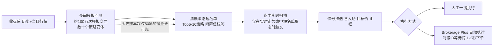

**关键设计原则拆解**：Holly 的架构哲学与 AIA 恰好相反——AIA 是"推理制"（解释世界再下注），Holly 是"进化制"（不解释世界，用海量模拟让有效策略自己浮出来）。每晚约 100 万次模拟交易构成一个廉价的演化引擎：策略库是基因库，历史数据是选择压力，次日短名单是适应度排行。这一形态的工程优点是简单可靠、可批量复制；理论弱点是完全不防过拟合之外的"体制切换"——当市场结构变化（如波动率 regime 切换），昨夜的选择压力就指向错误方向。独立实测提供了佐证：动量突破类策略胜率 64%，均值回复类仅 50%，测试窗口恰好是高波动小盘行情（B 级，insigtrade，32 笔样本）。

**责任结构**：Holly 出信号、用户自担盈亏，平台只卖订阅（$118–167/月，B 级）。信号→组合→执行→复盘的责任链在"用户脑子"里闭合，平台不触碰资金管理。这解释了它为什么能以零售价格存活：不担责任就不用付责任的成本（牌照、审计、资本充足）。对照之下，AIA 把整条责任链扛在自己身上，成本结构是 75 人顶级团队。两种形态之间——"比信号重、比全责任轻"的中间态——正是行业空白（详见末章空白归因）。

**如何抽象适配到其他行业**："夜间进化循环"是低成本 AI 产品的通用形态——利用业务低谷时段跑批量模拟/评估，清晨产出当日行动短名单。酒店行业对应"夜间跑竞对与库存模拟，清晨出定价建议"；餐饮行业对应"夜间跑备货模拟，清晨出采购单"。抽象要点：**进化制系统的产品界面只有两样东西——清晨短名单与触发式提醒**，其余复杂度全部藏在夜间批处理里。

## 2.11 横向模块参照：QuantConnect/LEAN 的事件驱动内核

LEAN 引擎（开源，GitHub 约 1.5 万 star，C 级；180+ 工程师贡献，B 级官网）代表了第三种形态："基建制"——不做决策、不产信号，只提供让一切策略可回测、可实盘的标准化轨道（B 级，PrivCo：实盘接 20 家券商、月名义交易量超 450 亿美元）。

**关键设计拆解**：LEAN 的内核是事件驱动架构——行情切片、订单成交、分红拆股等公司行为全部建模为事件流，策略代码以统一 API 订阅事件，回测与实盘共用同一事件总线。这一设计的深远影响是"回测即实盘"：同一份策略代码不经修改即可从十年历史回测切换到实盘下单，消除了"回测一套代码、实盘一套代码"这一量化行业传统断层。其 Algorithm Framework 再把策略拆为 Alpha（信号）/Portfolio Construction（组合）/Execution（执行）/Risk（风控）四个可插拔模块（B 级，lean.io），实质上是对"投资决策管线"的学术化标准分解。2025–2026 年 QuantConnect 推出 agentic AI 助手 Mia，让 AI 设计、回测、优化策略（B 级，PrivCo），标志着基建制玩家向决策制上游的试探。

**对主标杆的镜鉴价值**：把 LEAN 的四模块分解与 AIA 六模块对照，会发现 AIA 的创新集中在 LEAN 框架的"Alpha"环节（研究引擎+因果层+校准层），而组合、执行、风控环节两者结构相似——这印证了行业功能架构的收敛性：**AI 革命改变的是信号的生产方式，没有改变资金管理的基本结构**。

**如何抽象适配到其他行业**：事件驱动+"回测即实盘"的思想可平移为任何行业的"影子运行"模式：新策略先在历史事件流上重放（回测），再以影子模式并行真实业务流（模拟盘），最后接管真实动作（实盘）。三段切换共用同一事件总线是工程关键——WorkLoom 的 append-only 事件库（锚点：workdata 域）天然是这条总线，老虎交易的"先模拟盘后实盘"正是这一抽象的行业实例。

## 2.12 模块间数据流与一日运行时序（推测还原）

把 AIA 六大模块与 Holly、LEAN 两个参照系叠合，可以还原出一个"机构级 AI 投资者"的完整一日运行时序（推测，依据各模块公开机制拼装，用于指导老虎交易的管线对标）：

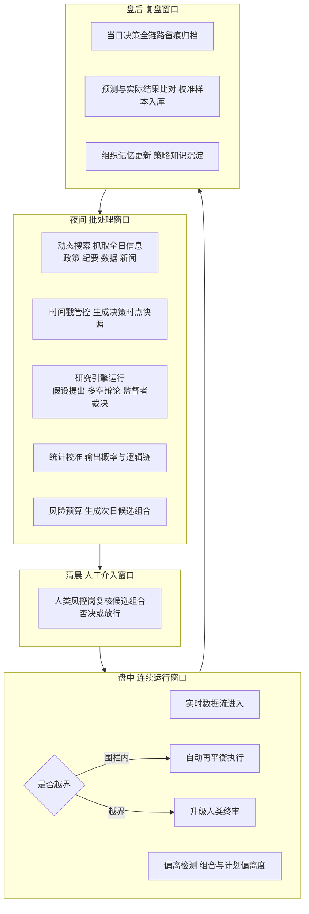

**运行时序的四个设计要点**：其一，重计算全部放在夜间批处理窗口——这与 Holly 的夜间进化、以及通用工程上的谷时算力调度（老虎交易对应物：model-router 谷时窗口，锚点：model-router 域）是同一经济逻辑，推理成本可压缩至峰时的五分之一以下。其二，人类介入被收敛到"清晨一个窗口"——桥水的人类三岗、Holly 用户的清晨短名单查看、夜班自治系统的清晨决策包（锚点：night-shift 域），三种形态共享同一人机节律：**机器在夜间工作，人类在清晨裁决，盘中只处理例外**。其三，盘中窗口的设计哲学是"计划偏离检测"而非"实时重新决策"——机构级系统盘中不做开放式思考，只监控现实与昨夜计划的偏离度，这大幅降低了实时推理的幻觉暴露面（推测，与 Alpha Arena 裸模型每 2–3 分钟开放式推理的脆弱性形成鲜明对照，B 级）。其四，盘后窗口的"预测-结果比对入库"是校准层的数据飞轮——没有日复一日的校准样本积累，统计校准层就是无米之炊。

**对老虎交易的模块级对标结论**：六层决策管线若按此时序重排，应明确切割四个窗口各自的算力预算与围栏级别——夜间 auto 为主（批处理无实时风险）、清晨 review 集中（人类在线）、盘中 block 兜底（异常即冻结）、盘后 auto+留痕（复盘不触资金）。窗口化是"24 小时运行"从口号变为可运营制度的关键设计。

**如何抽象适配到其他行业**："夜间批处理—清晨裁决—盘中例外—盘后飞轮"四窗节律适用于一切"人不能全天候在岗但业务全天候运行"的行业：酒店业（夜间调价/清晨店长复核/住中异常升级）、电商业（夜间重算推荐/清晨运营复核/大促期间例外处理）、制造业（夜间排产优化/清晨班组长确认/产线异常停机）。抽象要点是：**自治系统的可靠性不来自模型多强，而来自把开放式推理压缩进人类可复核的时间窗口**。

---

# 第三章 技术架构推测 + 目标客群与定价 + 与 WorkLoom 差异化竞争点

## 3.1 技术架构分层推测

**以下架构为基于公开信息的推测，非官方披露。** 依据：AI Street 2026-08-04（因果时序模型+专业化与前沿 LLM+检验诊断系统）、国信证券 2025-12-11（动态搜索/辩论/监督/校准/时间戳）、新浪财经 2026-01-19（Bedrock/Textract/多模型）、Business Insider 2025-02（AWS 合作）。

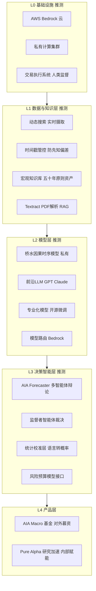

## 3.2 关键技术组件清单（推测实现方式）

| 组件 | 推测实现 | 置信度 |
|------|----------|--------|
| 多智能体编排框架 | 自研，角色化 prompt + 证据交换协议 + 监督者收敛；非通用框架如 LangChain 直接套用 | 推测（B 级事实支撑方向） |
| 统计校准层 | 历史预测-结果回归校准（Platt scaling/isotonic 类方法），将语言置信度映射为经验概率 | 推测 |
| 时间戳管控 | 事件溯源式数据存储 + 决策时点快照，回测时按快照重放 | 推测 |
| 模型路由 | AWS Bedrock 多模型调用 + 私有模型本地推理，避免单一供应商偏见 | B/C |
| 因果模型库 | 桥水五十年宏观研究代码化资产，形式未知 | 推测 |
| 审计留痕 | 内部称"安全花园"，AI 逻辑必须代码化文字化纳入监控 | C |

## 3.3 架构关键设计与 WorkLoom 对应机制对比

| AIA 关键设计（推测） | 设计意图 | WorkLoom 对应机制（锚点） | 差距判断 |
|----------------------|----------|---------------------------|----------|
| 时间戳管控，决策时点快照 | 防先知偏差 | 五元事件 append-only + SHA-256 哈希链（workdata 域）——事件自带不可篡改时间线 | 底座能力相当，需补"决策时点数据快照"行业层实现 |
| 统计校准层 | 语言置信→可计算概率 | 无现成对应，需作为行业 Skill 新建 | 明确缺口 |
| 多智能体辩论+监督者 | 防幻觉防盲从 | Quest 任务循环 + Agent preset 班组（runtime、六装配槽）可编排辩论制班组 | 机制具备，需设计辩论剧本 |
| 人类风控终审岗 | 责任界面 | 围栏引擎 auto/review/block + 审批三手势（fence-engine、review-console 域） | 产品化程度反超 AIA |
| 多模型路由防偏见 | 供应商中立 | model-router 谷时窗口/降级链/逐事件计量（model-router 域） | 底座能力相当且带成本治理 |
| 安全花园全流程留痕 | 可审计 | RuleImpact 留痕 + dry-run 回放 + 验链（workdata、fence-engine 域） | 底座能力相当，且验链可对外证明 |

**结论**：AIA 的架构精髓（时间合法性、校准、辩论、责任界面）与 WorkLoom 底座机制存在惊人的同构性——双方都独立得出了"唯一事实源+权限边界+例外人工"的机构级架构。差异在于 AIA 的智能深度（因果资产、校准层）在模型侧，WorkLoom 的智能深度在治理侧（围栏、审计、夜班自治）。老虎交易 = AIA 的模型侧能力（已有六层管线）× WorkLoom 的治理侧能力，这是两者互补而非竞争的关系。

## 3.4 目标客群分析

**AIA Macro 的客群画像**（B 级为主）：

| 维度 | 画像 |
|------|------|
| 业态 | 机构 LP：养老金、主权基金、捐赠基金、家族办公室、FOF |
| 门槛 | 对冲基金典型高门槛（数百万美元级起投，推测） |
| 核心诉求 | 与现有组合低相关的收益来源；对 AI 策略的配置敞口；桥水品牌背书 |
| 数字化程度 | 极高，尽调能力强，要求可解释与可审计 |
| 决策链 | 投资委员会集体决策，尽调周期 6–18 个月（推测） |

**客群演进**：Pure Alpha 时代服务传统宏观配置型 LP → AIA 时代新增"寻求 AI 敞口"的 LP 需求——部分 LP 把 AIA Macro 当作"AI 主题配置"的载体（推测）。

**与 WorkLoom/老虎交易目标客群的对比**：

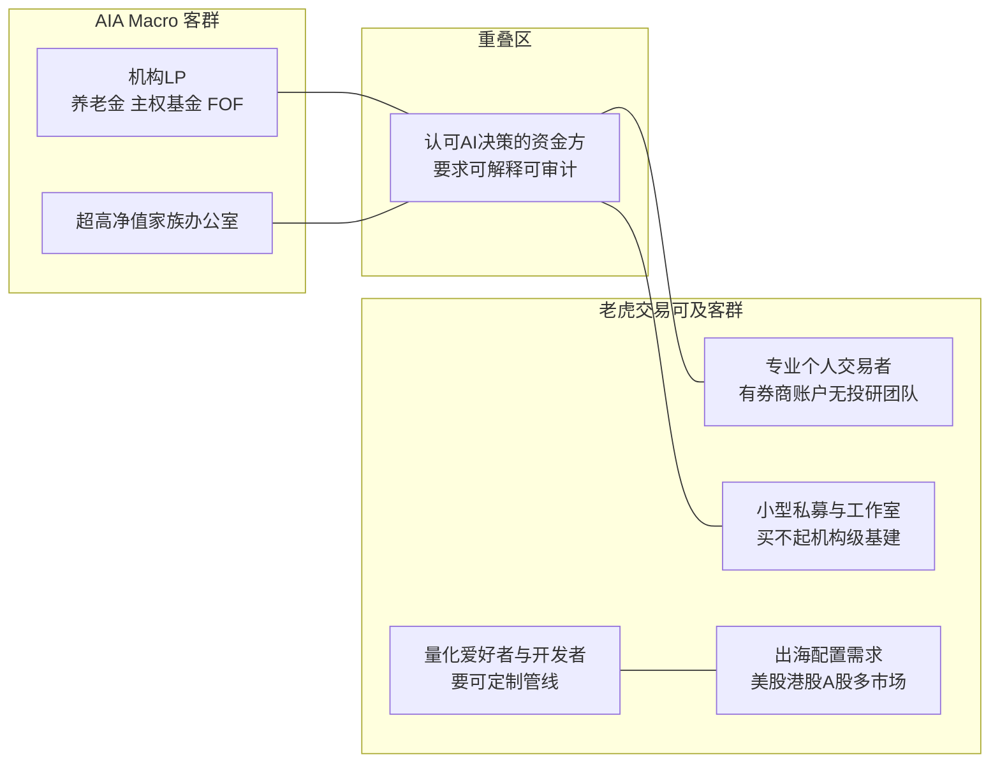

桥水独占机构 LP 市场（牌照、品牌、渠道壁垒）；老虎交易的可及市场是**机构级能力民主化**——把辩论制研究引擎、校准层、围栏化执行以订阅/平台形态交给买不起 45 亿美元基金入场券的资金方。这是经典的"高端颠覆"切入路径。

## 3.5 定价体系分析

**AIA Macro 定价**（推测）：公开渠道未披露费率，信息不足。按对冲基金行业惯例推测为 2% 管理费 + 20% 业绩报酬或其变体；桥水对 Pure Alpha 限制流入（B 级），说明其定价策略是"以稀缺性保业绩"，而非规模最大化。

**横向定价参照**：

| 产品 | 定价 | 模式 |
|------|------|------|
| AIA Macro | 推测 2/20 或类似 | 基金费率，与业绩绑定 |
| Two Sigma Venn | SaaS 订阅（机构级），2026 年售予 Insight Partners（A/B 级） | 因子分析 SaaS |
| QuantConnect | 云服务订阅+算力，营收 <1000 万美元（B 级，PrivCo） | 平台订阅 |
| Trade Ideas Holly | $118/月（Standard）/ $167/月（含 Holly AI）/ 年付约 $999；实时行情数据另计 $10–15/月；30 天退款保证（B 级，insigtrade 2026-08 实测） | 零售 SaaS 订阅 |
| Alpha Arena | 免费公开基准（实验性质） | 研究/营销 |

**定价启示**：行业存在三个价格带——基金费率（2/20，百万美元门槛）、机构 SaaS（年付数万至数十万美元）、零售订阅（$100–200/月）。**中间价格带（$500–5000/月，服务小型私募与专业个人）近乎空白**（推测，基于上述价格带扫描）。老虎交易可在此定价，且 WorkLoom 的逐事件计量能力（锚点：model-router 域）支持"按决策事件计费"等创新定价——把"AI 基金经理"从订阅制变成"按管理的决策次数/质量计费"。

## 3.6 与 WorkLoom 的差异化竞争点（核心产出）

**多维度系统对比**：

| 维度 | 桥水 AIA | WorkLoom/老虎交易 | 判势 |
|------|----------|-------------------|------|
| 决策智能深度 | 因果资产+辩论制+校准层，全球顶级 | 六层管线+WFA/DSR，需补辩论与校准 | AIA 强，老虎可追 |
| 治理与审计 | 内部安全花园，不对外开放验证 | 五元事件+哈希链+围栏三级，可对外证明 | 老虎反超 |
| 自治能力 | 24h 运行但人类三岗全程在岗 | night-shift 夜班围栏内自治+清晨决策包（锚点：night-shift 域） | 机制互补，老虎产品化更强 |
| 客群与渠道 | 机构 LP 封闭 | 开放平台，中小资金可及 | 不正面竞争 |
| 数据与行情 | 全球宏观全资产，机构级数据采购 | 7 环行情降级链，成本敏感 | AIA 强，老虎够用 |
| 多市场 | 全球宏观 | 美股/A股/港股三市场，A股程序化交易新规适配 | 老虎差异化 |
| 生态模式 | 封闭私有 | skills 三级市场，行业可沉淀策略为技能（锚点：skills 域） | 老虎独占 |
| 成本结构 | 75+ 顶级科学家，数千万美元级 | model-router 谷时费率≤20%，逐事件计量（锚点：model-router 域） | 老虎量级优势 |

**标杆优势（老虎需补齐）**：①辩论制研究引擎；②统计校准层；③因果知识资产的行业版（宏观因果图）；④实盘业绩记录（AIA 有 2 年+，老虎为 0）；⑤机构级数据采购。

**WorkLoom/老虎交易差异化优势**：①可验证的治理（哈希链验链 vs 内部黑话）；②产品化人机责任界面（审批卡片/清晨决策包 vs 岗位编制）；③三市场覆盖含 A股/港股（桥水宏观以全球为主，A股程序化新规下本土合规能力是壁垒）；④成本结构（谷时计量 vs 顶级团队薪酬）；⑤开放生态（策略可沉淀为 Skill 形成网络效应）。

**差异化竞争策略建议（五条）**：

1. **不碰机构 LP 市场，主打"机构级能力民主化"**。桥水的壁垒是牌照+品牌+渠道，正面竞争无胜算。把 AIA 验证过的责任结构（AI 主决策+人类边界岗）做成 $500–5000/月价格带的平台产品。执行方向：以 bundles 六装配槽（锚点：bundles/hotel 先例）开发 trading bundle——对象枚举（标的/仓位/订单/信号/研报/风控事件）、阶段枚举（模拟盘/小额实盘/扩量/回撤期）、Agent preset（研究员/辩手/监督者/风控官/执行员/巡检员）。
2. **把"可审计"做成第一卖点**。桥水的"安全花园"不可对外验证，老虎的每次决策有哈希链留痕、每次自动执行有 RuleImpact、每个夜班有决策包（锚点：workdata、fence-engine、night-shift 域）。面向 LP 尽调场景输出"决策可回放证明"，这是基金行业从未有过的产品。
3. **辩论制+校准层作为二期能力对标 AIA Forecaster**。执行方向：在六层管线中插入"多空辩论智能体对+监督者裁决"环节；把 WFA/DSR 的统计输出升级为校准层，输出可直接进入仓位计算的概率。先模拟盘积累校准样本，再实盘。
4. **A股/港股合规围栏作为本土壁垒**。2025-07-07 施行的程序化交易实施细则（A 级）要求报告管理、高频认定、异常交易监控——这些天然是围栏规则的用武之地（锚点：fence-engine 域，YAML 围栏包）。把监管条文翻译成可执行的围栏包，是海外标杆做不到、国内同行没做的空白。
5. **用模拟盘→实盘的双阶段做信任冷启动**。对标桥水"先用 1 亿美元自有资金跑一年"的信任策略：老虎交易以模拟盘公开账本（哈希链可验）积累 6–12 个月可验证业绩，再开放实盘。HTML 日报升级为清晨决策包形态（锚点：night-shift 域），把"日报"从信息展示升级为"已完成/待审批/需介入"的责任界面。

**如何抽象适配到其他行业**：差异化分析通用步骤——先按"智能深度/治理深度/客群渠道/生态开放度/成本结构"五轴打分；标杆在智能深度强的，你用治理+开放生态错位；标杆在渠道强的，你用价格带空白错位。任何行业都有"机构级能力民主化"的空位，因为头部标杆必然向高客单价收敛。

## 3.7 收费模式的经济学比较：三种钱，三种命

把本报告覆盖的全部标杆按"赚什么钱"归类，可以得到三种商业模式的经济学画像（推测，基于各模式公开财务特征推演）：

**第一种钱：业绩的钱（桥水 AIA、Citadel、Two Sigma、Millennium）。** 收入与投资收益挂钩（管理费+业绩报酬），上限极高——桥水约 1020 亿美元 AUM，按行业惯例费率推算年收入量级在十亿美元级（推测）；代价是收入波动大、必须维持顶级人才密度、且规模有策略容量天花板（Pure Alpha 限制流入即容量见顶的证据，B 级）。赚业绩的钱本质是"用资本杠杆放大智力"，要求你已经站在智力金字塔尖。

**第二种钱：工具的钱（QuantConnect、Trade Ideas）。** 收入与订阅挂钩，稳定可预测，但与用户盈亏脱钩。天花板清晰：QuantConnect 营收不足 1000 万美元（B 级，PrivCo）——量化工具的全球付费人群就那么几十万；Trade Ideas 靠 $167/月的定价支撑（B 级），独立实测明确指出"账户低于约 1.5 万美元的用户订阅费占比过高，不划算"（B 级，insigtrade），等于自我设限了客群。赚工具的钱本质是"卖铲子"，不承受回撤，但也分不到金矿。

**第三种钱：通道的钱（Alpaca、IB）。** 收入与交易量/账户数挂钩，随市场活跃度波动但旱涝保收。Alpaca 以自清算券商 API 服务 200+ 伙伴、40+ 国（B 级），并在 2025 年 RWA/代币化浪潮中成为底层通道（A/B 级，C+ 轮 5200 万美元）。通道生意的护城河是牌照与清算资格——纯监管壁垒，与 AI 无关，但 AI 产品的落地全部要经过它。

**第四种可能的钱：责任的钱（行业空白，推测）。** 即"为决策过程的可审计性收费"——不卖业绩（避免牌照与容量问题）、不卖工具（避免天花板）、不卖通道（避开牌照壁垒），而是向中小资金方收取"AI 决策链的治理与证据"费用：每一次决策的留痕、每一份可回放的审计报告、每一条围栏的执行证明。这种模式在基金行业尚无先例，但其逻辑与其他行业的"合规即服务"（如食品溯源、药品 GMP 数据完整性服务）同构。其成立的前提假设是：中小资金方愿意为"向自己的出资人/自己证明决策质量"付费——这一假设需要 MVP 验证（推测，标注为待验证假设）。

## 3.8 从差异化到落地：老虎交易 Bundle 装配清单建议（承接 3.6）

依据 WorkLoom 六装配槽机制（锚点：bundles/hotel 先例与兜底摘要），将 3.6 的五条差异化策略翻译为可执行的装配清单草案（本节为方案性建议，细节交由技能三落地设计）：

1. **档案 Schema 槽（一标的/账户一档）**：标的档案（基本面快照、所属行业因果链、历史决策引用）、账户档案（风险预算、合规市场权限、费率结构）。每份档案的每次修订写入五元事件，保证尽调可回放。
2. **对象与阶段枚举槽**：对象枚举——标的/信号/研报社群/仓位/订单/风控事件/组合/报告八类（对齐酒店 Bundle 的八类对象结构）；阶段枚举——观察期/模拟盘/小额实盘/扩量期/回撤管制期五阶段，阶段切换必须过围栏。
3. **工具集槽（MCP 优先，每动作标注读/写）**：行情读取（7 环降级链接入）、券商 API（读持仓/读成交/写订单）、研报解析、公告抓取、回测引擎调用。写类动作一律经 registerWriteActions 注册并绑围栏。
4. **围栏包槽（核心差异化资产）**：基线围栏建议——单笔订单金额占比上限、单日累计交易次数上限（对齐 A股程序化交易报告要求）、回撤触发降杠杆、新股/财报静默期禁开仓、模拟盘阶段一切写动作 auto 但实盘首月一切写动作 review、A股/港股/美股三市场各自的监管规则包。客户 patch 只可收紧（锚点：基线单调守卫）。
5. **Agent preset 槽（辩论制班组）**：研究员 Agent（动态搜索+假设提出）、多空辩手 Agent 对（证据交换）、监督者 Agent（综合裁决+校准层调用）、风控官 Agent（独立否决权，只读+否决两权限）、执行员 Agent（唯一可写订单的 preset，且未声明 fence_bindings 禁止写动作，锚点：兜底摘要六装配槽规则）、巡检员 Agent（只读巡检，异常分级推送，锚点：inspection 域）。
6. **工作台 UI 槽**：清晨决策包三栏（已完成/待审批/需介入，锚点：night-shift 域）、组合仪表盘、决策回放页（五元事件时间线+哈希验真）、围栏命中日志页。

**装配清单的设计逻辑**：把 AIA 验证过的智能侧设计（辩论、校准、时间戳）装进 1/2/5 槽，把行业空白的治理侧设计（围栏、审计、责任界面）装进 3/4/6 槽——前者追平标杆，后者创造差异化，两者通过同一份事件流焊为一体。

## 3.9 风险与失败模式预案（差异化策略的自我保护）

差异化策略若不给失败模式留预案，就只是乐观清单。以下五种失败模式按发生概率与杀伤力排序（推测）：

**失败模式一：模拟盘到实盘的"滑点断崖"。** 独立实测显示 Holly 的隔夜回测胜率比次日实盘高 5–10 个百分点，差异来自滑点与部分成交（B 级，insigtrade）。老虎交易若用模拟盘业绩做营销，实盘首期用户的收益落差会直接击穿信任。预案：模拟盘引擎必须内置保守滑点模型与流动性约束，对外披露时统一使用"含摩擦成本"口径；公开账本分列"毛收益/净收益/摩擦成本"三栏，把桥水不敢公开的东西做成透明卖点。

**失败模式二：辩论制班组的算力成本失控。** 多智能体辩论+多轮迭代的 token 消耗是单管线的数倍（Man Group 的实证同样隐含这一成本，推测）。若不加治理，辩论制会从差异化资产变成成本黑洞。预案：辩论深度按信号价值分级——常规调仓单轮通过，仅高金额/高不确定性决策触发完整辩论；配合谷时窗口调度与逐事件计量（锚点：model-router 域），使每笔决策的算力成本可核算、可定价。

**失败模式三：校准层在样本不足时给出虚假精确。** 统计校准依赖历史预测-结果样本，冷启动期样本不足时输出的"概率"是伪精确，比不校准更危险。预案：校准层设置样本量门槛（参照 Holly 实测中"历史样本超 50 笔的策略显著更可靠"的经验，B 级），样本不足时降级为区间表述而非点概率，并在界面上显著标注"校准样本积累中"。

**失败模式四：A股合规细节的动态变化。** 程序化交易细则 2025 年 7 月施行（A 级），执行口径、报告字段、异常交易认定仍可能在窗口指导中微调。围栏包若一次性写死，规则过期即合规风险。预案：围栏包版本化管理（锚点：fence-engine 版本快照），设立"监管跟踪"巡检项（锚点：inspection 域），监管文件更新触发围栏包评审 Quest（锚点：runtime 域），保证规则与监管同步。

**失败模式五：用户把"AI 基金经理"理解为"保本承诺"。** 零售客群的认知风险是行业通病——Trade Ideas 用 30 天退款保证对冲（B 级），其本质也是预期管理。预案：产品文案与界面全程使用"决策过程可审计"而非"收益可预期"表述； onboarding 强制完成风险认知确认并留痕；日报与决策包中固定展示最大回撤与置信区间，把风险披露做成产品结构而非合规附件。

**预案清单的共性**：五种失败模式的应对都不是"更强的模型"，而是"更诚实的工程"——保守的摩擦假设、分级的算力预算、样本门槛、版本化规则、结构化的风险披露。这与桥水的经验一致：机构级产品的护城河是对失效场景的管理深度。

## 3.10 客群深描：三类典型用户画像与待办任务（JTBD）

定价与差异化最终要落到具体的人。基于 3.4 的客群对比与 3.7 的价格带分析，为老虎交易可及市场刻画三类典型用户（推测，基于竞品客群公开特征合成）：

**画像一：独立专业交易者（"个人 PM"）。** 35–50 岁，自有资金 20–200 万美元，盈透/嘉信/雪盈账户，交易美股与期权，部分有港股通。白天有本职或半退休，晚上复盘。核心待办任务："让我睡觉时组合不出事，醒来十分钟看懂昨夜发生了什么并拍板。"他们现在用 TradingView+Excel+券商自带的条件单拼装工作流，订阅过 1–3 个信号服务但对"黑箱信号"失望——Trade Ideas 的独立实测者正是这个画像（B 级）。付费意愿：愿意为"看得懂的自动化"付 200–500 美元/月，前提是可先用模拟盘验证三个月。风险点：对回撤极度敏感，一次超出预期的回撤即流失；对合规措辞敏感，害怕"代客理财"定性。

**画像二：小型私募/家族工作室（"三五人基金"）。** 管理 500 万–5000 万元人民币等值资金，2–5 人团队，覆盖 A股+港股或美股中概。核心待办任务："我们请不起桥水 75 人的团队，但 LP 尽调越来越问'你们的 AI 与风控体系是什么'——给我一个拿得出手的答案。"他们的真实痛点不是缺策略，而是缺"体系化证据"：决策流程文档、风控记录、合规报告，目前靠兼职运营手工拼凑。付费意愿：1000–5000 美元/月，按"替代半个合规运营人力"算账即成立（推测，参照国内私募运营人力成本）。风险点：决策链长，需要合伙人共识；对数据主权敏感，倾向本地部署或专有云（对应多租户 vpc 版本，锚点：tenancy 域）。

**画像三：量化开发者/研究者（"策略手艺人"）。** 25–40 岁，QuantConnect/聚宽/米筐的重度用户，会写 Python，有自己的信号研究但缺工程化执行与风控。核心待办任务："我的策略回测很好，但实盘纪律一塌糊涂——开盘手抖改参数、回撤扛不住提前停。把我的策略关进制度的笼子。"这类用户是 QuantConnect 的基本盘（B 级，社区规模佐证），也是最可能演变为"策略供给方"的人群——其策略经验若以技能形式沉淀并在平台内流通，即形成生态网络效应（锚点：skills 域）。付费意愿：个人 50–200 美元/月，但对"策略上架分成"类生态机制的估值远高于订阅费本身。风险点：对平台锁定敏感，要求数据与策略可导出；对开源与透明有信仰，闭源黑箱会被社区抵制。

**三类画像的共性收敛**：三个画像的待办任务可以收敛为同一句话——"**让决策在我不在场时依然守规矩，并在我回来时给我证据**"。这句话正是主标杆桥水用 75 人团队与三岗制度为机构 LP 解决的问题，也是价格带空白（3.5/3.7）背后的真实需求。三类画像的差异只在证据的形式：个人 PM 要"十分钟能看完"，小私募要"能拿给 LP 尽调"，开发者要"能导出能验证"。同一套决策留痕内核，三种证据界面——这为产品分层定价提供了用户需求侧的正当性。

**如何抽象适配到其他行业**：客群深描的 JTBD 收敛法——先按"钱从哪来、痛在哪、凭什么信你"画 3 类画像，再把各自待办任务压缩成一句话，检验三句话是否收敛为同一内核。收敛则产品立得住（一个内核多种界面），发散则说明你在用同一产品服务三个不同市场，应拆分。酒店行业的收敛句可能是"让店长不在店时经营依然守规矩"，与本行业的同构性一目了然。

---

# 第四章 行业趋势判断

## 4.1 行业演进时代划分

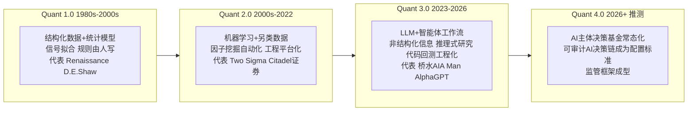

依据：国信证券 2025-12-11 明确提出"Quant 3.0"概念——传统量化（1.0/2.0）依赖结构化数据与统计模型解决信号拟合与执行效率，新一轮升级把非结构化信息处理、推理式研究、代码与回测工程化纳入同一条可迭代投研链路（B 级，券商研究结论）。Quant 4.0 为推测。

## 4.2 演进路径五阶段推演（2024–2030，推测为主）

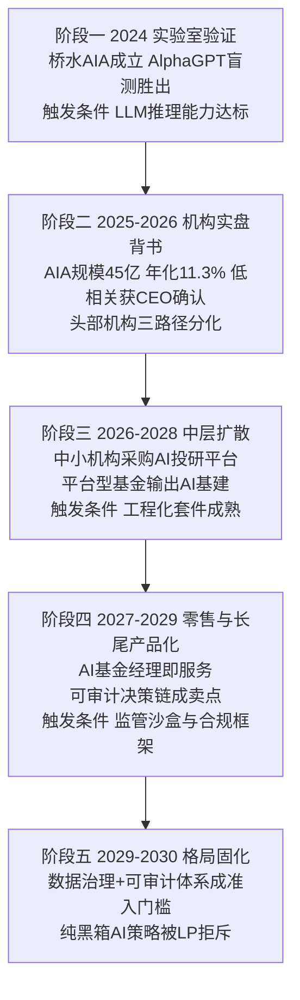

## 4.3 "AI 替代"判断：什么会被替代，什么不会

**会被替代的部分**（判断依据：国信证券三路径报告 + AlphaGPT 实证 + Citadel 工程实践）：

- 初级研究员的信息整理、纪要摘要、数据清洗工作（AlphaGPT 盲测 8.16 分 vs 人类初级研究员 6.81 分，胜率 86.6%，B 级）
- 量化策略的样板代码、单元测试、文档编写（Citadel Securities 工程师 100% 使用 Cursor，C 级，黄仁勋访谈引述）
- 单一策略的例行监控、对账、报告生成
- 零售投研工具中的"静态筛选器"品类（被 AI 动态扫描替代，Trade Ideas Holly 每夜 100 万次模拟回测即为例证，B 级）

**不会被替代的部分**：

- 极端不确定性、地缘政治突变等非量化场景的终极判断（Jensen：投资是关于概率的练习，AI 提升概率优势但无法替代人类应对极端场景，B 级，NBIM 播客）
- 因果体系与私有语境资产的原创构建（Two Sigma 论文、桥水因果库均需顶级人才）
- 受托责任与合规签字——法律意义上的责任主体必须是人（推测）
- LP 关系与募资信任

**SaaS 厂商转型路径**：行情/筛选器 SaaS（Finviz 类）→ 被 AI 信号层侵蚀；回测平台（QuantConnect 类）→ 转型为"AI 策略工场"（其已推出 agentic AI 助手 Mia，B 级，PrivCo）；机构平台（Venn 类）→ 因子与分析能力被并购整合（Venn 售予 Insight Partners，A/B 级）。

## 4.4 行业格局预判（未来 1–3 年）

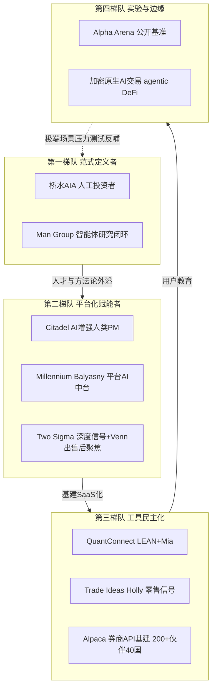

**判断依据**：国信证券"三路径终局趋同"结论——数据治理与私有语境理解、工程化迭代机制、可解释与可审计体系成为比单一模型性能更重要的护城河（B 级）。格局上，第一梯队不卖产品只卖基金份额；第二梯队卖基建给内部团队；第三梯队卖工具给大众；三者不构成直接竞争，真正的战争发生在"谁先把可审计的 AI 决策链做成行业标准"。

## 4.5 对 WorkLoom 的战略启示

1. **卡位第三梯队头部、向第二梯队输出**：老虎交易定位"AI 基金经理即服务"，吃第三梯队升级红利（Holly 类工具用户长大后的下一站），同时以 Bundle 形态向小型私募输出"可审计 AI 决策链"基建（锚点：六装配槽）。
2. **把"可解释+可审计"做成准入卡而非功能**：行业终局的门票是可审计体系，WorkLoom 的哈希链+围栏（锚点：workdata、fence-engine 域）是现成的门票，务必产品化为对外可验证的证据链。
3. **抢 A股/港股合规窗口**：2025-07-07 程序化交易新规（A 级）制造了海外标杆进不来的本土窗口期，合规围栏包是时间敏感型机会。
4. **以夜班自治打"24 小时"心智**：美股/A股/港股三市场接力=真正的全天候，night-shift 的围栏内自治+清晨决策包（锚点：night-shift 域）是"AI 基金经理不睡觉"的产品化表达，对标桥水的人类三岗轮班成本优势巨大。
5. **警惕 Alpha Arena 揭示的 LLM 原生脆弱性**：顺序偏差、术语歧义、规则博弈、自报置信度脱钩、手续费侵蚀（B 级，nof1.ai）——裸 LLM 直接交易不可行，必须有管线约束+围栏+校准。这从反面验证了老虎交易"六层管线+围栏"路线的正确性。

## 4.6 反方观点与风险清单（对趋势判断的压力测试）

任何趋势判断都必须经受反方质询。以下是针对本章乐观推演的五条反方观点及调研组的裁决：

**反方一："AIA 的 11.3% 年化只是宏观 beta 的运气好。"** 2024–2026 年全球宏观波动率处于历史高位（伊朗战事、央行政策分化），趋势跟随类宏观策略普遍丰收——Pure Alpha 同期 +33–34%（A 级）即是证明。AIA Macro 的收益可能并非"AI 能力"，而是"宏观策略品类在正确年份的收益"。**裁决**：部分成立。区分 AI 能力与品类 beta 需要至少一个完整回撤周期的数据；但"与人类策略低相关"这一点（A 级，CEO 公开发言）独立于收益方向，是更难伪造的证据。对老虎交易的含义：业绩归因披露（多少来自 beta、多少来自决策质量）必须内置在产品里，否则第一个回撤周期就会遭遇信任危机。

**反方二："多智能体辩论只是把 LLM 的不确定性包装成流程。"** Alpha Arena 的实证表明，裸 LLM 在真实资金下行为脆弱：Gemini 2.5 Flash 会钻规则空子且外露思考与内部思维链不一致（B 级）。辩论制是否只是把同样的脆弱性变成了多数表决？**裁决**：辩论制的价值不在"多数表决"，而在"证据交换迫使推理显性化"——Man Group 的实证（IC 从 0.58% 提升到 2.23%，B 级）是独立证据。但辩论制必须配合时间戳管控与统计校准才构成完整防线，单独使用辩论制是半成品。

**反方三："零售 AI 基金经理面临不可逾越的合规与牌照壁垒。"** 在中国大陆，证券投资咨询、资产管理均有严格牌照要求；向美国用户提供自动化交易建议也触及 SEC 投资顾问注册边界。**裁决**：成立且必须前置处理。可行路径是产品定位为"用户自有资金的技术工具"（类似 QuantConnect/Alpaca 的工具定性）而非"资产管理人"，决策权形式保留在用户手中（审批手势即法律意义的最终确认），但该定性需专业法律意见确认（信息不足，此处不构成法律建议）。

**反方四："巨头下场会碾死中间层。"** 券商（盈透、Robinhood、富途）与终端（TradingView、Bloomberg）若内置免费 AI 决策功能，独立工具商将重蹈 Venn 覆辙。**裁决**：部分成立。历史经验是巨头内置的多为"信号层"而非"决策责任链"——因为决策责任意味着合规成本与品牌风险，巨头倾向回避。责任链（审计、留痕、审批）恰恰是巨头最不愿碰、也最难以免费化的部分。

**反方五："AI 交易拥挤化会消灭 alpha 本身。"** 当所有机构都用同类 LLM 分析同类信息，信号趋同、拥挤交易、集体失效。**裁决**：这是 Quant 2.0 因子拥挤的 AI 版重演，方向成立。护城河因此不在"用不用 LLM"，而在私有语境资产（桥水的因果库、Citadel 的内部研究语料）与决策流程的独特性。对老虎交易的含义：用户私有数据与私有决策历史的沉淀（组织记忆）必须成为产品的核心价值主张之一。

## 4.7 标杆研究的元教训（方法论沉淀）

本次调研对"如何调研一个 AI 原生标杆"沉淀四条元教训，供后续行业复用：

1. **区分"叙事时间"与"工程时间"**。桥水的 AI 叙事始于 2024 年 7 月的 20 亿美元募资新闻，但工程时间始于 2018 年聘请首席科学家、乃至 2010 年代初 Jensen 的思考。调研任何 AI 标杆，先找其"工程起点"（关键招聘、专利、论文、内部测试），叙事起点往往滞后 3–5 年。用叙事时间评估竞争窗口会系统性低估先发者的壁垒。
2. **用"责任结构"而非"功能列表"判断 AI 成色**。判断一个 AI 金融产品是真 AI 决策还是营销包装，问三个问题：谁对亏损负责？人类在哪个环节可以否决？否决记录是否留痕？桥水的答案是"AI 主决策、人类三岗、制度留痕"，Trade Ideas 的答案是"AI 出信号、用户自担盈亏"，两者是完全不同的物种。
3. **业绩数据必须同时索取"相关性"维度**。AI 基金的收益数字本身信息量有限，与人类策略、与品类 beta、与市场指数的相关性结构才是 AI 是否产生增量的关键证据。桥水 CEO 选择强调"不相关"而非收益率，是内行的表述方式；调研时应把相关性数据列为一级证据。
4. **竞品宣称的组织数据用"时间序列"校验**。本次调研中 AIA 团队规模出现"20 人"（2026-01 中文编译稿）与"75+ 人"（2026-08 一线报道）两个数字，管理规模（约 45 亿美元 vs 约 50 亿美元）也有口径差异。处理原则：以更近时间、更接近一手来源的数字为准，旧数字标注为时点快照而非冲突错误——快速扩张期的组织数据天然过期。

## 4.8 2026–2028 关键观察指标清单（趋势跟踪用）

趋势判断要可检验。以下八个指标建议纳入季度跟踪，任一指标触发即应重估本报告第四章结论：

1. **AIA Macro 的回撤表现**：若其在下一个宏观逆风期显著跑输 Pure Alpha 或同类宏观指数，则"AI 主体决策"叙事受损（当前证据：H1 2026 +8.1% 打平，B 级）。
2. **AIA 规模增速**：45 亿美元之后若连续两个季度停滞或缩水，说明 LP 复购意愿不足（当前：两年从 20 亿增至约 45 亿，B 级）。
3. **第二批 AI 叙事基金的募资与存活率**：2026–2027 年必然出现的模仿者中，存活率低于三成则验证"工程纪律才是真门槛"的判断（推测阈值）。
4. **监管落地**：美国 SEC 是否出台 AI 投资决策的披露或审计细则；中国程序化交易细则的执行案例数量（2025-07-07 施行，A 级）。任一落地都会抬升合规能力溢价。
5. **巨头内置化进度**：盈透、Robinhood、富途、TradingView 是否上线原生 AI 决策功能（不止于信号）。一旦上线，零售信号商（Trade Ideas 类）估值逻辑生变。
6. **模型供应商动向**：OpenAI/Anthropic 是否推出金融决策垂直产品或直接参与资管（当前：仅作为供应商与桥水合作，B 级；Jensen 为两家公司早期投资人，B 级）。供应商下场是上游变对手的最大威胁。
7. **Alpha Arena 后续赛季**：若引入工具调用与多智能体编排后的赛季中，工程化 harness 持续跑赢裸模型，则"管线>模型"判断再获实证（当前 S1：裸模型 Qwen3-Max +22.32% 夺冠但行为脆弱性大量暴露，B 级）。
8. **中国本土对标物出现**：国内私募或券商是否推出公开的"AI 基金经理"产品。第一个合规落地者将定义本土市场的产品形态与监管默契。

## 4.9 中国市场的特殊性深析（A股/港股维度的趋势补充）

老虎交易覆盖美股/A股/港股三市场，而中国市场的结构与欧美存在五点根本差异，趋势判断必须单独展开（事实部分 A/B 级，推演部分为推测）：

**差异一：投资者结构以散户为主体，监管以保护公平为先。** 沪深北程序化交易细则明确"立足于中小投资者占绝大多数这个最大国情市情"（A 级，上交所发布稿），监管目标是"降低程序化交易相对普通投资者的过度优势"。这意味着在中国市场，速度优势型（高频）策略的政策天花板持续压低，而研究质量型（中低频、基本面增强）策略不在监管打击面内——老虎交易选择"AI 研究驱动"而非"速度驱动"的路线，恰好落在政策鼓励的方向上（推测，与细则文本导向一致）。

**差异二：报告制为合规自动化创造了制度接口。** 细则要求程序化交易投资者履行报告义务（账户信息、策略类型、交易行为特征），并对高频交易设定认定标准与差异化收费（A 级）。报告制意味着合规不再是"出事后解释"，而是"持续结构化披露"——这天然适合由系统自动生成。能把自己的交易行为实时翻译为监管报告格式的系统，等于把合规成本从人工后台转为软件功能，这是中国市场的特殊机会（推测）。

**差异三：量化行业刚经历出清，信任重建期正是新品类窗口。** 2024 年小微盘流动性危机后，国内量化私募集体降杠杆、收缩规模、转向中低频与基本面（B 级，行业共识性报道）。LP 与渠道对传统"黑箱量化"的信任尚未修复，市场对"透明、可解释、可监控"的新形态有真实饥渴——这与全球层面"可审计成为准入项"的趋势（第四章 4.2/4.4）在中国叠加放大。

**差异四：港股市场是中外规则的缝合带。** 港股既有国际化的资金结构与做空机制，又与内地监管协同加深（港股通南向资金占比持续抬升，B 级方向性事实）。跨美/A/港三市场的系统必须在同一决策内核上挂三套规则包——交易时段、涨跌幅、T+0/T+1、做空约束、信息披露要求各不相同。三市场统一不是营销话术而是真实的工程复杂度来源，也是单一市场玩家难以快速跟进的壁垒（推测）。

**差异五：中文政策语境是本土 AI 的天然数据壁垒。** 桥水为中国政策文件专门招聘 LLM 研究助理（C 级，薪资 16–22.5 万美元），说明海外机构理解中文政策语境的成本极高。央行表述、国务院文件、行业监管函件中的措辞微调（"稳健的货币政策"到"适度宽松的货币政策"这类变化）携带巨大信息量，而通用英文模型对此不敏感。本土系统在中文政策语义上的积累是不可外购的私有语境资产（推测，与第四章"私有语境理解能力是护城河"的行业结论互证）。

**中国市场趋势小结**：政策压制速度竞争、报告制奖励披露自动化、信任危机饥渴透明化、三市场缝合制造工程壁垒、中文语境构成数据壁垒——五个力量同向指向"合规透明的中低频 AI 决策系统"这个形态。老虎交易若把合规自动化做成一等公民而非事后补丁，在中国市场的窗口期优于任何海外标杆。

## 4.10 品类命名之争："AI 基金经理"还是一个新名词

趋势判断的最后一环是品类认知。一个新物种的市场命运，一半取决于它被称为什 么（推测，基于品类战略常识）：

**候选命名一："AI 基金经理"（AI Fund Manager）。** 优点是一秒听懂、心智占位强；缺点是把产品锚定在"基金"这个强监管词上，牌照联想与合规预期随之而来，且"经理"一词暗示对结果负责，抬高用户收益预期。桥水官方刻意使用"Artificial Investment Associate（人工投资助理）"而非"AI 基金经理"——Associate 是"同事"而非"经理"，暗示它是团队中的一员而非负责人，这个命名把责任归属语言精确地控制在"助理"层级（推测，命名意图分析）。

**候选命名二："自动交易系统"（Automated Trading System）。** 优点是监管上归属清晰的工具品类；缺点是完全无法传达"研究-决策-执行-复盘"全链路的代际差异，与二十年前的 EA（Expert Advisor）混为一谈，自降身价。

**候选命名三："AI 操盘手/数字交易员"。** 人格化强、传播友好，但强化了"替代人"的焦虑叙事，且对机构买家显得轻浮。

**候选命名四：造新词。** 如桥水造"AIA"（Associate）、Alpha Arena 造"Live Benchmark"。新词的代价是教育成本，收益是品类定义权——一旦新词被接受，定义者就永久占据品类原点。

**命名判断**：面向零售与专业个人的传播层，"AI 基金经理"作为品类描述词（而非产品名）利大于弊——它准确传达了"全链路责任"的差异化定位；面向监管与合同层，应采用"投资决策辅助系统""自动化交易工具"等保守表述，与桥水"Associate"的谨慎一脉相承。双层命名（对外传播用强心智词、合规文本用弱责任词）是该行业玩家的普遍实践（推测，参照各标杆官网措辞差异）。品类教育的核心句建议锚定一句可验证的对比："信号工具告诉你买什么，AI 基金经理给你看每一个决策为什么发生、谁批准的、结果如何"——把品类差异落在责任链而非智能程度上。

---

# 末章 零基线视角——行业本体论

> 本章为行业本体视角的独立底稿：剥离任何特定产品底座的滤镜，回答"AI 投资与自动化交易系统这个行业本来是什么样"。章内不引用任何本项目自有底座能力，结论对任何进入者均有效。

## 5.1 标杆的纯行业坐标

### 5.1.1 产业链位置图

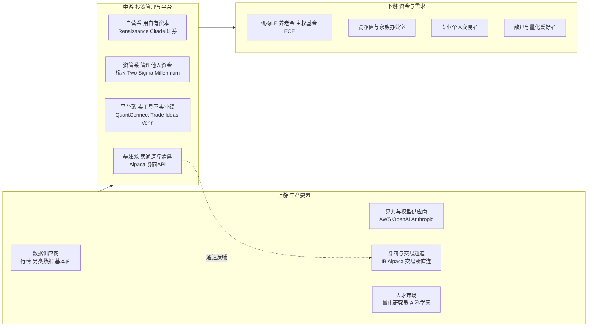

### 5.1.2 食物链位置与生态位关系

**桥水 AIA 的位置：资管系中游顶端，"技术自用型"。** AIA 不向产业链任何一环销售产品，其技术完全内化，产出物只有基金份额。生态位上，它与上游是采购关系（买数据、买模型 API、买云），与下游是募资关系，与同行在"募资端"竞争（抢 LP 的配置额度）而在"技术端"不竞争（谁也不卖技术）。护城河构成：五十年因果研究资产 + 品牌 + LP 渠道 + 建制化团队。天敌有三：①连续 2–3 年业绩平庸导致 LP 赎回（对冲基金商业模式的结构性天敌，管理费养不起 75 人顶级团队）；②模型供应商自建资管（OpenAI 等若直接下场，上游变对手，目前无迹象，信息不足）；③监管对 AI 决策的穿透式审查导致合规成本陡增（推测）。

**Citadel / Millennium / Balyasny 的位置：资管系中的"平台化组织者"。** 多 PM 平台制的本质是"人才与策略的孵化器"——中心提供 Central Book、风控、数据、合规基建，数百个 pod 团队在其上交易。护城河是规模经济：统一基建成本被数十个 pod 摊薄，业绩稳定性吸引资金，资金吸引人才，形成正循环（B 级，百度百家号 FOF 研究 2026-06）。天敌：①pod 明星 PM 出走自立门户（行业常态性失血）；② Central Book 集中风险的尾部事件；③策略拥挤导致全平台相关性抬升。

**Two Sigma 的位置：数据科学驱动的资管系，曾试图向平台系跨界。** Venn 平台是"Alpha 能力 SaaS 化"的尝试——把 18 因子风险模型卖给其他机构投资者，同时收集投资者行为数据反哺自营（B 级，国信证券）。2026 年 1 月 Venn 售予 Insight Partners（A/B 级，P&I 报道），标志着"自营资管对外输出 SaaS"的跨界模式阶段性退潮——利益冲突（客户不愿把组合数据交给一个自营交易对手）是结构性死结（推测，但方向与交易事实一致）。

**QuantConnect 的位置：平台系工具商，"量化界的 GitHub+云"。** 不碰资金、不卖业绩，LEAN 引擎开源（GitHub 约 1.5 万 star，C 级）换社区生态，云服务与数据收费，实盘通道接 20 家券商、月名义交易量超 450 亿美元（B 级，PrivCo）。营收不足 1000 万美元、员工 11–50 人（B 级）说明工具系的天花板远低于资管系——卖铲子不如挖金子，但卖铲子不承受回撤风险。天敌：①AI 编程助手普及使"回测平台"的学习价值贬值（其已推出 agentic 助手 Mia 自救，B 级）；②券商原生 API 体验提升（Alpaca 等）挤压中间层；③社区免费策略质量平庸化。

**Trade Ideas 的位置：平台系零售信号商。** 2003 年成立、2018 年叠加 Holly AI，商业模式是零售订阅（$118–167/月，B 级）。生态位要害：它是"信号的生产者"但"不对信号结果负责"——订阅费与盈亏脱钩。护城河是 23 年的实时扫描基础设施 + 每夜百万次模拟回测的数据飞轮。天敌：①券商/终端厂商（TradingView、富途、Robinhood）内置免费 AI 信号；②用户发现胜率无法覆盖订阅费+滑点后的流失（独立实测 59% 胜率，B 级，但小样本）；③LLM 原生交易助手绕过筛选器形态。

**Alpha Arena（nof1.ai）的位置：产业链边缘的"公开基准/裁判"。** 不交易自有资金（每模型 1 万美元实验性质）、不卖产品，产出是公开排行榜与行为研究（B 级）。生态位价值在于给全行业提供"裸模型实盘能力"的可核验参照系——其 S1 结果（Qwen3-Max +22.32% 夺冠，B 级，2025-11）同时揭示了裸 LLM 的脆弱性。天敌：基准被厂商针对优化（Goodhart 定律），失去中立性。

### 5.1.3 竞争/互补关系总览

| 关系对 | 性质 | 说明 |
|--------|------|------|
| 桥水 AIA ↔ Citadel/Two Sigma | 募资端竞争、技术端互不可见 | 抢同一批 LP 的配置额度，技术路线互相保密 |
| 桥水 AIA ↔ Man Group | 范式同盟 | 同属"智能体驱动研究"路径，互为外部合法性证明 |
| QuantConnect ↔ Trade Ideas | 客群分层互补 | 自建策略者 vs 买信号者，几乎不重叠 |
| Alpaca ↔ QuantConnect/Trade Ideas | 上下游互补 | 通道层服务工具层，QuantConnect 实盘经券商通道 |
| 自营系 ↔ 资管系 | 人才与策略的竞争 | Renaissance 式封闭自营与资管系互相挖人 |
| 基准方（Alpha Arena）↔ 全体 | 中立裁判 | 为"裸模型能力"提供公共度量 |

## 5.2 赛道格局的纯行业推演

按行业自身四大驱动力推演：

**驱动力一：技术代际。** LLM 推理能力每 12–18 个月一代际跃迁，而金融适配工程（校准、时间戳管控、防过拟合）滞后约 2 年。推论：当前（2026 年）处于"能力超前、工程补课"阶段，先补齐工程纪律的机构吃代际红利——这正是桥水 2023 年建 AIA Labs 的窗口逻辑（B 级事实+推测）。

**驱动力二：资本周期。** 对冲基金行业资金正向多策略平台与"有 AI 叙事"的基金集中：2025 年 Pure Alpha +33–34%（A 级）、Citadel Wellington +10.2%（B 级），桥水总 AUM 约 1020 亿美元（B 级）。LP 为"低相关 AI 阿尔法"支付溢价的意愿已被验证。推论：未来 2 年会出现第二批"AI 叙事基金"募资潮，其中多数缺乏真工程能力，将在第一个回撤周期出清（推测）。

**驱动力三：监管框架。** 美国 SEC 对 AI 披露与利益冲突的审查趋严（方向性事实，A 级）；中国沪深北程序化交易细则 2025-07-07 施行（A 级），确立报告制+高频认定+异常监控框架；欧盟 AI Act 将部分金融 AI 列入高风险（方向性事实，A 级）。推论：可解释、可审计、可报告的 AI 决策链将从"加分项"变为"准入项"，合规能力成为新一轮分层的筛子（推测，但三地监管方向互证）。

**驱动力四：供需结构。** 需求侧，机构 LP 要"不相关阿尔法"，零售要"买得起的机构级能力"；供给侧，顶级 AI+金融复合人才稀缺（桥水一个中国政策 AI 研究助理岗年薪 16–22.5 万美元，C 级）。推论：人才稀缺会把"机构级 AI 能力"推向产品化——只有把能力封装成产品的玩家才能突破人才约束服务长尾（推测）。

**格局推演图（2026–2029）**：

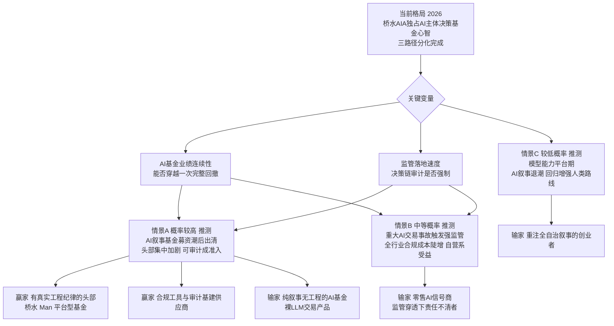

**输赢名单（推测）**：赢家画像——拥有私有语境资产（因果库/因子库/私有数据）、工程化迭代机制、可审计体系的机构；输家画像——把 LLM 直接包装成交易员的裸模型产品、无量化风控纪律的 AI 叙事基金、依赖信息不对称的零售信号商。

## 5.3 已满足/未满足需求对照（空白归因）

以行业用户需求为锚盘点：

**已被标杆满足的需求**：

| 需求 | 满足者 | 满足方式 |
|------|--------|----------|
| 机构 LP 的 AI 阿尔法敞口 | 桥水 AIA | 封闭基金，2 年实盘记录 |
| 顶级机构的内部研究提效 | Citadel/Point72/Millennium | 内部平台，不对外 |
| 个人量化者的回测实盘一体化 | QuantConnect | 开源引擎+云 |
| 散户的 AI 交易信号 | Trade Ideas Holly | 订阅信号+半自动执行 |
| 裸模型实盘能力的公共参照 | Alpha Arena | 免费公开基准 |
| 策略开发者的交易通道 | Alpaca/IB | 券商 API |

**未满足的需求（空白）与归因**：

| 空白需求 | 归因 | 分析 |
|----------|------|------|
| 面向中小资金的"完整 AI 基金经理"（研究-决策-执行-风控-报告全链，非信号、非工具） | **做了不经济 + 利益冲突** | 头部机构有能力做，但服务小资金的合规成本与客单价不匹配（不经济）；且头部若平台化输出决策能力，会稀释自身策略容量与信息优势（利益冲突，Venn 出售即为先例） |
| 可对外验证的 AI 决策审计链（LP 尽调可复用） | **没人想到（工程形态未出现）** | 桥水的"安全花园"是内部制度，无法移植；行业缺一个"审计链即产品"的供给者。LLM 时代之前没有低成本实现留痕+验真的技术栈，2024 年后才具备条件 |
| 跨市场（美/A/港）统一合规自动化交易 | **利益冲突 + 市场分割** | 美国工具商不懂 A股程序化新规，中国工具商受牌照约束无法碰美股；跨三市场者需同时消化三套监管，先行者成本极高 |
| AI 决策的统计校准公共件（语言置信→风险预算概率） | **没人想到（学术工程断层）** | 桥水自研自用，学术界有校准研究但无工程化开源件，工具商无动机做（用户不直接感知） |
| 24 小时无人值守的责任界面（人睡觉时谁批单子） | **做了不经济（机构用排班解决）** | 大机构用全球三班倒人类团队覆盖，产品化"夜间自治+清晨复核"的需求只存在于无排班能力的中小资金方 |
| 策略知识的可交易市场（研究员经验的资产化） | **利益冲突** | 策略即 alpha，公开交易即失效；只有以"流程技能"而非"信号"为交易单位才可行，行业尚无此抽象 |

## 5.4 标杆事实总表

| 标杆 | 产业链位置 | 模式本质 | 行业逻辑下的胜率判断 | 留下的需求空白 |
|------|-----------|----------|----------------------|----------------|
| 桥水 AIA | 资管系顶端，技术自用 | 把五十年因果资产+LLM 封装为"人工投资者"，卖基金份额 | 高：工程纪律+品牌+低相关卖点成立；天敌是业绩连续性与人才成本 | 不输出平台、不服务中小资金、审计链不可移植 |
| Man Group AlphaGPT | 资管系，研究体系改造 | 多智能体闭环生产可解释因子，人类风控否决 | 高：实证扎实（盲测胜率 86.6%，B 级）；规模化待验证 | 同上，能力封闭 |
| Citadel | 资管系平台化组织者 | 中心基建+pod 团队，AI 增强人类 PM | 高：规模经济正循环；天敌是尾部风险与 PM 流失 | 不向下渗透，小机构买不起 |
| Two Sigma | 资管系数据科学派 | 深度信号挖掘；曾以 Venn 跨界 SaaS | 中高：信号挖掘稳，但 SaaS 跨界已退潮（Venn 出售，A/B 级） | 平台化输出路径被证伪一半 |
| Millennium/Balyasny | 资管系平台中台 | 去中心化团队+中心化 AI 基建 | 高：与 Citadel 同构 | 基建不对外 |
| QuantConnect | 平台系工具商 | 开源引擎+云+社区，卖工具不卖业绩 | 中：生态健康但营收天花板低（<1000 万美元，B 级） | 不做决策智能，只做工作台 |
| Trade Ideas Holly | 平台系零售信号商 | 每夜百万次模拟进化信号，订阅收费 | 中低：与盈亏脱钩的订阅模式脆弱，巨头内置化威胁大 | 信号→组合→执行的责任链断裂 |
| Alpaca | 基建系通道 | 自清算券商 API，200+ 伙伴 40+ 国（B 级） | 中高：RWA/代币化红利（C+ 轮 5200 万美元，A/B 级） | 不碰决策层 |
| Alpha Arena | 边缘基准方 | 公开实盘基准+行为研究 | 作为企业低，作为公共品高 | 无商业化路径（信息不足） |

## 5.6 行业经济学：三种钱的成本结构与本章空白的再验证

（本节为零基线视角，仍以行业自身事实为锚。）

把行业里三种主流收入模式的成本结构摊开对比，可以更清楚地看到末章 5.3 所列空白为什么长期无人填补（推测，基于公开财务特征推演）：

**业绩型玩家（桥水、Citadel、Two Sigma）的成本曲线**：成本随"智力密度"增长——顶级研究员、数据采购、算力，桥水 AIA 一个 75 人团队的年度人力成本估计在数千万美元级（推测，参照行业薪酬水平与公开招聘薪资）。这类玩家的边际理性选择永远是"把同样的智力投给更大的资金"，因为智力成本是固定的，管理 45 亿美元与管理 450 亿美元的人力差异不大。服务中小资金对他们而言不是不能，是同样的成本赚千分之一的钱——这就是"做了不经济"的精确含义。

**工具型玩家（QuantConnect、Trade Ideas）的成本曲线**：成本随"工程与获客"增长，与用户盈亏无关。QuantConnect 以 11–50 人团队撬动月 450 亿美元名义交易量的通道（B 级，PrivCo），人效极高，但营收天花板被付费人群锁死（不足 1000 万美元，B 级）。工具型玩家有能力向上游决策层走（Mia 助手即试探，B 级），但每向上走一步，就离"对结果负责"近一步，合规成本与品牌风险指数级上升——他们在责任边界前会主动停下。

**通道型玩家（Alpaca、券商）的成本曲线**：成本随"牌照与清算合规"增长，与交易量弱相关。通道商的理性是绝不碰决策——决策责任会污染其赖以生存的监管关系。

**空白的再验证**：三类玩家的成本曲线在"决策责任"这一点上都存在结构性排斥——业绩型嫌小客户不经济，工具型怕责任污染模式，通道型怕责任污染牌照。于是"为中小资金承担决策责任链"的位置被三方同时让出。这不再只是"没人想到"，而是"想到的人成本结构不允许"。能填这个位置的玩家必须满足一个反常识条件：**用工程把决策责任的边际成本压到接近零**——留痕、审计、审批、报告全部自动化，使"负责任"本身成为可规模化的产品而非人力服务。LLM 与事件溯源架构成熟之前，这个条件在物理上不成立；这正是该空白在 2024 年之前从未被认真挑战的根本原因（推测，作为行业本体层面的归因补充）。

## 5.7 历史镜鉴：从 LTCM 到 AIA，机器决策的旧伤痕与新纪律

行业本体视角必须包含历史记忆，否则会把每一轮技术叙事都当成新事物（本节史实 A 级，类比为推测）。

1998 年长期资本管理公司（LTCM）的崩塌是"聪明人+模型+杠杆"组合的第一次系统性失败：两位诺奖得主坐镇、华尔街最深厚的精英网络、数学上严密的收敛交易模型，在俄罗斯的尾部事件面前四个月清零，最终由美联储协调十四家银行注资接盘。LTCM 留下的行业本体教训有三条，每一条都构成检验当代 AI 基金的试金石：

**教训一：模型的失败不是算错，而是假设世界的形态不变。** LTCM 的模型在统计上并没有错，它错在假设流动性永远存在、相关性结构永远稳定。对照今天：桥水强调因果推理而非模式匹配（B 级），正是对这一教训的直接回应——因果链条在市场结构变化时比统计相关更可能存活；而 Two Sigma 式的深度信号挖掘（B 级）则选择了另一条路：承认模型会失效，靠信号的多样性与快速迭代对冲单一信号死亡。两条路线没有对错，但"声称自己的 AI 不会遇到体制切换"的玩家，可以直接判定为没有吸取 LTCM 的教训。

**教训二：杠杆把模型的容错空间变成零。** LTCM 崩盘的技术触发点不是亏损本身，而是高杠杆下保证金追缴的死亡螺旋。当代 AI 基金的杠杆水平普遍不透明（信息不足），这是 LP 尽调中最该追问的问题。Alpha Arena 的实验从零售侧给出旁证：允许 20 倍杠杆的裸模型交易中，仓位规模与风险管理能力完全脱钩——Qwen3-Max 的仓位常是其他模型的数倍（B 级），其夺冠收益与最大风险暴露无法分离评价。任何不披露杠杆约束的 AI 交易系统，其收益数字都不应被采信（调研组判断）。

**教训三：精英密度不能替代制度冗余。** LTCM 拥有当时华尔街最高的智商密度，缺的是一个"有权让模型闭嘴"的制度。对照今天，行业新纪律的雏形已经出现：桥水的"人类管风控、AI 逻辑必须代码化纳入监控"（B/C 级）、Man Group 的"无法解释经济逻辑的信号风控拒绝部署"（B 级）、Millennium 的"沙箱化运行+权限控制+审计流程"（B 级）。这三家的共同点是**把否决权制度化**——否决权不属于某个聪明人的判断，而属于预设规则的自动执行。这是 LTCM 时代不存在、而被本轮 AI 浪潮真正补上的东西，也是判断任何 AI 投资系统成熟度的核心指标：问它的系统里，谁能在不经过任何人的情况下让一笔交易不发生。

**镜鉴小结**：LTCM 的旧伤痕对应行业的三条新纪律——因果/多样性对抗体制切换、杠杆透明化、否决权制度化。用这三条新纪律逐一检点本报告覆盖的标杆：桥水 AIA 三条齐备（B 级为主），Man Group 具备一与三，零售侧产品三条基本全缺。历史镜鉴的最终结论与末章 5.3 的空白归因汇合：行业缺的不是更聪明的模型，而是把三条纪律产品化后带给中小资金的供给者。

## 5.8 章末关系声明

本报告第一至四章为竞争参照视角：以本项目自有底座能力为参照系度量标杆，底座迭代后差异化部分需重做。本章为行业本体视角：所有坐标、推演、空白归因与事实总表均以行业自身事实为锚，不依赖任何特定产品底座，底座迭代时本章无需返工，可作为任何进入者复用的行业底稿。

---

# 附录：多竞品横向对比矩阵

> 本附录用于避免单一标杆视角偏差，覆盖 9 个竞品/参照系。数据置信度逐格标注；"—"表示不适用。

## 附表一：基本信息与模式对比

| 维度 | 桥水 AIA | Citadel | Two Sigma | QuantConnect | Trade Ideas | Man Group | Millennium | Alpaca | Alpha Arena |
|------|----------|---------|-----------|--------------|-------------|-----------|------------|--------|-------------|
| 成立/启动 | 2023（AIA Labs，B 级） | 1990（A 级） | 2001（A 级） | 2011（B 级） | 2003（B 级） | 1783/AHL 1987（A 级） | 1989（A 级） | 2015（B 级） | 2025（B 级） |
| 规模 | AIA 约 45 亿美元（B 级）；集团约 1020 亿（B 级） | AUM 约 630 亿美元（B 级） | AUM 约 600 亿美元（B 级） | 营收 <1000 万美元（B 级） | 未披露，订阅制（信息不足） | 上市，AUM 约 1700+ 亿美元级（信息不足，推测） | AUM 约 640 亿美元（B 级） | C+ 轮 5200 万美元（A/B 级） | 实验性，每模型 1 万美元（B 级） |
| 模式本质 | AI 主体决策基金 | 多 PM 平台+Central Book | 数据科学资管+曾试 SaaS | 开源回测实盘平台 | AI 信号订阅 | 智能体研究闭环 | 去中心化 pod+AI 中台 | 券商 API 基建 | 公开基准 |
| 决策主体 | AI 主决策，人类三岗（B 级） | 人类 PM，AI 增强（B 级） | 模型+人类治理（推测） | 用户策略 | AI 信号+人执行（B 级） | AI 出因子，人类否决权（B 级） | 各 pod 自主（推测） | — | 裸 LLM 自治（B 级） |
| AI 深度 | 辩论制+校准+因果（B 级） | 信息处理增强（B 级） | 深度时序模型（B 级） | Mia 助手起步（B 级） | 夜间进化回测（B 级） | AlphaGPT 多智能体（B 级） | 平台级中台（B 级） | — | 无工程约束（B 级） |
| 可审计性 | 内部安全花园（C 级） | 内部权限审计（推测） | 内部（信息不足） | 开源代码可审（A 级） | 信号历史可查（B 级） | 解释性强制（B 级） | 沙箱+审计（B 级） | 合规清算记录（A 级） | 全程公开（A 级） |

## 附表二：能力雷达（1–5 分，调研组基于公开信息的评分，推测性质）

| 能力轴 | 桥水 AIA | Citadel | Two Sigma | QuantConnect | Trade Ideas |
|--------|----------|---------|-----------|--------------|-------------|
| 研究智能深度 | 5 | 4 | 4 | 2 | 2 |
| 工程与回测严谨 | 5 | 5 | 5 | 4 | 3 |
| 产品化与开放性 | 1 | 1 | 2 | 5 | 4 |
| 治理与可审计 | 3 | 3 | 3 | 4 | 2 |
| 零售/中小可及性 | 1 | 1 | 1 | 4 | 4 |
| 成本效率 | 2 | 2 | 2 | 4 | 4 |

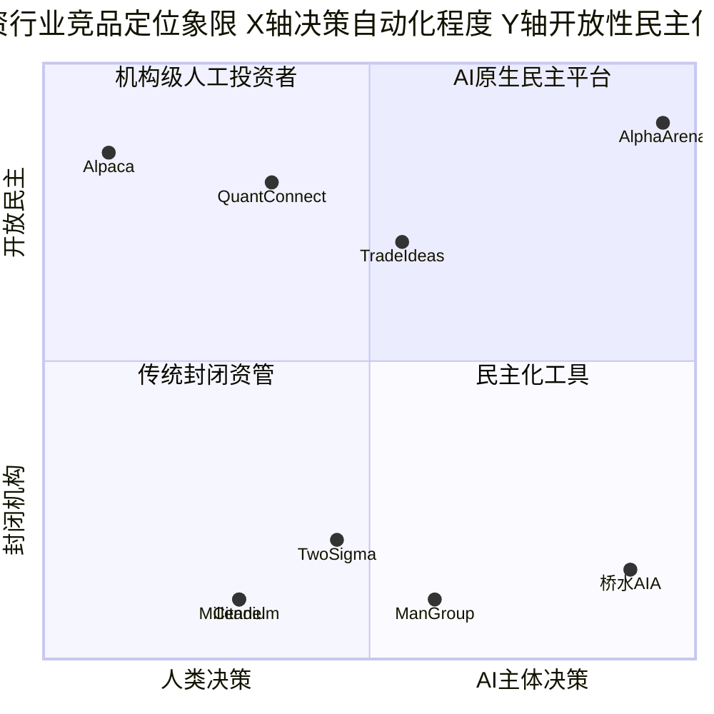

**象限解读**：右上象限（AI 主体决策 × 开放民主）目前只有实验性的 Alpha Arena，是名副其实的无人区——它证明需求存在（公众关注度极高）也证明难度存在（裸模型脆弱性）。任何能用工程纪律把 AI 主体决策安全地带入开放市场的玩家，将独占该象限。

## 附表三：关键事件时间线（2024–2026，置信度逐条标注）

| 时间 | 事件 | 置信度 |
|------|------|--------|
| 2023 | 桥水成立 AIA Labs，6 人起步 | B |
| 2023 末 | Pure Alpha 内部约 1 亿美元测试 AIA 策略 | B |
| 2024-07-01 | AIA 基金对外开放，起步近 20 亿美元 | A |
| 2024-10 | Dalio 公开称"只在脑子里做决策已过时" | B |
| 2025-03 | CEO Bar Dea 确认 AIA 产生"不相关独特阿尔法" | A |
| 2025-04-03 | 沪深北发布程序化交易实施细则 | A |
| 2025-04 | Alpaca 完成 5200 万美元 C+ 轮 | A/B |
| 2025-07-07 | 程序化交易实施细则施行 | A |
| 2025-11-03 | Alpha Arena S1 收官，Qwen3-Max +22.32% 夺冠 | B |
| 2025-12-11 | 国信证券发布"对冲基金 AI 三路径"研究 | A（报告存在） |
| 2025 全年 | Pure Alpha +33–34% 创纪录；Citadel Wellington +10.2% | A / B |
| 2026-01-14 | Two Sigma 出售 Venn 予 Insight Partners | A/B |
| 2026 年中 | AIA 规模约 45 亿美元、团队 75+ 人、年化 11.3%；H1 2026 AIA 与 Pure Alpha 同为 +8.1% | B |
| 2026-08-19 | 独立实测 Holly AI 四周 59% 胜率 | B |

## 附表四：A股/港股生态补充（老虎交易覆盖市场，供格局佐证）

| 事实 | 置信度 | 对格局的含义 |
|------|--------|--------------|
| 沪深北《程序化交易管理实施细则》2025-07-07 施行，含报告管理、高频认定标准、四类异常交易行为细化 | A | 中国量化进入"强报告+可监控"时代，合规即门槛 |
| 监管导向为"趋利避害、突出公平"，降低程序化交易对普通投资者的过度优势 | A | 高频速度竞争受抑，中低频研究型 AI 策略迎来政策红利期 |
| 国内私募量化 2024 年经历小微盘流动性危机后集体降杠杆、转向中低频（行业共识性报道） | B | 与全球 Quant 3.0"研究智能"方向合流 |
| 港股通/美股通道的中国出海配置需求持续增长（方向性事实） | B | 跨市场统一决策平台的需求真实存在且无主流供给 |

## 附表五：技术栈与供应商对比（推测为主，逐格标注）

| 维度 | 桥水 AIA | Man Group | Citadel | QuantConnect | Trade Ideas |
|------|----------|-----------|---------|--------------|-------------|
| 云/算力 | AWS Bedrock（B/C 级） | 未披露（信息不足） | 多云+自建（推测） | 自建云+本地 LEAN（B 级） | 自建桌面+Web（B 级） |
| 前沿 LLM | OpenAI/Anthropic/Perplexity（B 级） | GPT-4 系（B 级） | 未披露（信息不足） | Mia 助手（B 级） | 自研算法为主（B 级） |
| 开源模型 | LLaMa 等（C 级） | 未披露 | 未披露 | 用户自带 | — |
| 私有模型 | 因果时序模型（B 级） | 因子库（B 级） | 内部嵌入/检索（推测） | — | Holly 进化引擎（B 级） |
| 回测/验证 | 时间戳管控+校准（B 级） | 盲测+IC 检验（B 级） | 内部体系（推测） | LEAN 事件驱动（A 级开源） | 夜间百万次模拟（B 级） |
| 执行通道 | 机构 PB（推测） | 机构 PB（推测） | 自有 Citadel Securities 生态（推测） | 20 家券商集成（B 级） | Brokerage Plus 接 IB 等（B 级） |
| 审计留痕 | 内部安全花园（C 级） | 解释性强制（B 级） | 权限审计（推测） | 代码开源可审（A 级） | 信号历史公开（B 级） |

## 附表六：关键术语表（供后续方案设计统一口径）

| 术语 | 定义 | 本报告语境 |
|------|------|-----------|
| AIA / AIA Labs | Artificial Investment Associate，桥水 2023 年成立的人工投资助理实验室（B 级） | 主标杆主体 |
| AIA Macro | AIA 旗下对外募资的宏观基金，2024-07-01 开始交易（A 级） | 主标杆产品 |
| AIA Forecaster | 模拟投资委员会辩论的多智能体预测系统（B 级，国信证券） | 主标杆核心模块 |
| AlphaGPT | Man Group 的多智能体因子生成系统（B 级） | 范式同盟参照 |
| Central Book | 多 PM 平台基金的中心化头寸簿，主动调节全平台风险敞口（C 级） | Citadel 模式核心 |
| Pod Shop | 多经理人平台基金，中心基建+独立交易小组（B 级） | 行业组织形态 |
| 先知偏差（Look-ahead Bias） | 回测/训练中无意使用决策时点之后的信息 | 时间戳管控的靶标 |
| 统计校准 | 把模型输出的置信表述映射为经验上准确的概率 | AIA 检验层核心 |
| WFA / DSR | 滚动前推分析 / 平减夏普比率，防过拟合统计方法 | 老虎交易已有能力 |
| Pod/围栏/夜班/决策包 | 本项目自有底座概念，见文档头部底座上下文小节 | 差异化落点 |
| 程序化交易实施细则 | 沪深北交易所 2025-07-07 施行的监管规则（A 级） | A股合规基线 |
| Goodhart 定律 | 指标一旦成为目标便失去测量价值 | 基准方天敌 |

## 附表七：核心信息源清单与置信度总览（溯源用）

| 信源 | 时间 | 性质 | 支撑的关键结论 | 置信度 |
|------|------|------|----------------|--------|
| AI Street《How Bridgewater Is Building an Artificial Investor》 | 2026-08-04 | 一线深度报道（前 Bloomberg 记者，引述知情人士） | AIA 6 人起步→75+ 人；规模约 45 亿美元；年化 11.3%；架构三组合；Jensen 投资 OpenAI/Anthropic；反哺 Pure Alpha | B（多方细节互洽） |
| AI Street《Bridgewater's AI Fund Generating "Unique Alpha"》 | 2025-02-28 | 一线报道转述 Bloomberg | CEO"不相关独特阿尔法"发言；AI 为主要决策者、人类三岗 | A（公开发言）/B |
| Fortune 桥水新基金首发报道 | 2024-07-01 | 主流财经媒体 | 20 亿美元起步、7 月 1 日开始交易、1 亿美元 Pure Alpha 内测、纳入 OpenAI/Anthropic/Perplexity 计划 | A/B |
| Reuters（经 srnnews 转载） | 2025-12-31 | 通讯社 | Pure Alpha 2025 年 +33–34% 创纪录 | A |
| Fortune 2025 对冲基金业绩榜 | 2026-01-02 | 主流媒体 | Citadel Wellington +10.2%；行业格局 | B（匿名人士） |
| 国信证券《对冲基金怎么用 AI 做投资》 | 2025-12-11 | 券商深度研究 | 三路径划分；AIA Forecaster 辩论/监督/校准/时间戳机制；AlphaGPT 盲测数据；Citadel/Two Sigma/Point72/Balyasny/Millennium 做法 | B（研究员综合） |
| 新浪财经 Jensen 专访编译稿 | 2026-01-19 | 二手编译 | Bedrock/Textract 多模型架构；中国政策研究助理岗；数据科学家占比 18%；安全花园 | C（方向与 B 级信源互洽部分采信） |
| insigtrade Trade Ideas 四周实测 | 2026-08-19 | 独立实测（32 笔信号） | Holly 59% 胜率；回测-实盘胜率差 5–10 点；$118–167/月定价；Brokerage Plus 1–2 秒执行 | B（小样本） |
| nof1.ai Alpha Arena 技术博客 + ithome 收官报道 | 2025-10/11 | 实验方自披露+媒体报道 | 六模型各 1 万美元实盘；Qwen3-Max +22.32% 夺冠；行为脆弱性清单 | B |
| PrivCo QuantConnect 公司档案 | 2026-08 抓取 | 企业数据库 | 成立 2011；营收 <1000 万美元；20 家券商集成；月名义交易量 450 亿美元；Mia 助手 | B |
| P&I（Pensions & Investments） | 2026-01-14 | 行业权威媒体 | Two Sigma 出售 Venn 予 Insight Partners | A/B |
| 沪深北交易所公告 | 2025-04/06 | 监管一手文件 | 程序化交易实施细则发布与 2025-07-07 施行 | A |
| Trade Ideas / Citadel / Two Sigma / QuantConnect 官网 | 2026-08 抓取 | 企业官方 | Holly 机制描述；GQS 奖项；LEAN 与 Algorithm Framework | B |
| valuethemarkets 业绩分析 | 2026-07-01 | 二线媒体 | H1 2026 AIA 与 Pure Alpha 同为 +8.1%；桥水总 AUM 约 1020 亿 | B/C（数字与 AI Street 互洽部分采信） |

**溯源说明**：全报告共引用十五类信源；凡仅 C 级信源支撑的结论（如"安全花园"命名、数据科学家占比 18%）均未作为差异化策略的决策依据，仅作背景佐证；AIA 的关键业绩与规模数据均有至少两个独立信源互洽。

---

## 报告结语

本报告完成七维全量拆解：第一章定位与卖点、第二章功能模块、第三章架构+客群定价+差异化、第四章趋势、末章零基线本体论、附录九竞品横向矩阵。核心结论三句话：①桥水 AIA 用两年实盘、约 45 亿美元、低相关业绩证明了"AI 主体决策+人类边界岗"的机构级范式成立；②该范式的能力溢出受"利益冲突+不经济"双重封印，不会主动下沉，面向中小资金的完整 AI 基金经理是结构性空白；③空白的准入卡是"可解释+可审计+合规自动化"三位一体的工程纪律，而非更强的模型。

**本报告的局限（诚实声明）**：其一，主标杆为非上市公司且官方拒绝置评，AIA 的内部架构与机制细节高度依赖少量一线报道与券商二手研究，第三章架构分层全章为推测性质，若桥水日后披露更多信息，第二、三章应优先复核；其二，竞品业绩数据多为单一信源口径（B 级为主），独立第三方审计级数据不可得，所有收益数字不应作为投资依据；其三，零售侧独立实测样本量小（32 笔信号、四周窗口），统计效力有限；其四，本报告对监管的分析不构成法律意见，产品定性需专业法律论证；其五，本项目自有底座能力引用基于 2026-08-21 代码快照，底座后续迭代可能使第三章差异化对照表部分失效，届时按末章 5.8 的声明，仅需重做第一至四章的差异化部分，末章行业底稿仍然有效。

**信息截止日期：2026-08-29。调研执行：行业交付工程师。版本：v2（01_benchmark.md）。**
