# 投资管理与自动化交易行业一线作业与 Know-How 深度调研报告

## ——面向中小私募/家族办公室/专业个人交易者的"五层深度还原"

---

## 调研说明

### 调研方法

本报告采用技能规范《industry-frontline-research v1.3》定义的"五层深度还原"方法论执行：

1. **公开信息调研**：检索知乎、雪球、华尔街见闻、百家号、猎聘/招聘 JD、私募合规实务汇编、学术论文（arXiv/AAAI）等公开渠道中一线从业者的自述、访谈、规则文本与多智能体交易框架论文。
2. **行业 know-how 结构化**：将优秀从业者（资深 PM、交易员、风控官、量化研究员）的隐性经验显性化为可落地的 Skill 方法论描述。
3. **合理推演**：对公开信息未覆盖的细节（如小团队夜间值守的具体分钟级动作、家族办公室对账细节）进行合理推演，推演处均以"（合理推演）"或"（经验估计）"标注。

### 主要信息来源

- 知乎问题《基金经理的日常工作是什么？》《全职业的交易员每天是怎么度过的？》及高赞回答；
- 知乎专栏《交易员的一天：以纪律与策略为核心的循环》《8人私募团队》等；
- 华尔街见闻《再谈复盘的意义——修炼策略的三种方式》；
- 雪球：《做私募好难呀，算一下低于5亿规模会亏钱》《生存调查：一个私募管理人的合规运营成本》等私募成本讨论帖；
- 新浪财经/叩富网等：A股/港股/美股交易规则与交收制度对比（2025-09 港股拟 T+1 结算改革报道）；
- 界面新闻/百家号/雪球：SEC 与 FINRA 于 2026 年正式废除 PDT 规则（2.5 万美元日内交易门槛）的报道（2026-04 批准、2026-06-04 新规生效、券商最长 18 个月过渡）；
- 中基协《私募证券投资基金运作指引》（2024-04-30，含程序化交易专章）；
- 论文与项目：TradingAgents（arXiv:2412.20138，多智能体交易框架：分析师团队—多空辩论—交易员—风控—基金经理）；FinMem（分层记忆交易智能体，AAAI）；FinAgent（双层反思机制）；AlphaAgent（因子流水线对抗衰减）；Alpha Arena（Nof1.ai 发起的六大模型实盘交易大赛，2025-10-18 至 2025-11-04 第一季：Qwen3-Max +22.3% 夺冠，DeepSeek V3.1 +4.89%，Claude Sonnet 4.5 -30.81%，Grok 4 -45.3%，Gemini 2.5 Pro -56.71%，GPT-5 -62.66%）；
- 量化从业自述：《一份真实的量化研究员日报》（含 Walk-Forward Analysis 实务）、聚宽/知乎过拟合讨论帖。

### 信息截止日期

**2026-08-29**。此后发生的规则变化（如 PDT 废除的 18 个月过渡期执行情况、港股 T+1 结算改革落地进度）未纳入本报告。

### WorkLoom 底座上下文（代码快照：2026-08-21 main 分支，已核验）

本报告在第三、四章将一线环节映射到 WorkLoom 底座能力。以下事实已按技能规范附录 A 动态读取代码核验（快照时间戳 **2026-08-21 main**），禁止凭记忆发挥：

| 能力 | 已核验事实 | 代码锚点 |
|------|-----------|----------|
| 五元事件库 | 唯一事实源，append-only + SHA-256 哈希链 + 幂等；Who×Context×Object×Decision×RuleImpact 五元模型，schema v1 冻结 | packages/base（workdata） |
| 围栏引擎 | auto/review/block 三级判定，deny 优先，求值异常按 block"宁可错杀"；YAML 围栏包 DSL；dry-run 回放验证；基线单调守卫只可加严 | packages/base（fence-engine） |
| Quest 任务循环 | 长任务断点重放、崩溃恢复 | packages/runtime |
| night-shift 夜班班组 | 18:00 候选清单 → 22:00-08:00 围栏内自治 → 08:30 清晨决策包（已完成/待审批/需介入三栏，≤20 条）；一键暂停 ≤60s；夜班动作 100% 过围栏 | packages/base（night-shift） |
| inspection 巡检 | 只读巡检（工具集裁剪保证），异常 P0/P1/P2 分级聚合推送防风暴，一键派单 | packages/base（inspection） |
| skills 技能市场 | official/team/industry 三级；安装即绑定围栏、卸载即收缩；forge 零代码自建；安装前 dry-run；意识系统（同类动作 ≥3 次/周产出固化建议） | packages/base（skills） |
| model-router | 记忆复用优先 → 确定性分级 → 峰谷窗口（22:00-08:00 谷时费率 ≤20%）→ 降级链 → 熔断；逐事件计量，降级写事件禁静默换模型 | packages/base（model-router） |
| 组织记忆 | pgvector 语义检索，workspace/agent/run 三级作用域，preference/pattern/sop/forbidden 四类 | packages/base（workdata） |
| bundles 六装配槽 | preset / 围栏包 / 工具集 / Schema / 阶段 / UI；演示 bundle 为 bundles/hotel（7 preset + R1-R6 围栏 + 3 官方 SKILL） | bundles/hotel |
| 审批触达 | 统一审批队列，三手势（采纳/编辑后采纳/驳回），驳回必填原因，审批卡片为 IM 原生消息，高危项不过期自动放行 | apps/server、apps/site |
| 执行面五级 | L1 官方 API → L2 确定性适配器 → L3 确定性剧本 → L4 自主探索 → L5 人工接管 | packages/runtime |

**引用锚点表**：本报告后文中凡引用上述能力处，均以（锚点：xxx）形式标注对应代码域。

---

# 第一章 基金经理（PM）日常工作全景

## 1.1 角色画像：六角色全员表

本报告覆盖的一线角色共六类，均为 1-10 人小团队（中小私募/家族办公室/专业个人交易者工作室）中的真实岗位设置。在小团队中，一人常兼多角（如 PM 兼研究员、风控由合规负责人兼任），但**职能不可省略**——中基协对证券类私募要求全职员工原则上不少于 5 人，其中法定代表人/总经理、风控合规负责人不得兼任投资岗位（来源：中基协规定及知乎《8人私募团队》讨论）。

| 角色 | 典型画像 | 核心职责 | 工作特征关键词 |
|------|----------|----------|----------------|
| 基金经理/投资经理（PM） | 30-50 岁，多为名校金融/理工背景，5-15 年从业；小私募中常是创始人本人 | 最终投资决策、组合管理、客户（LP）沟通、团队管理 | 高决策密度、高责任浓度、高信息焦虑、低容错 |
| 研究员/分析师 | 25-40 岁，宏观/行业/个股/技术/舆情各有分工，小团队常 1-2 人全覆盖 | 产出投资观点与标的池，覆盖宏观、产业链、基本面、技术面、新闻舆情、社媒情绪 | 高信息吞吐、高写作负荷、成果难量化 |
| 交易员 | 23-35 岁，执行导向，部分由 PM 或研究员兼任 | 盘前计划、盘中执行、订单管理、成交回报核对 | 高纪律性、高实时性、动作机械但容错为零 |
| 风控与合规官 | 28-45 岁，常具法律/合规背景，小团队中为独立岗位（合规强制） | 敞口监控、止损纪律执行、三市规则合规、程序化交易报备、信息披露 | 规则密集、一票否决、事后责任重 |
| 复盘/归因分析师（量化研究员） | 25-38 岁，数理/CS 背景 | 日度归因、统计检验、策略迭代、Walk-Forward 验证、反过拟合 | 高枯燥度、高方法论门槛、成果滞后显现 |
| 数据/运营支持 | 23-35 岁 | 数据采集清洗、行情/财报库维护、对账、净值核算配合、报告发布 | 高重复、高琐碎、出错即连锁 |

**合理推演说明**：以上画像综合知乎/猎聘 JD/雪球讨论得出；家族办公室场景下，"PM"对应投资总监或家族 CIO，"客户沟通"替换为"向家族委托人汇报"，其余职能同构。

## 1.2 PM 的工作特征："三市连轴、四高一大"

覆盖美股/A股/港股三市的主动投资 PM，其一天的本质是**跟随三个市场的时钟连轴转**：

- **港股时段**（北京 09:30-12:00、13:00-16:00）与 **A股时段**（09:30-11:30、13:00-15:00）白天高度重叠，需并行关注；
- **美股时段**（夏令时北京 21:30-次日 04:00，冬令时 22:30-次日 05:00）完整覆盖北京深夜；
- 因此一个三市 PM 的理论清醒工作窗口可达 **07:00 至次日 04:00，约 21 小时**（经验估计，综合知乎多位 PM 自述）。

PM 工作特征归纳为"四高一大"：

1. **高决策密度**：每个交易日需做出数十个"买/卖/持有/加仓/减仓/不动"决策，且每个决策直接对应真金白银的盈亏；
2. **高信息焦虑**：宏观数据（非农、CPI、议息）、行业事件、个股公告、舆情突发全天候涌现，"漏看一条"的代价不可控；
3. **高情绪负荷**：浮亏时的止损纪律与"再扛一扛"的人性冲动持续交战，Alpha Arena 大赛中 GPT-5 亏损 62.66% 的核心教训之一正是"弱退出纪律"——机器尚且如此，人类更甚；
4. **高碎片切换**：研究、决策、执行、风控、汇报五类心智模式在一天内反复切换；
5. **大时间跨度**：三市时钟使工作日被拉长到 16-21 小时，睡眠被美股时段切割——这是小团队最结构性、最无解的痛。

## 1.3 三市时钟叠加（北京时间）

```mermaid
flowchart LR
    subgraph 白天["北京时间 07:00 - 21:00"]
        A1["07:00-08:30<br/>隔夜美股复盘+晨讯阅读"]
        A2["08:30-09:15<br/>晨会：定今日计划"]
        A3["09:15-09:30<br/>A股集合竞价"]
        A4["09:30-11:30<br/>A股早盘+港股早盘并行"]
        A5["11:30-13:00<br/>午间复盘+港股午间"]
        A6["13:00-15:00<br/>A股午盘+港股午盘"]
        A7["15:00-16:00<br/>A股收盘复盘+港股尾盘"]
        A8["16:00-18:00<br/>当日归因初稿+研报阅读"]
        A9["18:00-21:00<br/>晚餐/休整+美股盘前数据"]
    end
    subgraph 深夜["北京时间 21:00 - 次日 07:00（美股时段）"]
        B1["21:30（夏令时）<br/>美股开盘：关键决策窗口"]
        B2["22:00-00:00<br/>盘中监控：高波动时段"]
        B3["00:00-04:00<br/>值守低谷：人性极限区"]
        B4["04:00<br/>美股收盘：当日总结"]
        B5["04:00-07:00<br/>睡眠（被切割）"]
    end
    白天 --> 深夜 --> 白天
```

**规则差异速查**（信息截止 2026-08-29）：

| 维度 | A股 | 港股 | 美股 |
|------|-----|------|------|
| 交易制度 | T+1（当日买入次日可卖） | T+0 | T+0 |
| 涨跌幅 | 主板 ±10%，创业板/科创板 ±20%，北交所 30%，ST ±5% | 无涨跌停；VCM：个股 5 分钟波动超 ±10% 触发 5 分钟冷静期 | 无涨跌停；标普 500 跌 7%/13%/20% 触发一/二/三级熔断（15 分钟停盘/当日停市） |
| 交收 | T+1（资金 T 日可用） | T+2（2025-09 特首提出探索缩短至 T+1，截至本报告未落地） | T+1（2024 年起） |
| 日内限制 | 无（但 T+1 天然限制） | 无 | **PDT 规则已废除**：SEC/FINRA 2026-04 批准、2026-06-04 生效，取消 2.5 万美元门槛，改为基于盘中敞口的保证金标准；券商最长 18 个月过渡期（信息截止时部分券商仍在过渡） |
| 做空 | 融券门槛高、标的少 | 成熟，可灵活做空对冲 | 成熟 |
| 最小单位 | 100 股/手 | 每手股数公司自定 | 1 股起 |

三市规则差异不是"知识问题"而是**风控约束的硬编码输入**：T+1 意味着 A 股当日买错无法当日纠错；港美无涨跌停意味着止损纪律是唯一防线；熔断/VCM 触发时订单簿行为完全改变。任何一个自动化系统若把三市规则混用，将直接产生合规事故与资金损失。

## 1.4 PM 的 24 小时时间线（工作日，夏令时）

以下为综合多位 PM 公开自述还原的典型工作日时间线（含合理推演的分钟级细节）：

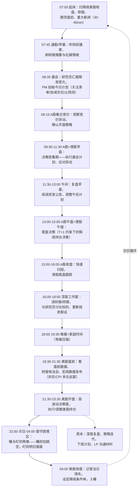
```mermaid
flowchart TD
    T1["07:00 起床：扫隔夜美股收盘、欧股、<br/>期货盘前、重大新闻（30-45min）"]
    T2["07:45 通勤/早餐：听财经播客、<br/>刷研报摘要与社媒情绪"]
    T3["08:30 晨会：研究员汇报隔夜变化，<br/>PM 拍板今日计划（关注清单/加减仓位/止损线）"]
    T4["09:15 A股集合竞价：观察竞价异动，<br/>确认开盘策略"]
    T5["09:30-11:30 A股+港股早盘：<br/>决策密集期——执行晨会计划、应对异动"]
    T6["11:30-13:00 午间：复盘早盘、<br/>阅读突发公告、调整午后计划"]
    T7["13:00-15:00 A股午盘+港股午盘：<br/>尾盘决策（T+1 约束下的隔夜持仓决策）"]
    T8["15:00-16:00 A股收盘：快速归因，<br/>港股尾盘跟踪"]
    T9["16:00-18:00 深度工作窗：读财报/研报、<br/>与研究员讨论标的、更新投资假设"]
    T10["18:00-19:30 晚餐+家庭时间（常被压缩）"]
    T11["19:30-21:30 美股盘前：看盘前数据、<br/>财报电话会、宏观数据发布（非农/CPI 多在此窗）"]
    T12["21:30-23:30 美股开盘：高波动决策窗，<br/>执行/调整美股持仓"]
    T13["23:30-次日 04:00 值守困境区：<br/>睡与盯的两难——睡则怕跳空，盯则明日报废"]
    T14["04:00 美股收盘：记录当日得失，<br/>设定隔夜条件单，入睡"]
    T15["周末：深度复盘、策略迭代、<br/>下周计划、LP 沟通材料"]
    T1 --> T2 --> T3 --> T4 --> T5 --> T6 --> T7 --> T8 --> T9 --> T10 --> T11 --> T12 --> T13 --> T14
    T14 -.->|"次日循环"| T1
    T12 -.-> T15
```

时间线上最值得注意的三段：**T5/T7 白天决策密集期**（港股与 A 股并行，注意力被撕裂）；**T13 值守困境区**（5 小时灰色地带，是"无交易室"场景的核心断点温床，详见第四章）；**T15 周末深度复盘**（唯一不被行情打扰的深度工作窗，但往往被疲劳侵蚀）。

**时间线的三个反直觉观察**（综合自述+推演）：①**最高价值的决策往往发生在信息最少的时刻**——美股开盘前 30 分钟（21:00-21:30）是全天决策质量的分水岭：隔夜信息已齐备、盘面尚未开始，此时定的计划是理性的；开盘后的决策则不断被价格波动污染。优秀 PM 因此把"开盘前定稿、盘中只执行"作为铁律。②**碎片化不是均匀分布的**——盘中 4 小时的"盯盘"里真正有动作的时刻通常不超过 30 分钟，其余是低质量等待；但没人敢离开屏幕，因为异动的到达时间不可预测。这种"99% 等待 + 1% 高压"的负荷结构是对人类注意力最不友好的任务形态，恰恰是对机器最友好的。③**睡眠不是休息问题而是风险敞口问题**——PM 的睡眠质量与组合的美股敞口负相关：敞口越大睡得越浅，睡得越浅次日决策越差，形成恶性循环。小团队 PM 的常态是美股时段睡 2-4 小时分段睡眠（经验估计），长期健康代价真实存在，这也是"无交易室"叙事在情感上最能击中该客群的原因——它卖的不是效率，是"敢睡觉"。

## 1.5 核心工作模块清单（PM 视角，8 个）

将 PM 一天的工作归纳为 8 个可独立分析的核心模块：

| # | 模块 | 说明 | 日均耗时（经验估计） |
|---|------|------|---------------------|
| M1 | 信息摄入与过滤 | 新闻/公告/研报/舆情/宏观数据的阅读与筛选 | 2.5-4 小时 |
| M2 | 投资决策 | 标的买卖/仓位调整/止损止盈的最终拍板 | 1-2 小时（纯决策，不含酝酿） |
| M3 | 盘中监控与应对 | 盯盘、异动响应、计划修正 | 4-8 小时（三市合计，含碎片） |
| M4 | 交易执行监督 | 确认执行质量、滑点、未成交处理 | 0.5-1 小时 |
| M5 | 风控复核 | 敞口检查、止损纪律确认、规则合规 | 0.5-1 小时 |
| M6 | 复盘与归因 | 当日得失分析、假设检验、策略迭代 | 1-2 小时（周末 4-8 小时） |
| M7 | 报告与沟通 | LP 汇报、团队管理、外部沟通 | 0.5-2 小时（月末/季末骤增） |
| M8 | 研究深化 | 个股/行业深度研究、调研、电话会 | 1-3 小时 |

**日均总耗时 11-21 小时**，其中 M1+M3（信息摄入+盘中监控）合计 6.5-12 小时，占 55%-65%，是最典型的时间黑洞区——这正是第二章与第三章量化分析的重点。

## 1.6 PM know-how 显性化：Skill 方法论描述

**Skill：三市 PM 的"决策分层"方法论**（来源：综合知乎资深 PM 自述 + 华尔街见闻复盘方法论，结构化整理）

> 优秀 PM 的第一个共识是"**决策必须分层，不能所有决策都用同一档注意力**"：
> 1. **战略层决策**（月度/季度）：组合结构、行业配置、三市资金分配——只在深度工作窗（周末/收盘后）做，盘中永远不做战略决策；
> 2. **战术层决策**（日度）：晨会拍板的当日计划——依据隔夜信息，开盘前定稿，盘中只执行不修改（除非触发预设的修正条件）；
> 3. **应激层决策**（盘中）：异动应对——只允许在预设的"如果-就"规则内反应（如"跌破 X 则减半仓"），规则外的应激反应一律延迟到收盘后复盘。
>
> 配套纪律：**每条持仓必须有"事前写好的退出条件"**（止损价/时间止损/逻辑止损三选一以上），退出条件在买入时写入交易日志，盘中不临时发明理由。华尔街见闻复盘方法论中"把自己的每笔交易记录下来，过段时间翻看，小动作和坏习惯一目了然"正是此纪律的复盘侧。

该 Skill 可直接转化为自动化系统的决策架构：战略层=人工专属（review 以上级），战术层=人机协作（AI 生成计划、人审批），应激层=规则化后完全自动化（auto 级围栏内）。详见第三章替代矩阵。

## 1.7 三类目标客群的差异分析

虽然三类客群同属"1-10 人小团队、非大型机构"，但其工作形态存在关键差异，直接影响后续替代矩阵与产品设计的权重分配：

**中小私募（证券类私募基金管理人）**：受中基协强监管，合规是刚性成本中心。全职员工原则上不少于 5 人，风控合规负责人独立设置、不得兼任投资；需履行信息披露、估值核算配合、程序化交易报备（2024 年《私募证券投资基金运作指引》专章要求）等义务。其痛点排序是：**合规成本 > 人力成本 > 三市覆盖**。对 AI 数字员工的接受逻辑是"合规生存的最低成本方案"——用系统替代的不是"最好的人"，而是"雇不起的第 6、7、8 个人"。其决策链短（创始人即 PM），采购决策快，但付费能力弱（5 亿以下规模普遍亏损或微利），对价格极度敏感。

**家族办公室（单一家办/小型联合家办）**：不受私募监管约束（不对外募集资金），合规压力小，但**受托责任与隐私要求极高**。投资范围更杂（三市股票之外常有期权、债券、另类资产），美股/港股敞口占比通常显著高于私募（经验估计 40%-70%），因此**夜间覆盖是其第一痛点**。委托人（家族）与执行人（CIO/投资总监）之间存在信任代理问题：一切动作需要可解释、可回溯，以应对委托人的质询——"决策留痕"需求强度甚至高于私募。付费能力最强，但对数据主权最敏感：持仓与家族财务数据绝不出私域，倾向私有化部署。

**专业个人交易者（工作室形态，1-3 人）**：无监管合规负担，无 LP 汇报义务，一人分饰全部六角。其痛点排序是：**时间覆盖 > 纪律执行 > 方法论**。最接近"超级个体"形态：白天上班或处理其他事务，晚上交易美股，睡眠不足是常态；其最大失效模式是情绪化交易与复盘缺失。付费能力最弱但数量最大、决策最快，是"自助式"产品的天然客群。对其而言，AI 数字员工不是"替代员工"，而是"第一次拥有员工"。

三客群的共性交集——**时间覆盖、纪律执行、决策留痕、归因工业化**——构成本报告第三、四章替代矩阵的主线；差异项（合规自动化之于私募、隐私部署之于家办、低门槛自助之于个人）则决定 bundles/trading 角色包的版本分层策略。

## 1.8 PM 决策场景的三个典型案例（合理推演，基于公开自述模式）

**案例一：A 股 T+1 约束下的尾盘决策**。14:40，PM 持仓的某创业板股票盘中跳水 -6%，触及心理止损位。但 T+1 规则下，今日买入的部分无法卖出；昨日底仓可卖。PM 需要在 20 分钟内判断：这是情绪性错杀（尾盘拉回概率大）还是逻辑破坏（次日继续跌）？卖底仓则今日损失固化但保留现金主动权，不卖则赌隔夜。优秀 PM 的处理是回到"事前写好的退出条件"：若买入时写的是"跌破 20 日线离场"，则执行卖底仓，不因盘中情绪改判。该案例说明：**T+1 使 A 股的决策时点被迫前移——风控动作必须在买入前完成设计，盘中纠错空间天然受限**。

**案例二：美股盘前财报的双向赌博**。某持仓股盘前 20:00（北京）发财报，21:30 开盘。PM 面对选择：持仓过财报（赌方向）、盘前减仓（锁部分）、或用期权对冲（需权限与技能）。小团队常态是"凭感觉选一个"。优秀 PM 的处理是把财报事件分类：预期内波动（IV 显示的隐含波动 < 历史财报后实际波动）可持仓，预期外风险（仓位 >10% 且隐含波动极高）必减仓到"睡得着的水平"。该案例说明：**事件驱动的仓位管理可以规则化为"事件日历 × 仓位上限 × 隐含波动"的预案矩阵**——这正是第四章 BP1/BP2 自动化的认知基础。

**案例三：港股 VCM 冷静期的流动性幻觉**。某港股持仓 5 分钟急跌 11% 触发 VCM，进入 5 分钟冷静期，报价被限制在参考价 ±10% 内。新手在冷静期急于抄底或割肉，发现流动性稀薄、点差巨大，成交即亏。优秀从业者的规则是"冷静期内不动作，等机制结束后观察 15 分钟再决策"。该案例说明：**三市各自的微观结构规则（涨跌停/VCM/熔断/盘前盘后流动性）不是背景知识，而是执行层的硬约束**，自动化系统若未编码这些规则，会在最极端的行情里做出最差的成交。

**三个案例的共同模式**：每个案例中"优秀 PM 的做法"都不是更聪明，而是**更早把决策做完**——把盘中才能做的判断提前到平静时刻完成，盘中只剩执行。这是全部 know-how 的元规则：主动投资的自动化可行性，本质取决于"有多少决策能被前移到平静时刻"。不能前移的（真正的突发事件、真正的新信息），才是人类判断最后的领地。

## 1.9 本章如何抽象适配到其他行业

"PM 的一天"的抽象结构是：**多市场/多窗口时钟叠加 + 高决策密度 + 执行与研究心智切换 + 非工作时间的事件暴露**。这一结构可平移到：跨境电商运营（多平台多市场时钟、广告调价决策密度）、连锁餐饮区域经理（多门店监控+高峰期决策）、外贸企业主（跨时区客户+汇率敞口）。还原方法不变：先画"时钟叠加图"找出灰色值守区，再用 24 小时时间线定位"高决策密度窗口"与"人性极限窗口"——前者是 AI 增强区，后者是 AI 替代区。

---

# 第二章 核心角色工作流程分析

本章对研究员/分析师、交易员、风控与合规官、复盘/归因分析师（量化研究员）、数据/运营支持五类角色的核心工作模块逐一深度拆解：标准流程还原（Mermaid flowchart）→ 痛点识别（量化）→ 时间价值矩阵（Mermaid quadrantChart）→ AI 增强机会 → know-how Skill 化 → 跨行业抽象。

## 2.1 研究员/分析师：六维覆盖的信息炼金术

### 2.1.1 角色与模块说明

小团队的研究员通常 1-2 人要覆盖六个维度：**宏观**（货币政策、经济数据、地缘政治）、**行业/产业链**（供需、竞争格局、政策）、**个股基本面**（财报、公告、调研）、**技术面**（价量结构、关键位）、**新闻舆情**（主流媒体、突发）、**社媒情绪**（雪球/X/Reddit/WSB 等）。这与 TradingAgents 框架的分析师团队设置（基本面/情绪/新闻/技术四类分析师 Agent）高度同构——说明该分工是行业公认的最小完备覆盖（来源：arXiv:2412.20138）。

### 2.1.2 六维信息源清单与典型一天

小团队研究员的实际信息源拼图（公开自述+合理推演）：**宏观**——央行公告、统计局数据、财经日历工具、华尔街见闻类快讯；**行业/产业链**——行业协会数据、券商研报（蹭机构服务或公开摘要）、产业政策文件、供应链人脉；**个股基本面**——交易所公告、财报原文、业绩电话会（美股需英文+深夜）、调研纪要；**技术面**——行情软件自选股预警、关键价位手工标注；**新闻舆情**——快讯 App 推送、几十个微信群与公众号；**社媒情绪**——雪球热帖、X（Twitter）财经圈、Reddit/WSB（美股）、股吧（A 股，信噪比极低）。

典型一天的节奏（经验估计）：07:30 扫隔夜快讯 40 分钟；08:00-08:50 写晨会简报；09:30 后盘中穿插跟踪持仓相关公告与舆情；11:30-13:00 读两篇研报；15:00-17:00 当日主线信息归档+个股财报精读；晚间若有持仓股财报或宏观数据，21:00 后继续工作 1-2 小时。全日信息处理量 300-500 条标题级、30-50 条正文级、3-5 份深度材料。**其中约 70% 的时间消耗在"找到值得读的东西"而非"读"本身**——这是信息过滤环节被判定为最大时间黑洞的直接依据。

### 2.1.3 标准流程

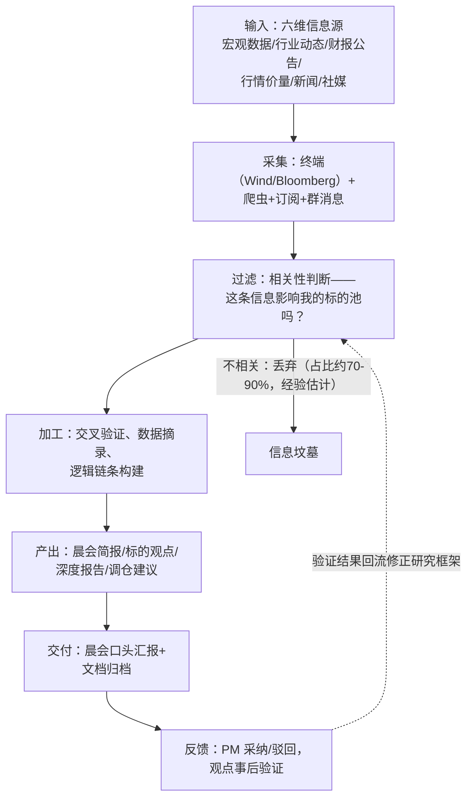
```mermaid
flowchart TD
    S1["输入：六维信息源<br/>宏观数据/行业动态/财报公告/<br/>行情价量/新闻/社媒"]
    S2["采集：终端（Wind/Bloomberg）+<br/>爬虫+订阅+群消息"]
    S3["过滤：相关性判断——<br/>这条信息影响我的标的池吗？"]
    S4["加工：交叉验证、数据摘录、<br/>逻辑链条构建"]
    S5["产出：晨会简报/标的观点/<br/>深度报告/调仓建议"]
    S6["交付：晨会口头汇报+<br/>文档归档"]
    S7["反馈：PM 采纳/驳回，<br/>观点事后验证"]
    S1 --> S2 --> S3 --> S4 --> S5 --> S6 --> S7
    S7 -.->|"验证结果回流修正研究框架"| S3
    S3 -->|"不相关：丢弃（占比约70-90%，经验估计）"| SX["信息坟墓"]
```

### 2.1.3 痛点清单（量化）

| # | 痛点 | 量化 | 依据 |
|---|------|------|------|
| P1 | 信息过滤耗时巨大 | 日均阅读 200-500 条信息，有效信息占比约 10%-30%，过滤耗时 2-3 小时/日 | 经验估计，综合知乎研究员自述 |
| P2 | 跨语言跨时区 | 美股研究需英文财报+电话会（多在深夜），一人难兼顾 | 公开信息 |
| P3 | 舆情/社媒情绪监测原始 | 靠人肉刷雪球/X，无量化情绪指标，突发舆情平均滞后 30-120 分钟发现 | 经验估计 |
| P4 | 研究成果不沉淀 | 小团队无研究管理系统，观点散落在微信/文档/脑子里，人员流动即流失 | 经验估计；离职带走研究框架是私募常见损失 |
| P5 | 观点无事后验证闭环 | "当时为什么这么看"很少被系统性回溯，同类错误重复犯 | 华尔街见闻复盘方法论的反面即现状 |
| P6 | 写作负荷 | 一份深度报告 8-20 小时，晨会简报 1-2 小时/日 | 经验估计 |

### 2.1.4 时间价值矩阵

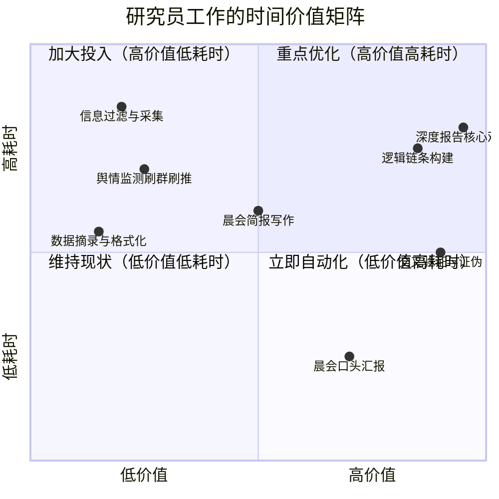
```mermaid
quadrantChart
    title 研究员工作的时间价值矩阵
    x-axis 低价值 --> 高价值
    y-axis 低耗时 --> 高耗时
    quadrant-1 重点优化（高价值高耗时）
    quadrant-2 加大投入（高价值低耗时）
    quadrant-3 维持现状（低价值低耗时）
    quadrant-4 立即自动化（低价值高耗时）
    信息过滤与采集: [0.2, 0.85]
    舆情监测刷群刷推: [0.25, 0.7]
    晨会简报写作: [0.5, 0.6]
    数据摘录与格式化: [0.15, 0.55]
    逻辑链条构建: [0.85, 0.75]
    交叉验证与证伪: [0.9, 0.5]
    深度报告核心观点: [0.95, 0.8]
    晨会口头汇报: [0.7, 0.25]
```

### 2.1.5 AI 增强机会表

| 环节 | AI 替代可行性 | 增强方向 | 对应 WorkLoom 能力 |
|------|--------------|----------|---------------------|
| 信息采集与过滤 | 完全替代 | 多源采集+相关性打分+去重摘要，过滤 70-90% 噪音 | skills 工具集（MCP 数据源）+ model-router 谷时批处理（锚点：skills、model-router） |
| 舆情/情绪监测 | 完全替代 | 7×24 情绪指标化、异动秒级告警（对比人工滞后 30-120 分钟） | inspection 巡检 P0/P1/P2 分级推送（锚点：inspection） |
| 晨会简报初稿 | 人机协作 | AI 生成简报，研究员修订背书 | review 级围栏 + 审批三手势（锚点：fence-engine、review-console） |
| 逻辑链条构建/证伪 | 人机协作 | AI 提供反方观点（多空辩论机制，源自 TradingAgents 的 Bull/Bear researcher 辩论） | 组织记忆沉淀辩论记录（锚点：workdata 组织记忆） |
| 核心观点形成 | 保留人工 | 投资直觉与产业理解是人机协作中人的终审权 | — |
| 研究归档与验证闭环 | 完全替代 | 观点自动入库，到期自动回溯验证对错 | 五元事件库 + 组织记忆 pattern 类（锚点：workdata） |

### 2.1.6 know-how Skill 化

**Skill：研究的"证伪优先"方法论**——优秀研究员与普通研究员的差别不在"找到看多的理由"，而在"主动寻找让自己观点成立的反面证据"。结构化流程：①任何看多观点必须附带"三个可能让我错的证据"及监控指标；②每个指标设定"证伪触发线"（如"若 Q3 库存周转天数 >X 天则逻辑破坏"）；③触发线进入监控清单，触发即自动降级该观点置信度。该方法论可直接编码为研究类 Skill 的产出 Schema（观点+反证+触发线三件套），并让巡检系统承接触发线的持续监控——这是 FinMem 分层记忆（短期行情/中期事件/长期逻辑分层存储与衰减）思想在人工研究流程中的对应物。

### 2.1.7 跨行业抽象

研究员模块的抽象结构是"**多源信息→相关性过滤→逻辑加工→观点产出→事后验证**"。该链条在任何"信息驱动决策"的行业都存在：咨询行业的分析师、电商行业的选品专员、媒体行业的选题编辑。抽象要点：过滤层永远可以自动化（噪音占比 70%+ 是普遍规律），加工层人机协作，观点层保留人工，验证闭环层是最容易被人类偷懒省略、又最容易被系统补齐的一环。

## 2.2 交易员：纪律的化身与机械执行的代价

### 2.2.1 角色与模块说明

交易员的工作分三段：**盘前计划**（将 PM 的决策转化为可执行订单计划）、**盘中执行**（按计划下单+应对异动）、**订单管理**（未成交处理、成交回报核对、条件单维护）。在小团队中交易员常由 PM 或研究员兼任——兼任恰恰是最危险的结构：决策者与执行者同一人，纪律失去外部约束（合理推演，基于"决策-执行分离"的风控通识）。

### 2.2.2 标准流程

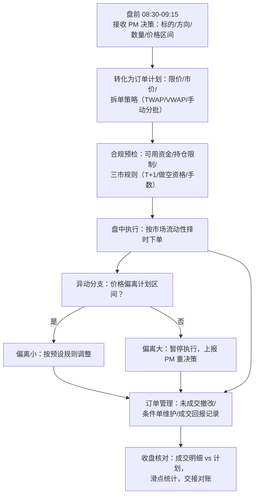
```mermaid
flowchart TD
    E1["盘前 08:30-09:15<br/>接收 PM 决策：标的/方向/数量/价格区间"]
    E2["转化为订单计划：限价/市价/<br/>拆单策略（TWAP/VWAP/手动分批）"]
    E3["合规预检：可用资金/持仓限制/<br/>三市规则（T+1/做空资格/手数）"]
    E4["盘中执行：按市场流动性择时下单"]
    E5["异动分支：价格偏离计划区间？"]
    E6["偏离小：按预设规则调整"]
    E7["偏离大：暂停执行，上报 PM 重决策"]
    E8["订单管理：未成交撤改/<br/>条件单维护/成交回报记录"]
    E9["收盘核对：成交明细 vs 计划，<br/>滑点统计，交接对账"]
    E1 --> E2 --> E3 --> E4 --> E5
    E5 -->|是| E6 --> E8
    E5 -->|否| E7 --> E8
    E4 --> E8 --> E9
```

### 2.2.3 痛点清单（量化）

| # | 痛点 | 量化 | 依据 |
|---|------|------|------|
| P1 | 执行纪律被人性侵蚀 | 计划外交易占个人/小团队总交易的 20%-40%，是亏损主因之一 | 经验估计；雪球/知乎交易员自省帖高频主题 |
| P2 | 三市规则手工预检易错 | T+1 误卖、碎股、手数、做空资格错误，月均 1-3 次低级错误/交易员 | 经验估计 |
| P3 | 夜间执行无人 | 美股时段小团队无专职夜班交易员，PM 自行盯盘或放弃 | 结构性痛点，详见第四章 |
| P4 | 拆单与择时粗糙 | 小团队无算法交易系统，手动分批，冲击成本与滑点年损耗估算 0.3%-1% 本金 | 经验估计（按年换手 5-10 倍、单次滑点 5-15bps 推算） |
| P5 | 成交回报核对机械 | 每日 15-45 分钟纯核对工作 | 经验估计 |

### 2.2.4 时间价值矩阵

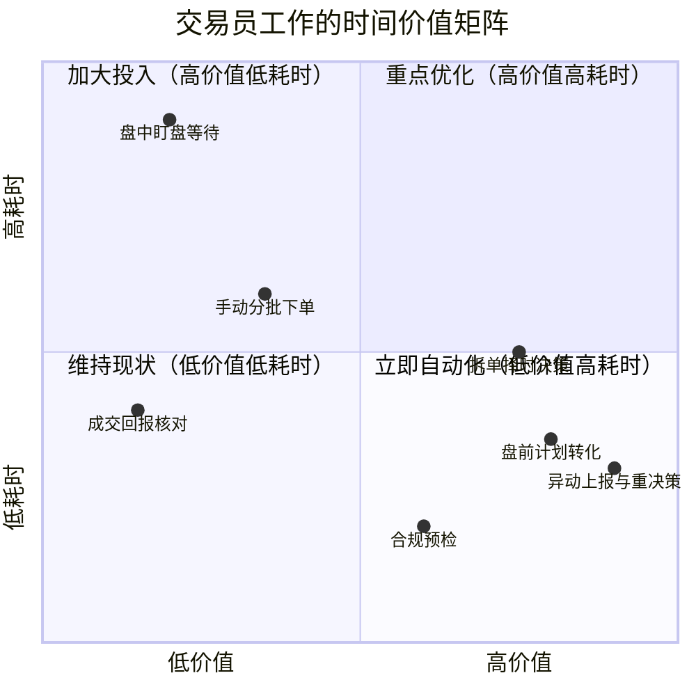
```mermaid
quadrantChart
    title 交易员工作的时间价值矩阵
    x-axis 低价值 --> 高价值
    y-axis 低耗时 --> 高耗时
    quadrant-1 重点优化（高价值高耗时）
    quadrant-2 加大投入（高价值低耗时）
    quadrant-3 维持现状（低价值低耗时）
    quadrant-4 立即自动化（低价值高耗时）
    盘中盯盘等待: [0.2, 0.9]
    手动分批下单: [0.35, 0.6]
    成交回报核对: [0.15, 0.4]
    合规预检: [0.6, 0.2]
    拆单择时决策: [0.75, 0.5]
    异动上报与重决策: [0.9, 0.3]
    盘前计划转化: [0.8, 0.35]
```

### 2.2.5 AI 增强机会表

| 环节 | AI 替代可行性 | 增强方向 | 对应 WorkLoom 能力 |
|------|--------------|----------|---------------------|
| 合规预检（三市规则） | 完全替代 | 规则硬编码为围栏表达式，下单前自动校验，违规直接 block | 围栏引擎 deny 优先 + 求值异常按 block（锚点：fence-engine） |
| 计划内订单执行 | 完全替代 | 计划经审批后转为条件单/算法单自动执行，执行回执留痕 | Quest 任务循环 + Receipt 回执（锚点：runtime、workdata） |
| 盯盘等待与异动检测 | 完全替代 | 行情监控 7×24，触发预设条件才打扰人 | inspection 只读巡检 + 分级推送（锚点：inspection） |
| 异动重决策 | 人机协作 | AI 生成应对方案（含数据支撑），PM 一键采纳/驳回 | review 级围栏 + 审批卡片 IM 触达（锚点：review-console） |
| 拆单择时 | 人机协作偏替代 | TWAP/VWAP 规则化执行，大单人工定策略 | 执行面 L1/L2 确定性路径（锚点：runtime） |
| 成交核对 | 完全替代 | 成交明细 vs 计划自动比对，差异即告警 | 五元事件库对账投影（锚点：workdata） |

### 2.2.6 know-how Skill 化

**Skill：交易员的"计划即合同"纪律**——优秀交易员把盘前计划视为与 PM 签订的合同：①计划中每笔订单必须写明触发条件、价格区间、数量、失效时间四要素；②盘中只允许"按合同执行"或"上报变更"，不允许第三种动作；③每日收盘统计"计划外动作率"（目标 <5%）与"滑点归因"（市场因素 vs 执行因素）。该 Skill 的可自动化本质：四要素计划 = 机器可读的结构化指令；计划外动作率 = 系统级的围栏违规率指标。这解释了为什么执行环节在替代矩阵中几乎全部落在"完全替代"档。

### 2.2.7 执行环节的深度细节：滑点、拆单与盘前盘后

公开从业者分享中对执行细节的还原较少，以下为基于交易实务的合理推演细化：

**滑点的三层来源**：①**点差成本**——买入按卖一价、卖出按买一价，流动性差的标的（港股小盘、美股盘前盘后）点差可达 0.3%-1%；②**冲击成本**——单笔订单超过盘口深度时逐档吃单，10 万股级别的订单在小盘股可推高价格 0.5% 以上；③**择时成本**——盘中犹豫导致的成交价格漂移，人类交易员"再等一等"的平均代价经验估计为每次 5-20bps。优秀交易员的对应纪律：大单必拆（拆成 5-20 笔按时间或成交量分布释放）、避开开盘收盘的波动极值段（除非策略要求）、流动性差标的只用限价单。这三条纪律全部是**可枚举规则**——这正是执行环节被判为"完全替代"档的实务依据：不是因为执行不重要，而是因为优秀执行的本质就是纪律的机械重复。

**盘前盘后的特殊地位**：美股盘前（16:00-21:30 北京）与盘后（04:00-08:00 北京）是财报与重大新闻的密集发布窗，流动性仅为常规时段的 5%-15%，点差大、波动剧烈。小团队此时段几乎无覆盖能力，要么放弃（错失信息优势窗口），要么 PM 亲自下场（进一步切割睡眠）。该时段的动作规则恰恰最简单（流动性差→只做限价单、只做减仓类防御动作），是最适合自动化先行先试的时段。

**三市执行差异的编码清单**：A 股——集合竞价规则（9:15-9:20 可撤、9:20-9:25 不可撤的博弈结构）、T+1 卖出校验、涨跌停板的挂单排队逻辑；港股——每手股数不一、碎股流动性折价、VCM 冷静期报价限制、半日市规则；美股——盘前盘后流动性分层、熔断期间的订单类型限制、2026 年 PDT 废除后日内保证金新规的过渡期差异（各券商执行进度不一，截至 2026-08-29 仍在 18 个月过渡期内）。这份清单本身就该是围栏包与执行适配器的第一批规则资产。

### 2.2.8 跨行业抽象

交易员模块的抽象结构是"**决策→可执行计划→合规预检→机械执行→核对归因**"。同构场景：电商的"定价决策→改价计划→平台规则预检→批量改价→改价结果核对"；供应链的"采购决策→采购单→预算预检→下单→到货核对"。抽象要点：凡"计划可结构化、规则可枚举、执行可回执"的环节，都是自动化最确定的高地；人类价值集中在"计划外的异常重决策"。

## 2.3 风控与合规官：小团队的"制度肉身"

### 2.3.1 角色与模块说明

风控合规官在小私募是监管强制的独立岗位（中基协要求风控合规负责人不得兼任投资岗位）。其工作四块：**敞口监控**（仓位/行业/个股/市场敞口实时计算）、**止损纪律**（监督止损线执行）、**三市规则合规**（交易规则、信息披露、程序化交易报备——《私募证券投资基金运作指引》2024 年专章要求程序化交易私募制定专门业务管理制度）、**记录与报告**（监管报送、内部合规留痕）。

### 2.3.2 合规义务的实务清单（监管框架下的真实负荷）

以中国证券类私募为例，风控合规官背负的可枚举义务包括（依据《私募证券投资基金运作指引》及中基协相关规定整理）：**日常**——投资范围与比例监控（双 25% 组合投资要求等）、杠杆监控、关联交易监控、异常交易自查（拉抬打压、对倒等监管关注点）；**程序化交易专项**——开展程序化交易的私募应当制定专门的业务管理制度与风控制度，按规定向协会报告程序化交易相关参数信息，系统接入与变更需留痕；**定期**——季度/年度信息披露、重大事项临时披露（10 个工作日内）、自查报告、投资者适当性复核；**随时**——监管问询回复、托管与外包机构的配合核对。跨境部分（若有 QDII 或收益互换通道）另有一套额度与申报规则。美股/港股侧则对应券商层面的合规约束（做空资格、期权权限分级、盘前盘后风险披露）。这些义务的特征是**条文稳定但执行琐碎、违规代价高但日常无感**——最符合"规则硬编码+自动执行+自动留痕"的自动化形态；合规官的人类价值上移到"解读新规、设计内控、应对监管沟通"三层。

### 2.3.3 标准流程

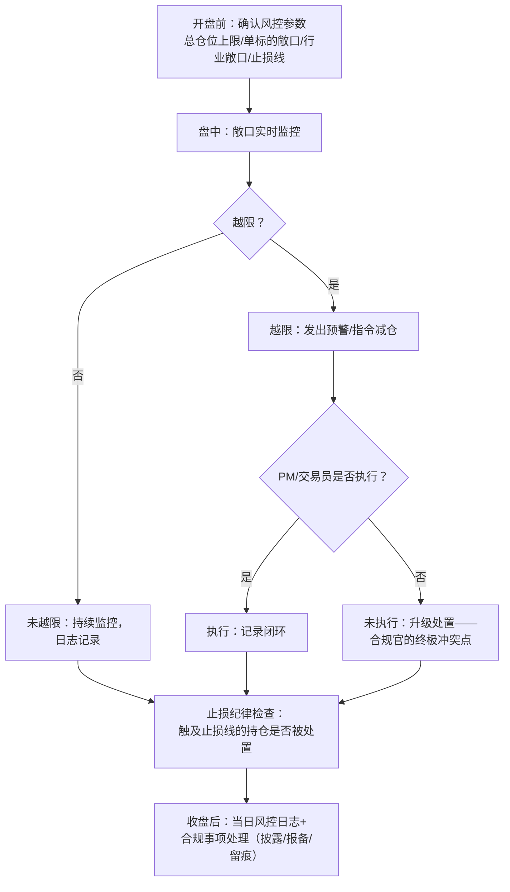
```mermaid
flowchart TD
    R1["开盘前：确认风控参数<br/>总仓位上限/单标的敞口/行业敞口/止损线"]
    R2["盘中：敞口实时监控"]
    R3{"越限？"}
    R4["未越限：持续监控，<br/>日志记录"]
    R5["越限：发出预警/指令减仓"]
    R6{"PM/交易员是否执行？"}
    R7["执行：记录闭环"]
    R8["未执行：升级处置——<br/>合规官的终极冲突点"]
    R9["止损纪律检查：<br/>触及止损线的持仓是否被处置"]
    R10["收盘后：当日风控日志+<br/>合规事项处理（披露/报备/留痕）"]
    R1 --> R2 --> R3
    R3 -->|否| R4 --> R9
    R3 -->|是| R5 --> R6
    R6 -->|是| R7 --> R9
    R6 -->|否| R8 --> R9
    R9 --> R10
```

### 2.3.3 痛点清单（量化）

| # | 痛点 | 量化 | 依据 |
|---|------|------|------|
| P1 | 小团队风控流于形式 | 5-10 人团队中风控官常为"合规摆设"，实际敞口监控靠 PM 自觉 | 经验估计；雪球私募运营讨论帖共识 |
| P2 | 止损执行的人情困境 | 风控官与 PM 是同事甚至雇佣关系，强制减仓指令被顶回率高；止损延迟 1-2 天平均多损失 2%-5% 持仓市值（极端行情更多） | 经验估计 |
| P3 | 三市规则记忆负荷 | A股 T+1/涨跌停分板、港股 VCM/手数不定、美股熔断/盘前盘后流动性差异，规则更新（如 2026 年 PDT 废除、港股拟 T+1）需持续跟踪 | 公开信息 |
| P4 | 合规文书耗时 | 信息披露、程序化交易报备、自查报告，月均 2-5 个工作日 | 经验估计，据《运作指引》合规要求推算 |
| P5 | 夜间风控真空 | 美股时段敞口失控无人知晓，跳空风险敞口裸露 | 结构性痛点，详见第四章 |

### 2.3.4 时间价值矩阵

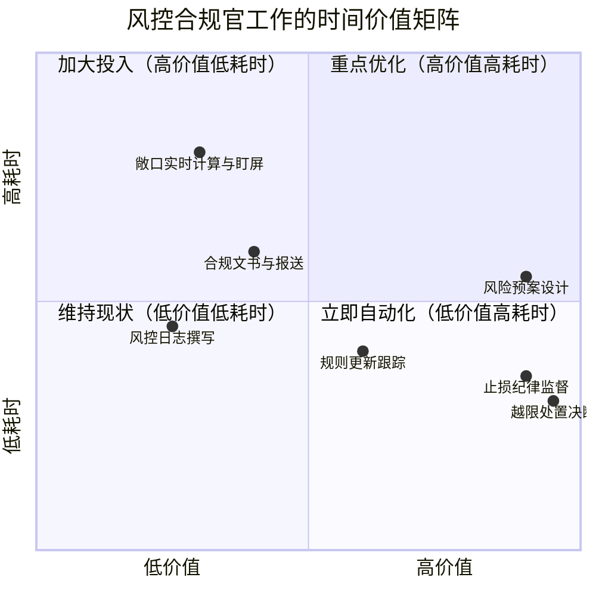
```mermaid
quadrantChart
    title 风控合规官工作的时间价值矩阵
    x-axis 低价值 --> 高价值
    y-axis 低耗时 --> 高耗时
    quadrant-1 重点优化（高价值高耗时）
    quadrant-2 加大投入（高价值低耗时）
    quadrant-3 维持现状（低价值低耗时）
    quadrant-4 立即自动化（低价值高耗时）
    敞口实时计算与盯屏: [0.3, 0.8]
    风控日志撰写: [0.25, 0.45]
    合规文书与报送: [0.4, 0.6]
    越限处置决断: [0.95, 0.3]
    止损纪律监督: [0.9, 0.35]
    规则更新跟踪: [0.6, 0.4]
    风险预案设计: [0.9, 0.55]
```

### 2.3.5 AI 增强机会表

| 环节 | AI 替代可行性 | 增强方向 | 对应 WorkLoom 能力 |
|------|--------------|----------|---------------------|
| 敞口实时计算监控 | 完全替代 | 系统连续计算，越限即触发围栏 | 围栏引擎 auto/review/block + 哈希链留痕（锚点：fence-engine、workdata） |
| 止损线强制执行 | 完全替代（关键） | 止损规则写入围栏，触及即自动执行或强制 review，消除"人情顶回" | 基线单调守卫：止损规则只可加严不可放松（锚点：fence-engine 基线守卫） |
| 三市规则校验 | 完全替代 | 规则编码为围栏包，规则更新=围栏包版本升级+dry-run 回放验证 | 围栏包 DSL + dry-run（锚点：fence-engine） |
| 越限处置中的"是否特批" | 保留人工 | 特批涉及责任承担，必须人拍板且留痕 | 审批队列高危项不过期自动放行（锚点：review-console） |
| 合规文书 | 人机协作 | AI 起草，合规官审定签发 | skills + review（锚点：skills、review-console） |
| 风险预案设计 | 保留人工 | 压力情景假设需要经验与想象力 | — |

### 2.3.6 know-how Skill 化

**Skill：风控的"三层防线"设计法**——优秀风控官不把风控寄托于"盘中盯得住"，而设计三层防线：①**事前防线**（下单前）：所有订单过规则校验，违规根本无法发出——把风控从"监督"前移为"物理不可能"；②**事中防线**（持仓中）：敞口指标连续计算，触及预警线自动通知、触及强制线自动执行，人不参与也安全；③**事后防线**（每日）：全部动作留痕可回放，任何特批必须写明理由进入复盘样本。核心洞察：**止损纪律的最大敌人是"这一次不一样"的叙事**，因此止损规则必须在情绪平静时设定、在系统中固化、在执行时无人工旁路。这与围栏引擎"deny 优先、求值异常按 block 宁可错杀、基线只可加严"的设计哲学完全一致。

**配套实务细节**（合理推演）：优秀风控官还有两个较少被提及的习惯。一是**"特批台账"**——每一次风控规则被特批放行，都记录"谁申请、什么理由、事后结果"，每月统计特批的事后胜率；多数团队会发现特批胜率显著低于规则执行（经验估计特批后结果优于原规则的不足 40%），这个数据本身就是减少特批的最强论据。二是**"压力情景日课"**——每周抽 30 分钟做一次思想实验："如果明天组合最大持仓跌停/熔断/停牌，我的动作序列是什么？"把答案写下来。这个习惯的本质是把极端情景的决策同样前移到平静时刻——与第一章"决策前移"元规则同构。两个习惯的可自动化映射：特批台账=审批驳回/修改记录的自动统计（驳回必填原因的设计为此而生）；压力情景日课=定期的组合压力测试脚本化，输出"若 X 发生则敞口变为 Y"的预计算结果。

### 2.3.7 跨行业抽象

风控模块的抽象结构是"**规则事前硬编码 + 阈值事中自动触发 + 留痕事后可审计**"。同构场景：连锁零售的"价格下限/折扣权限"管控、企业财务的"付款审批权限矩阵"、食品行业的"保质期红线"。抽象要点：风控自动化的本质是把"依赖人的自觉"改为"依赖系统的不可能"——任何行业中"制度靠人肉执行"的环节都是同样的替代机会。

## 2.4 复盘/归因分析师（量化研究员）：与过拟合作战的人

### 2.4.1 角色与模块说明

该角色负责：**日度归因**（今日盈亏从哪里来——市场β/行业/个股选择/交易执行）、**统计检验**（策略表现是否统计显著，还是运气）、**策略迭代**（修正投资假设与规则）、**Walk-Forward Analysis（WFA）**（滚动样本外验证，对抗过拟合）。来源：量化研究员日报自述（2026-01 百家号）详述 WFA"像在时间的缝隙里做微创手术，稍有不慎就会数据窥探，自己骗了自己"。

### 2.4.2 一个归因细算案例（合理推演）

某 1 亿组合某日净值 +0.42%（+42 万）。未经归因的叙事是"今天行情不错"。三层归因的细算：①**β 贡献**——沪深 300 当日 +0.55%，组合 A 股 β 仓位 60%，贡献约 +0.33%（+33 万）；②**行业贡献**——超配的电子行业跑赢大盘 0.8pct，超配仓位 15%，贡献 +0.12%（+12 万）；③**个股选择**——持仓中某个股跑赢所属行业 1.5%，仓位 8%，贡献 +0.12%（+12 万）；④**执行损耗**——当日两笔调仓滑点合计 -0.03%（-3 万）；⑤**费用**——佣金印花税 -0.02%（-2 万）。合计 +0.52% 与实际的 +0.42% 差异 -0.10% 归因于港股汇兑与未对冲汇率波动。**细算后的真实结论与叙事完全不同**：当日超额收益为负（跑输基准 0.13%），"赚钱"主要靠 β 与运气性的汇率，选股贡献为正但执行与汇兑在吃利润。这类细算如果每天做，一个月后就能发现"执行损耗年化 -0.7%"和"汇率敞口未管理"两个可修复的漏血点；如果不做，年底归因只能是一句"市场不好"。这就是归因职能从"奢侈品"变为"日用品"的价值逻辑。

### 2.4.3 标准流程

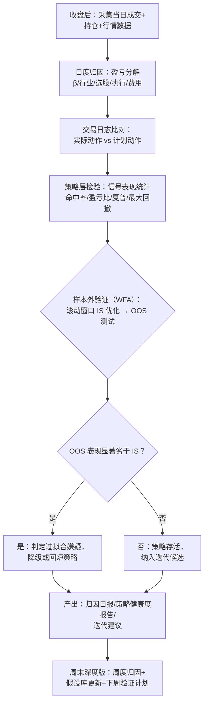
```mermaid
flowchart TD
    Q1["收盘后：采集当日成交+<br/>持仓+行情数据"]
    Q2["日度归因：盈亏分解<br/>β/行业/选股/执行/费用"]
    Q3["交易日志比对：<br/>实际动作 vs 计划动作"]
    Q4["策略层检验：信号表现统计<br/>命中率/盈亏比/夏普/最大回撤"]
    Q5{"样本外验证（WFA）：<br/>滚动窗口 IS 优化 → OOS 测试"}
    Q6{"OOS 表现显著劣于 IS？"}
    Q7["是：判定过拟合嫌疑，<br/>降级或回炉策略"]
    Q8["否：策略存活，<br/>纳入迭代候选"]
    Q9["产出：归因日报/策略健康度报告/<br/>迭代建议"]
    Q10["周末深度版：周度归因+<br/>假设库更新+下周验证计划"]
    Q1 --> Q2 --> Q3 --> Q4 --> Q5 --> Q6
    Q6 -->|是| Q7 --> Q9
    Q6 -->|否| Q8 --> Q9
    Q9 --> Q10
```

### 2.4.3 痛点清单（量化）

| # | 痛点 | 量化 | 依据 |
|---|------|------|------|
| P1 | 小团队根本无此职能 | 1-10 人团队中专职归因/量化研究员是奢侈品，多数中小私募归因停留在"感觉"层面 | 经验估计；私募成本帖显示 6 人团队人力已 250 万/年，量化岗首当其冲被砍 |
| P2 | 过拟合陷阱普遍 | 个人量化社区实测：全样本优化的双均线策略 IS Sharpe +0.774、OOS Sharpe 0.000，过拟合率 100%（11 个 WFA 窗口） | CSDN/知乎量化帖实测数据 |
| P3 | 归因方法论门槛 | 正确归因需要数据管道+统计功底，非专业者做的"归因"多为叙事 | 经验估计 |
| P4 | 数据准备工作吃掉 60-70% 时间 | 清洗、对齐、复权、拼接，真正分析时间不足 1/3 | 量化从业自述共识，经验估计 |
| P5 | 复盘依赖自律 | 每日复盘在疲惫状态下最先被跳过；亏损日的复盘价值最高、被执行概率最低 | 经验估计；华尔街见闻复盘帖侧面印证 |

### 2.4.4 时间价值矩阵

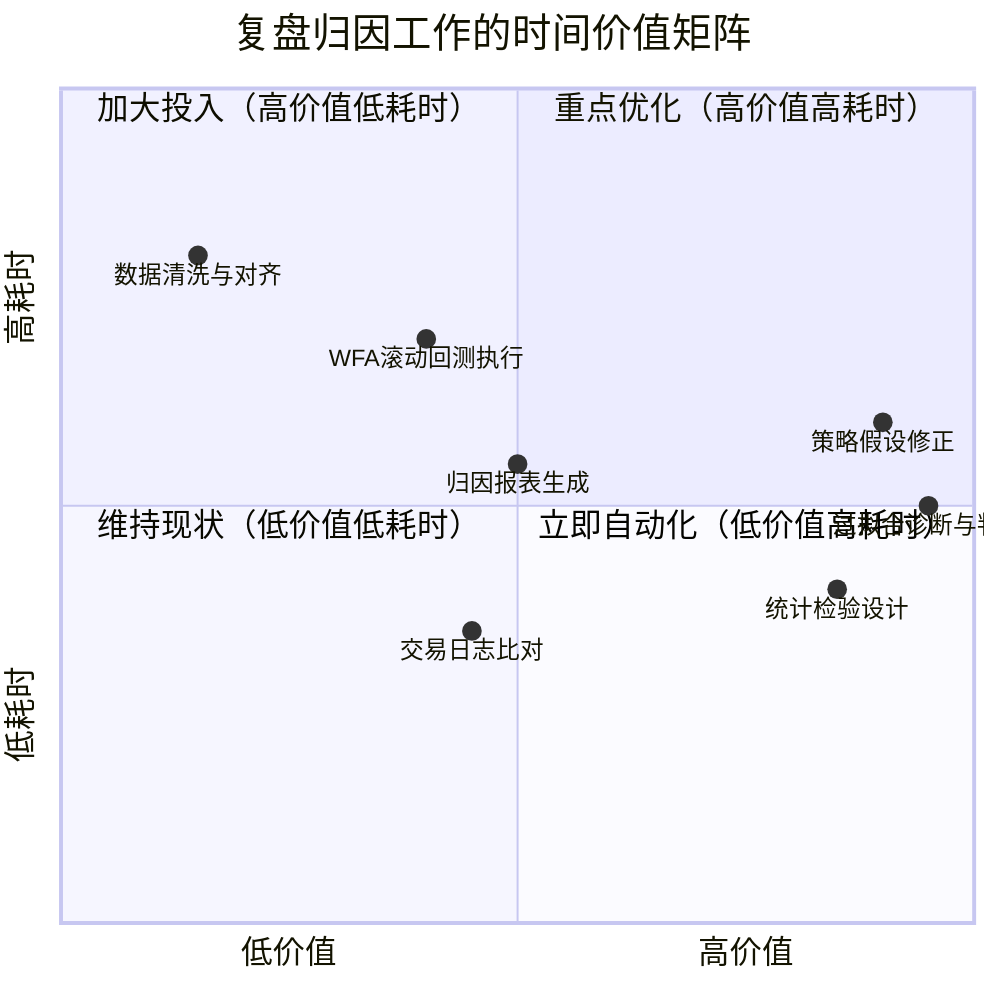
```mermaid
quadrantChart
    title 复盘归因工作的时间价值矩阵
    x-axis 低价值 --> 高价值
    y-axis 低耗时 --> 高耗时
    quadrant-1 重点优化（高价值高耗时）
    quadrant-2 加大投入（高价值低耗时）
    quadrant-3 维持现状（低价值低耗时）
    quadrant-4 立即自动化（低价值高耗时）
    数据清洗与对齐: [0.15, 0.8]
    归因报表生成: [0.5, 0.55]
    WFA滚动回测执行: [0.4, 0.7]
    统计检验设计: [0.85, 0.4]
    过拟合诊断与判决: [0.95, 0.5]
    策略假设修正: [0.9, 0.6]
    交易日志比对: [0.45, 0.35]
```

### 2.4.5 AI 增强机会表

| 环节 | AI 替代可行性 | 增强方向 | 对应 WorkLoom 能力 |
|------|--------------|----------|---------------------|
| 数据清洗/对齐/复权 | 完全替代 | 管道化自动处理，异常数据告警 | 工具集 MCP + Quest 批处理（锚点：runtime、skills） |
| 日度归因报表 | 完全替代 | 模板化归因自动产出，人只读异常项 | night-shift 夜间批处理 + 清晨决策包（锚点：night-shift） |
| 交易日志比对（计划 vs 实际） | 完全替代 | 五元事件天然结构化，比对零成本 | 五元事件库 Decision 字段（锚点：workdata） |
| WFA 执行与统计计算 | 完全替代 | 滚动窗口计算机械化执行，防数据窥探由管道保证 | model-router 谷时算力（锚点：model-router） |
| 过拟合诊断判决 | 人机协作 | AI 给出 IS/OOS 衰减证据与判决建议，人终审 | review 级（锚点：fence-engine） |
| 策略假设修正 | 保留人工偏协作 | 新假设的经济逻辑需要人的产业理解 | 组织记忆沉淀假设库（锚点：workdata 组织记忆） |

### 2.4.6 know-how Skill 化

**Skill：复盘的"三层归因诚实法"**——优秀复盘者的纪律：①**盈亏归因与对错归因分离**：赚钱的错误决策（运气）和亏钱的正确决策（概率兑现）必须分开记录，否则复盘变成"以结果论英雄"的自我欺骗；②**归因必须落到可检验的假设**：每条归因写为"因为 X 假设，所以 Y 动作，结果 Z，假设是否仍成立？"；③**迭代必须有统计门槛**：策略修改需满足"OOS 衰减 <30%、样本期内最大回撤不恶化、逻辑上有经济解释"三条件（AlphaAgent 以"抗衰减"为目标的因子流水线思想的人工版）。该 Skill 的直接自动化含义：五元事件库把"动作+依据+结果"天然绑定，使三层归因从"依赖自律"变为"系统默认产出"。

### 2.4.7 跨行业抽象

归因模块的抽象结构是"**结果数据→结构分解→假设检验→迭代闭环**"。同构场景：电商的"GMV 归因（流量/转化/客单）"、餐饮的"翻台与菜品归因"、SaaS 的"续费归因"。抽象要点：归因是小组织最奢侈的职能（需要数据+方法论+时间三要素同时具备），因而也是自动化边际价值最高的职能——把归因从"专家手工艺品"变成"系统日抛品"。

## 2.5 数据/运营支持：被低估的地基

### 2.5.1 角色与模块说明

数据/运营支持负责：**数据采集清洗**（行情/财报/公告/另类数据）、**对账**（券商成交 vs 内部记录 vs 托管估值）、**报告发布**（净值、月报、LP 报告）、**系统维护**（终端、数据库、工具链）。小团队中此角色常是"运营+合规+IT"三合一。

### 2.5.2 标准流程与痛点

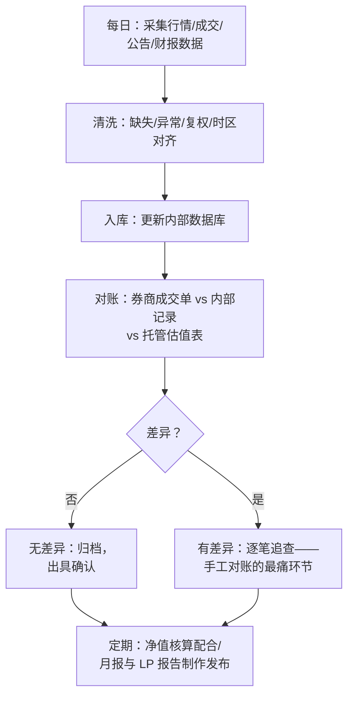
```mermaid
flowchart TD
    D1["每日：采集行情/成交/<br/>公告/财报数据"]
    D2["清洗：缺失/异常/复权/时区对齐"]
    D3["入库：更新内部数据库"]
    D4["对账：券商成交单 vs 内部记录<br/>vs 托管估值表"]
    D5{"差异？"}
    D6["无差异：归档，<br/>出具确认"]
    D7["有差异：逐笔追查——<br/>手工对账的最痛环节"]
    D8["定期：净值核算配合/<br/>月报与 LP 报告制作发布"]
    D1 --> D2 --> D3 --> D4 --> D5
    D5 -->|否| D6 --> D8
    D5 -->|是| D7 --> D8
```

**痛点量化**：①三市三券商对账每日 30-90 分钟，差异追查单次可达数小时（经验估计）；②数据错误传导——一处清洗错误污染下游研究与归因，事后返工成本是预防成本的 5-10 倍（经验估计）；③月报/LP 报告制作 1-3 个工作日/月（经验估计）；④人员流动风险：小团队的工具链常为"个人手艺"，离职即瘫痪（经验估计）。

**对账实战的三个典型差异源**（合理推演）：①**口径差**——券商成交单含手续费与净额口径不一致，托管估值表的应收应付科目与内部记录的时点差（T+1/T+2 交收制度差异直接制造账实时间窗）；②**公司行动**——分红、送股、拆股、供股权证的登记与到账跨期，港股供股权证的处理尤其容易漏记；③**汇率折算**——多币种账户下，内部记录按交易日汇率、托管按估值日汇率，差异随汇率波动放大。三类差异的共同特征：单笔金额小、追查耗时长、不追则慢性失真——追踪一条 200 元的差异可能花掉 40 分钟，但不追踪的代价是净值失真传导至 LP 信任与监管申报。自动对账的价值因此不是省那 30 分钟，而是把"差异发现时点"从月底提前到当日。

### 2.5.3 AI 增强机会与 Skill 化

**AI 增强机会**：数据采集清洗（完全替代，管道化）；对账（完全替代，五元事件库使"内部记录"天然结构化、自动三方比对，差异即告警）；报告生成（人机协作，AI 生成+人签发）；系统维护（保留人工）。

**Skill：运营的"单一事实源"原则**——优秀运营的第一原则：任何数据只在一个地方产生、所有下游引用同一份（single source of truth），禁止"微信里一个数、Excel 里一个数、报告里一个数"。配套：每笔差异必须归因到"采集错/清洗错/口径错/对方错"四类之一并统计月度分布，差异率目标 <0.1%。该原则与五元事件库"唯一事实源+哈希链"是同一思想的两面。

**运营的隐形价值**：运营岗位在小团队中薪酬最低、流动性最高，却是唯一"天天碰全部数据"的角色——优秀运营对数据异常的直觉（"这个数看着就不对"）往往比任何监控规则更早发现问题。因此运营 know-how 的沉淀方向有二：一是把这种直觉显性化为校验规则（某类数据的合理区间、勾稽关系、时序连续性检查），让系统继承"看着不对"的能力；二是把运营从核对劳动中解放后，让其转型为"数据质量管理员"——对系统自动产出的结果做抽检与异常裁决，人的角色从生产者变为质检者。这一转型路径对所有被自动化的岗位都成立：**自动化的终局不是无人，而是人从执行者上移为裁决者与质检者**。

### 2.5.4 跨行业抽象

运营模块抽象为"**采集→清洗→入库→对账→报告**"的数据地基链条，存在于一切有多方账目需要核对的行业：连锁零售（门店 POS vs 总部 vs 支付渠道三方对账）、酒店（OTA 渠道对账）、电商（平台账单对账）。抽象要点：对账自动化价值 = 差错率 × 单笔差错损失 + 释放的工时，小组织中该角色常兼职化、手艺化，是最典型的"看不见但天天漏血"的地基环节。

## 2.6 多智能体交易框架的 know-how 对照研究

本行业的特殊性在于：学术界与开源社区已存在多个"用多智能体模拟投资团队分工"的公开框架，它们的分工设计本身就是对一线 know-how 的结构化提炼，且经受了回测或实盘检验。将四个代表性框架与第二章的人类角色对照，可交叉验证本章流程拆解的完备性，并为角色包设计提供直接参照。

### 2.6.1 TradingAgents：交易员公司式分工（arXiv:2412.20138）

该框架完整复刻了交易公司的组织形态：**分析师团队**（基本面分析师、情绪分析师、新闻分析师、技术分析师四类）→ **研究员多空辩论**（看涨研究员与看跌研究员就证据对抗辩论）→ **交易员**（综合辩论结论形成交易计划）→ **风险管理团队**（激进/保守/中性三视角风控评审）→ **基金经理**（最终拍板）。与本报告第二章的对照结论：①四类分析师与 2.1 节"六维覆盖"基本同构（宏观维度被并入新闻/基本面），验证了小团队研究覆盖的最小完备集；②多空辩论机制是 2.1.6"证伪优先"方法论的系统化——把"找反方证据"从个人自律升级为组织结构；③三视角风控评审对应 2.3 节风控官的"风险偏好分层"，提示风控不是单一阈值问题而是立场平衡问题。其局限同样值得记录：框架为单标的日频决策设计，未覆盖组合层敞口管理、跨市场规则差异与真实执行细节（滑点/流动性/断连）——这些恰是本报告调研揭示的人类一线真正的痛点密集区，说明学术框架与一线实务之间存在"最后一公里"的空白带。

### 2.6.2 FinMem：分层记忆（AAAI）

FinMem 的核心设计是**记忆分层与差异化衰减**：即时行情信息快速衰减、中期事件记忆按重要度保留、长期逻辑记忆持久保存，并以"个性化配置"模块定义智能体的风险偏好画像。对照人类一线：这与优秀 PM 的信息处理节律一致——盘中价格波动几小时后就不重要了（否则会被噪音淹没），财报逻辑管一个季度，产业判断管数年。人类的问题在于**衰减靠感觉、无一致性**：疲惫时把噪音当信号，恐慌时把长期逻辑瞬间丢弃。FinMem 的启示是把"信息半衰期"显性化为系统参数，这与 2.1.5 研究归档自动化的设计直接对应。

### 2.6.3 FinAgent：双层反思

FinAgent 在市场分析智能体之上叠加**双层反思机制**：对单次决策的即时反思与对决策模式的周期反思。对照人类一线：这正是 2.4 节"日度归因"与"周末深度复盘"的双层结构——即时反思管单笔对错，周期反思管方法论迭代。人类一线的失效模式是两层都依赖自律、亏损日恰恰最不愿反思；系统化后两层均成为默认产出。

### 2.6.4 AlphaAgent：因子流水线与抗衰减

AlphaAgent 面向量化研究，核心是用智能体流水线持续产出**抗衰减的因子**——针对因子随时间失效（alpha decay）这一量化行业公敌，让系统持续检验、淘汰、再生因子。对照人类量化研究员：2.4.3 痛点 P2（过拟合）与 P4（数据准备吞噬时间）正是其要解决的问题的人类版本；WFA 滚动验证在 AlphaAgent 中是流水线内建环节而非可选纪律。

### 2.6.5 框架对照的综合结论

四个框架与本报告人类流程拆解的映射高度吻合，互相印证了"分析师—辩论—交易员—风控—基金经理"是投资团队的行业最小完备分工。同时必须清醒记录两点：①**学术框架普遍回避了执行层与合规层的脏活**（断连、对账、规则差异、留痕审计），而这些在本报告痛点量化中占比近半；②**实盘证据仍然薄弱**——Alpha Arena 作为迄今最受关注的实盘检验，六模型中四家亏损且头部模型回撤巨大（详见 3.6 节），说明"框架分工正确"不等于"实盘盈利可靠"，人审机制在可见期内不可省略。

### 2.6.6 从框架到角色包的五条移植原则

综合四个框架的得失与第二章的一线实务，提炼从"学术多智能体"到"可落地角色包"的五条移植原则：①**分工沿用以证据为准**——分析师四类划分、多空辩论、三视角风控直接采用，因为它们是行业组织形态的收敛解；②**记忆必须分层且带衰减**（FinMem 原则），且衰减参数按标的类型可调（题材股记忆半衰期短、价值股长）；③**反思必须双层且强制**（FinAgent 原则），即时反思挂接每笔交易回执，周期反思挂接周末流水线，均不依赖人的发起；④**抗衰减是策略资产的默认假设**（AlphaAgent 原则），任何信号/因子入库即带"衰减监控"属性，OOS 衰减超阈值自动降级而非人工发现；⑤**执行与合规的脏活是一等公民**——框架论文不写的断连处理、对账、留痕、规则差异，在角色包中占用至少一半的设计预算，因为一线痛点的量化分布就是如此。

## 2.7 五角色协同接口分析（合理推演）

小团队的效率损耗大量发生在**角色间的接口**上而非角色内部：

- **研究员→PM 接口**：观点传递靠口头与微信，"当时推荐的理由"无结构化记录，事后无法验证研究员质量；接口损耗表现为 PM 对研究观点的采纳率无人能答（经验估计 20%-50% 但无数据）。
- **PM→交易员接口**：决策传递为自然语言（"宁德时代找机会减一点"），交易员需二次猜测数量、价格区间、时限——歧义是执行错误的最大来源。
- **交易员→风控接口**：风控依赖交易员自觉上报异常，主动监控手段缺失。
- **全员→归因接口**：归因需要"决策时的依据"，但决策依据散落在各角色的脑子里与聊天记录里，归因分析师做的是考古而非分析。
- **运营→全员接口**：对账差异的追查需要还原"当时谁做了什么"，无留痕则逐笔人肉核对。

接口分析的核心结论：**小团队的协同问题本质是"自然语言接口"问题**——角色间用自然语言传递本应结构化的信息（观点、指令、依据、结果）。任何自动化方案的价值排序应该是：先把接口结构化（观点三件套、订单四要素、动作留痕），再谈各角色内部的智能化。这一结论直接指导角色包设计： bundles/trading 的 Schema 装配槽（观点/计划/订单/归因四类对象的结构定义）优先级高于任何单个 Agent 的聪明程度。

---

# 第三章 行业痛点与 AI 替代可行性矩阵

## 3.1 行业特有效率瓶颈：根源分析

中小私募/家族办公室/专业个人交易者（1-10 人）面对的效率瓶颈，根源是**结构性**的——不是"不努力"，而是"规模不经济"：

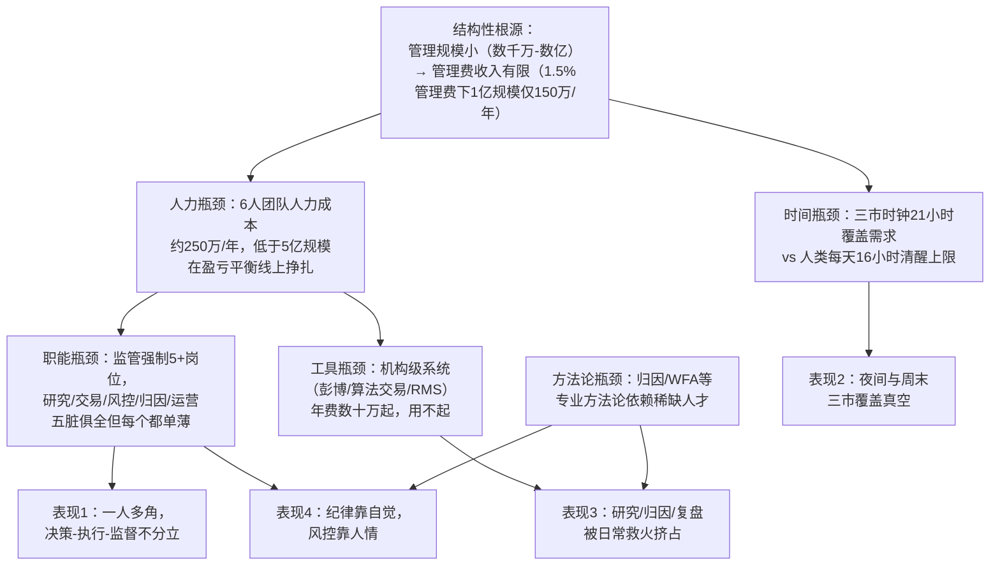
```mermaid
graph TD
    Root["结构性根源：<br/>管理规模小（数千万-数亿）<br/>→ 管理费收入有限（1.5%管理费下1亿规模仅150万/年）"]
    R1["人力瓶颈：6人团队人力成本<br/>约250万/年，低于5亿规模<br/>在盈亏平衡线上挣扎"]
    R2["职能瓶颈：监管强制5+岗位，<br/>研究/交易/风控/归因/运营<br/>五脏俱全但每个都单薄"]
    R3["时间瓶颈：三市时钟21小时覆盖需求<br/>vs 人类每天16小时清醒上限"]
    R4["工具瓶颈：机构级系统<br/>（彭博/算法交易/RMS）<br/>年费数十万起，用不起"]
    R5["方法论瓶颈：归因/WFA等<br/>专业方法论依赖稀缺人才"]
    P1["表现1：一人多角，<br/>决策-执行-监督不分立"]
    P2["表现2：夜间与周末<br/>三市覆盖真空"]
    P3["表现3：研究/归因/复盘<br/>被日常救火挤占"]
    P4["表现4：纪律靠自觉，<br/>风控靠人情"]
    Root --> R1 --> R2
    Root --> R3
    R1 --> R4
    R2 --> P1
    R3 --> P2
    R4 --> P3
    R2 --> P4
    R5 --> P3
    R5 --> P4
```

**关键数字**（来源已标注）：雪球私募成本帖估算 6 人最小团队人力成本约 **250 万/年**（40 万/人），另一 FOF 调查帖给出人力成本 **117-186 万/年** 区间；管理费 1.5% 下，1 亿规模年收入仅 150 万——**5 亿规模以下的小私募在合规运营状态下普遍处于亏损或微利状态**（雪球帖原话："低于 5 亿规模会亏钱"）。这意味着：目标客群对"降本"的敏感度极高，对"按人头发 SaaS 账号"的付费能力极弱——AI 数字员工若按"替代 FTE 的比例"计价，经济性叙事成立；若按传统机构软件定价，则与客群支付能力错配。

## 3.2 收益流失点分析（含量级估算）

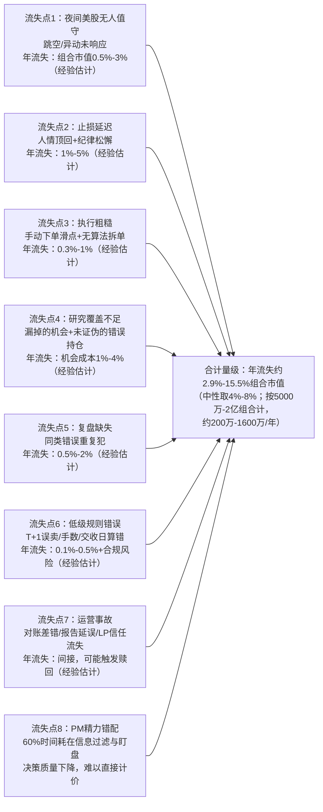
```mermaid
graph LR
    L1["流失点1：夜间美股无人值守<br/>跳空/异动未响应<br/>年流失：组合市值0.5%-3%（经验估计）"]
    L2["流失点2：止损延迟<br/>人情顶回+纪律松懈<br/>年流失：1%-5%（经验估计）"]
    L3["流失点3：执行粗糙<br/>手动下单滑点+无算法拆单<br/>年流失：0.3%-1%（经验估计）"]
    L4["流失点4：研究覆盖不足<br/>漏掉的机会+未证伪的错误持仓<br/>年流失：机会成本1%-4%（经验估计）"]
    L5["流失点5：复盘缺失<br/>同类错误重复犯<br/>年流失：0.5%-2%（经验估计）"]
    L6["流失点6：低级规则错误<br/>T+1误卖/手数/交收日算错<br/>年流失：0.1%-0.5%+合规风险（经验估计）"]
    L7["流失点7：运营事故<br/>对账差错/报告延误/LP信任流失<br/>年流失：间接，可能触发赎回（经验估计）"]
    L8["流失点8：PM精力错配<br/>60%时间耗在信息过滤与盯盘<br/>决策质量下降，难以直接计价"]
    Total["合计量级：年流失约2.9%-15.5%组合市值<br/>（中性取4%-8%；按5000万-2亿组合计，<br/>约200万-1600万/年）"]
    L1 --> Total
    L2 --> Total
    L3 --> Total
    L4 --> Total
    L5 --> Total
    L6 --> Total
    L7 --> Total
    L8 --> Total
```

**估算说明**：以上均为经验估计（区间），依据为：止损延迟单次多损 2%-5% 持仓市值 × 年发生 5-15 次 × 涉及持仓占比；滑点按年换手 5-10 倍 × 5-15bps；夜间未响应按美股持仓占比 20%-40% × 年重大隔夜异动 3-8 次 × 单次影响 1%-3%。各流失点存在重叠（如止损延迟与夜间值守可同因），合计取中性 4%-8% 而非简单加总上限。

**逐项流失机制的进一步说明**：

- **流失点 1（夜间无人值守）**：机制是"信息到达到行动之间的 6-8 小时睡眠真空"。财报季（每年四次、每次 4-6 周）是高发期——美股公司多在盘后发财报，次日开盘即重定价，北京时间的行动窗口几乎为零。经验估计该流失在美股敞口 >30% 的组合中年均 1%-3%，敞口 <10% 的组合可忽略。
- **流失点 2（止损延迟）**：机制是"处置效应"（disposition effect）的行为金融学经典偏差——人对亏损持仓的平均持有时间显著长于盈利持仓。止损延迟 1-2 日在趋势性下跌中平均多损 2%-5%（经验估计），且单次重大失控（死扛到 -30% 以上）一次即可吞掉全年超额收益。
- **流失点 3（执行粗糙）**：机制是点差+冲击+择时三层滑点的复利累积。年换手 8 倍、单次综合滑点 10bps 的组合，年损耗 0.8%——相当于管理费收入的 5 成被执行质量吃掉。
- **流失点 4（研究覆盖不足）**：机制是双向的——覆盖不到的标的错过机会，覆盖到的标的因反证不足而长期持有错误仓位。后者比前者更贵（错误持仓是负收益而非零收益）。
- **流失点 5（复盘缺失）**：机制是错误模式的重复率——无归因则无法区分运气与能力，同类错误（如追高、死扛、FOMO 加仓）年均重复 3-10 次（经验估计）。
- **流失点 6-8**：规则错误的单次损失小但伴生合规风险；运营事故的峰值损失是 LP 赎回（一次赎回 1000 万即损失 15 万/年管理费+业绩报酬）；PM 精力错配则是所有流失点的放大器——疲劳状态下决策质量系统性下降，该效应在行为研究中有充分证据但难以单独计价。

## 3.3 AI 替代可行性矩阵（三级）

综合第一、二章逐环节分析，全环节三级分类如下：

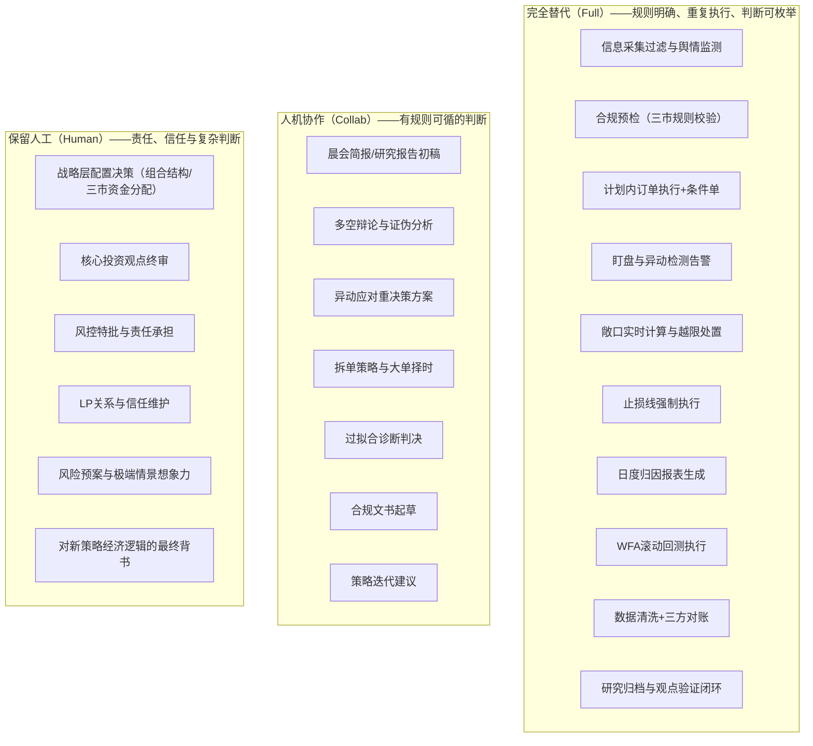
```mermaid
graph TD
    subgraph Full["完全替代（Full）——规则明确、重复执行、判断可枚举"]
        F1["信息采集过滤与舆情监测"]
        F2["合规预检（三市规则校验）"]
        F3["计划内订单执行+条件单"]
        F4["盯盘与异动检测告警"]
        F5["敞口实时计算与越限处置"]
        F6["止损线强制执行"]
        F7["日度归因报表生成"]
        F8["WFA滚动回测执行"]
        F9["数据清洗+三方对账"]
        F10["研究归档与观点验证闭环"]
    end
    subgraph Collab["人机协作（Collab）——有规则可循的判断"]
        C1["晨会简报/研究报告初稿"]
        C2["多空辩论与证伪分析"]
        C3["异动应对重决策方案"]
        C4["拆单策略与大单择时"]
        C5["过拟合诊断判决"]
        C6["合规文书起草"]
        C7["策略迭代建议"]
    end
    subgraph Human["保留人工（Human）——责任、信任与复杂判断"]
        H1["战略层配置决策（组合结构/三市资金分配）"]
        H2["核心投资观点终审"]
        H3["风控特批与责任承担"]
        H4["LP关系与信任维护"]
        H5["风险预案与极端情景想象力"]
        H6["对新策略经济逻辑的最终背书"]
    end
```

**分级理由汇总**：

- **完全替代档**的共同特征：输入输出可结构化、正确性可机器验证（回执/对账/规则命中）、错误代价有围栏兜底、人类执行时反而因疲劳/情绪/人情引入额外风险。典型如止损执行——人类止损的最大失效模式是"这一次不一样"的叙事，机器没有叙事。
- **人机协作档**的共同特征：判断质量依赖信息完备性（AI 可解决）与经验直觉（人保留），Alpha Arena 的教训（GPT-5 -62.66%：弱退出纪律+可能的方向误判；低换手精选的 Qwen +22.3% 胜出）表明纯 AI 自主决策在实盘尚不稳定，但 AI 生成"带证据的方案"+人审批，兼得信息处理带宽与责任终审。
- **保留人工档**的共同特征：决策后果的责任无法转移给机器（LP 问责的是人）、涉及信任关系（LP 沟通）、或需要对抗性想象（风险预案——AI 擅长拟合历史，不擅长想象历史未发生的崩坏路径）。

## 3.4 围栏分级模型设计（映射 WorkLoom 围栏引擎）

基于上述替代矩阵，设计 bundles/trading 角色包的 auto/review/block 三级围栏模型（锚点：fence-engine，deny 优先、求值异常按 block、基线单调守卫）：

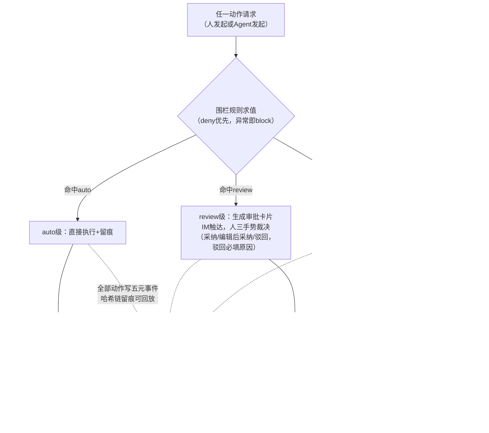
```mermaid
flowchart TD
    A["任一动作请求<br/>（人发起或Agent发起）"]
    B{"围栏规则求值<br/>（deny优先，异常即block）"}
    C["auto级：直接执行+留痕"]
    D["review级：生成审批卡片<br/>IM触达，人三手势裁决<br/>（采纳/编辑后采纳/驳回，驳回必填原因）"]
    E["block级：拒绝执行+P0告警<br/>记录违规尝试"]
    C1["auto级规则示例：<br/>R-T1 止损线触及自动执行<br/>R-T2 单标的敞口≤10%内调仓<br/>R-T3 计划内订单按审批快照执行<br/>R-T4 归因/对账/报告生成类只写内部库"]
    D1["review级规则示例：<br/>R-T5 新开仓/清仓任一标的<br/>R-T6 单标的敞口10%-20%调仓<br/>R-T7 异动应激交易（非计划内）<br/>R-T8 合规文书对外签发"]
    E1["block级规则示例：<br/>R-T9 单标的敞口>20%或总仓位>上限<br/>R-T10 A股当日买入当日卖出（T+1违反）<br/>R-T11 无做空资格标的的卖空<br/>R-T12 熔断/VCM冷静期内的追单<br/>R-T13 基线止损规则放松请求（只可加严）"]
    A --> B
    B -->|命中auto| C --> C1
    B -->|命中review| D --> D1
    B -->|命中block| E --> E1
    C -.->|"全部动作写五元事件<br/>哈希链留痕可回放"| LOG["五元事件库"]
    D -.-> LOG
    E -.-> LOG
```

**设计要点**：①高危项不过期自动放行（锚点：review-console）——深夜 review 项堆积到清晨决策包，绝不因超时而静默执行；②基线单调守卫确保客户 patch 只可加严（如把 R-T6 阈值从 20% 收紧到 15%），不可放宽（锚点：fence-engine 基线守卫）；③安装 Skill 即绑定围栏（锚点：skills），任何新策略 Skill 未声明 fence_bindings 禁止写动作。

**围栏参数的来源纪律**：围栏规则的阈值不应由产品方拍脑袋，也不应由客户在情绪激动时设定，其合法来源只有三个：①**监管硬约束**（如双 25% 组合投资比例、杠杆上限）——直接转译为 block 级基线，不可修改；②**客户风险预算**（最大回撤容忍度、单标的敞口上限）——在开户/初始化时以"风险预算面谈"流程设定，平静期设定、修改走 review 且只可加严；③**策略自身参数**（止损线、目标仓位）——随策略审批快照绑定，与策略同生命周期。三条来源对应围栏包的三层结构：基线层（监管）→ 客户 patch 层（风险预算，只收紧）→ 策略快照层（随审批生效）。**围栏的进化方向**也由此明确：每次断点事件复盘后，新识别的风险模式固化为新规则（dry-run 回放历史事件验证不误伤后上线，锚点：fence-engine dry-run），围栏包版本号随规则演进，版本快照随每次动作留痕——出事后可以精确回答"当时生效的是哪版规则"。

**围栏与审批的负荷设计**：review 级规则的阈值需要调校到"每日审批量 3-10 条"的甜区——过多则审批疲劳（人开始无脑点采纳，review 退化为摆设），过少则说明阈值过松（auto 域过大）或策略过于保守。清晨决策包 ≤20 条的硬约束（锚点：night-shift）与审批卡片的三手势设计（采纳/编辑后采纳/驳回，驳回必填原因并回流为记忆校准样本，锚点：review-console）共同保证人机交互带宽不被淹没。

## 3.5 经济性测算（区间估计）

**测算对象**：管理规模 5000 万-2 亿、团队 5-8 人的典型中小私募，引入 AI 数字员工团队（替代/增强研究员、交易员、风控执行、归因、运营五类职能的部分工时）。

### 降本价值（节省人力，年化）

| 档位 | 假设 | 年化降本 |
|------|------|----------|
| 保守 | 替代 1.0 个 FTE（运营+部分研究过滤工时），人均综合成本 30 万 | **30 万** |
| 中性 | 替代 1.5-2.0 个 FTE（运营 0.7 + 研究过滤 0.5 + 交易执行 0.4 + 归因 0.4），人均 30-40 万 | **50-70 万** |
| 乐观 | 替代 2.5-3.0 个 FTE（五人团队可精简至 2-3 人 + 外部合规挂靠） | **90-120 万** |

### 增收价值（挽回流失，年化，按 1 亿组合中性规模）

| 档位 | 假设 | 年化增收 |
|------|------|----------|
| 保守 | 挽回流失点总量 4%-8% 中的 15%（仅夜间值守+止损纪律两项部分见效） | **60-120 万** |
| 中性 | 挽回 25%-35%（执行滑点+低级错误+复盘纠错逐步叠加） | **100-280 万** |
| 乐观 | 挽回 50%（全流程纪律化+研究覆盖扩展显效） | **200-400 万** |

### 合计与关键假设清单

| 档位 | 年化总价值（1亿组合） |
|------|----------------------|
| 保守 | 90-150 万 |
| 中性 | 150-350 万 |
| 乐观 | 290-520 万 |

**关键假设清单**：

1. 人均综合成本 30-40 万/年（依据：雪球私募成本帖 40 万/人、FOF 帖 117-186 万/5-6 人区间，取下沿）；
2. 组合流失总量 4%-8%/年（依据：3.2 节经验估计叠加去重）；
3. 挽回比例 15%/25%-35%/50% 三档（经验估计，参考：止损与夜间值守两项规则化程度最高、最先见效；研究类增强见效慢）；
4. 组合规模 1 亿为中性基准，价值随规模近似线性缩放；
5. AI 系统自身成本（算力+数据+订阅）5-20 万/年（经验估计，谷时算力可压至下沿，锚点：model-router 谷时费率 ≤20%）。

**敏感性说明**（最敏感假设）：

- **挽回比例**：中性档若从 30% 降至 15%（保守档水平），年化总价值从 150-350 万降至 90-190 万——**减半**。反之升至 50%，升至 290-520 万。该假设弹性最大，取决于客户是否真正把止损/夜间值守交给系统而非人工旁路。
- **组合规模**：流失挽回价值与规模线性相关，5000 万规模下中性档合计降至 100-210 万，2 亿规模升至 250-630 万。规模 <3000 万的微型客户，降本价值占比将超过增收价值，定价叙事应切换为"合规生存的最低成本方案"（对比 250 万/年的合规人力底线）。

**测算结论**：对 1 亿级小私募，AI 数字员工团队年化价值中性估计 150-350 万，相对 5-20 万的系统成本，ROI 约 10-30 倍；即使保守档（90-150 万）ROI 也有 5-15 倍。经济性叙事成立，且核心价值主张不是"帮你赚更多"，而是"**让你以 3 个人的成本活出 8 个人的纪律与覆盖**"。

**测算的补充说明（定价含义）**：①**客群分层的价值结构差异**——中小私募的价值以降本为主（合规人力底线 250 万/年的硬约束下，任何能安全减员的方案都有确定价值）；家族办公室的价值以夜间增收为主（美股敞口大，流失点 1 权重高）且付费能力强；个人交易者的价值以"第一次拥有纪律与复盘"为主，货币化空间最小但可走量。②**价值兑现的时间曲线**——止损铁律、规则预检、对账自动化首月即见效（避免型价值）；执行质量提升 3-6 个月可见（滑点统计对比）；研究覆盖与策略迭代的价值需 6-12 个月才能从归因数据中与运气区分。因此定价与续约叙事应把"首月可验证指标"（止损执行率、对账差异发现时点、审批留痕完整率）与"年度可验证指标"（滑点年化、计划外动作率、归因覆盖的决策占比）分层管理。③**反直觉的定价锚点**——该客群对"亏 5 万"的痛感远强于"省 5 万"的快感（损失厌恶），因此"避免一次止损失控（单次即可避免 10-50 万损失）"的事故型叙事比"年化降本 50 万"的报表型叙事更有转化力；但合同定价必须锚定在可持续的报表型价值上，事故型叙事只用于获客。

## 3.6 Alpha Arena 实盘教训专节：替代分级的现实校准

Alpha Arena（Nof1.ai，2025-10-18 至 2025-11-04）是迄今最受关注的 AI 自主交易实盘公开检验：六大模型（Qwen3-Max、DeepSeek V3.1、Claude Sonnet 4.5、Grok 4、Gemini 2.5 Pro、GPT-5）各持 1 万美元真实资金，在加密永续合约市场自主完成选品、择时、仓位与风控，全部决策与成交公开。第一季结果：Qwen3-Max +22.3% 夺冠，DeepSeek +4.89% 第二，其余四家亏损（-30.8% 至 -62.7%）。对本报告替代矩阵的校准价值如下：

**教训一：最终收益掩盖路径风险**。DeepSeek 盘中曾大幅盈利最终仅 +4.89%，说明评估 AI 交易能力必须看最大回撤、波动率、换手率等路径指标——这正是 2.4 节归因模块存在的意义，也说明自动化系统必须把"过程风控"置于"结果盈利"之上。

**教训二：低换手精选跑赢高频动作**。Qwen 全程约 43 笔交易（日均不足 3 笔）为全场最低换手之一且夺冠；亏损模型普遍动作频繁、退出纪律弱。对照替代矩阵：AI 在"少而精的战术执行"上已可信任，在"高频自主临机决策"上尚不可信任——这直接支撑"应激层规则化动作 auto、临机新决策 review"的围栏设计。

**教训三：同一技术族不同结局，治理结构比模型能力更关键**。六模型拿到相同输入与相同提示词，结局分化高达 85 个百分点，差异主要来自仓位管理、退出纪律与动作频率等"治理层"行为而非预测能力。对本报告的含义：bundles/trading 的竞争力不在底层模型选型，而在围栏、预案矩阵、归因闭环这些治理资产——治理结构决定 AI 是 Qwen 式结局还是 GPT-5 式结局。

**教训四：短期单窗口结果不构成能力证明**。17 天、单一市场、杠杆合约、单次运行，无法区分能力与运气。因此对 AI 自主交易的信任建立必须走"模拟盘→小资金实盘→逐步放权"的渐进路径，且每一步放权都以归因数据为依据——这与客户要求的"先模拟盘后实盘"路线一致，也应固化为围栏包版本的升级纪律（放权即围栏放宽，须基于 OOS 证据，且可回滚）。

## 3.7 替代矩阵汇总表（环节 × 三级 × 理由 × 优先级）

| 环节 | 分级 | 核心理由 | 落地优先级 |
|------|------|----------|-----------|
| 信息采集过滤/舆情监测 | 完全替代 | 噪音占比 70-90%，相关性打分可机器化 | P0 |
| 盯盘与异动检测 | 完全替代 | 人类盯盘是最差监控器（疲劳/情绪化） | P0 |
| 合规预检（三市规则） | 完全替代 | 规则可枚举，人类月均 1-3 次低级错误 | P0 |
| 止损线强制执行 | 完全替代 | 人类失效模式是"这一次不一样"叙事 | P0 |
| 敞口实时计算 | 完全替代 | 连续计算是机器本能 | P0 |
| 计划内订单执行 | 完全替代 | 四要素结构化+回执可验证 | P1 |
| 数据清洗/三方对账 | 完全替代 | 差异率目标可机器达成 | P1 |
| 日度归因报表 | 完全替代 | 模板化+五元数据天然齐备 | P1 |
| WFA 滚动验证 | 完全替代 | 机械计算+防数据窥探由管道保证 | P1 |
| 研究归档与验证闭环 | 完全替代 | 人类靠自律必然缺失 | P2 |
| 晨会简报/报告初稿 | 人机协作 | 生成可替代、背书须人 | P1 |
| 多空辩论/证伪分析 | 人机协作 | 反方证据生成可替代、判决须人 | P2 |
| 异动重决策方案 | 人机协作 | 方案生成可替代、责任裁决须人 | P1 |
| 拆单策略/大单择时 | 人机协作 | 规则化执行为主、策略裁定留人 | P2 |
| 过拟合诊断判决 | 人机协作 | 证据生成可替代、终审须人 | P2 |
| 合规文书起草 | 人机协作 | 起草可替代、签发须人 | P2 |
| 战略层配置决策 | 保留人工 | 责任不可转移+经济逻辑终审 | — |
| 核心投资观点终审 | 保留人工 | 直觉与产业理解的责任主体 | — |
| 风控特批 | 保留人工 | 特批=责任承担，须留痕 | — |
| LP/委托人沟通 | 保留人工 | 信任关系不可代理 | — |
| 极端情景预案设计 | 保留人工 | 需要对抗性想象力 | — |

**优先级逻辑**：P0 = 夜间值守与纪律类（无交易室场景的基石，流失挽回最快见效）；P1 = 日常机械流程类（降本主力）；P2 = 方法论增强类（长期复利价值）。

---

# 第四章 特殊场景："无交易室"全自动化业态

## 4.1 特殊业态识别

本行业的"无人业态"等价物是**"无交易室"全自动化业态**：没有物理交易室、没有轮班交易员、没有夜间风控员，1-3 人团队 + AI 数字员工团队，24 小时覆盖美/A/港三市。两个最严苛的子场景：

1. **夜间无人值守交易**：美股常规时段对应北京 21:30-04:00（夏令时）/22:30-05:00（冬令时），完整覆盖人类睡眠区。这是人类生理上最不可能长期自持的时段，也是本报告第一章 T13"值守困境区"的系统化解法。
2. **周末深度复盘**：周五美股收盘（周六凌晨）到周一 A 股开盘前的 60 小时，是唯一无行情打扰的窗口，承载周度归因、WFA、策略迭代、下周计划——但人类从业者在连轴五天后此时的有效产能极低。

## 4.2 全流程自动化与断点标注

以"夜间无人值守"为主场景，还原 24 小时全自动流程，并标注断点（◆BP）：

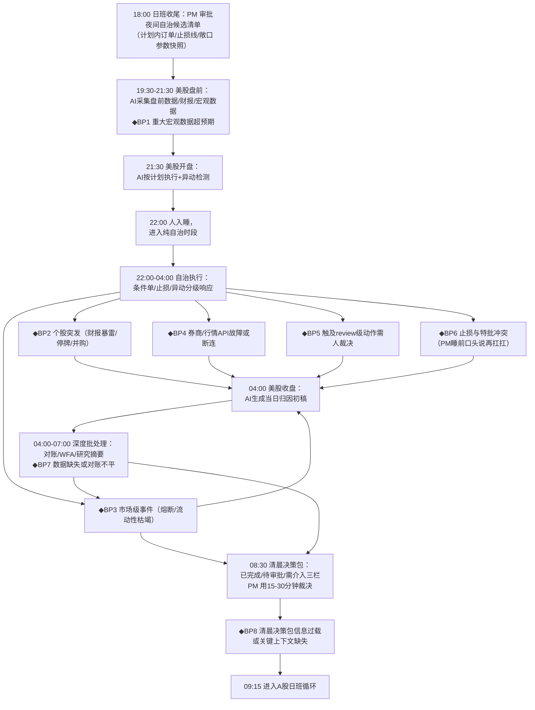
```mermaid
flowchart TD
    N1["18:00 日班收尾：PM 审批<br/>夜间自治候选清单<br/>（计划内订单/止损线/敞口参数快照）"]
    N2["19:30-21:30 美股盘前：<br/>AI采集盘前数据/财报/宏观数据<br/>◆BP1 重大宏观数据超预期"]
    N3["21:30 美股开盘：<br/>AI按计划执行+异动检测"]
    N4["22:00 人入睡，<br/>进入纯自治时段"]
    N5["22:00-04:00 自治执行：<br/>条件单/止损/异动分级响应"]
    N6["◆BP2 个股突发（财报暴雷/停牌/并购）"]
    N7["◆BP3 市场级事件（熔断/流动性枯竭）"]
    N8["◆BP4 券商/行情API故障或断连"]
    N9["◆BP5 触及review级动作需人裁决"]
    N10["◆BP6 止损与特批冲突<br/>（PM睡前口头说再扛扛）"]
    N11["04:00 美股收盘：<br/>AI生成当日归因初稿"]
    N12["04:00-07:00 深度批处理：<br/>对账/WFA/研究摘要<br/>◆BP7 数据缺失或对账不平"]
    N13["08:30 清晨决策包：<br/>已完成/待审批/需介入三栏<br/>PM 用15-30分钟裁决"]
    N14["◆BP8 清晨决策包信息过载<br/>或关键上下文缺失"]
    N15["09:15 进入A股日班循环"]
    N1 --> N2 --> N3 --> N4 --> N5
    N5 --> N6
    N5 --> N7
    N5 --> N8
    N5 --> N9
    N5 --> N10
    N6 --> N11
    N7 --> N11
    N8 --> N11
    N9 --> N11
    N10 --> N11
    N11 --> N12 --> N7 --> N13
    N12 --> N13 --> N14 --> N15
```

## 4.2.1 一个完整的夜间断点链案例（合理推演）

以一次真实的典型场景串起断点 1-8，说明断点不是孤立发生而是链式传导的：某周三，美联储议息夜。20:00（北京）某持仓科技股盘前发财报，营收不及预期，盘前 -9%（BP2 触发）。21:30 开盘前，系统按 PM 睡前审批的预案（"财报后跌 >8% 减半"）准备执行；22:00 PM 入睡。22:15 减半订单按限价单分批挂出，成交 70%，剩余 30% 因流动性稀薄未成交（正常执行分支）。23:40 美联储主席讲话偏鹰，纳指期货跳水（BP1 触发），系统切换防御参数：收紧剩余持仓止损线、暂停新开仓。01:20 行情推送中断 90 秒（BP4 触发），系统切换备用行情源并标记"数据缺口段"；因委托回报流同步中断，未成交的 30% 订单状态进入"不明"集合，按原则冻结该账户新动作直至状态收敛。01:35 连接恢复，对账确认订单已被交易所自动撤销，状态收敛，解冻。03:50 该股随大盘反弹至 -6%，触及收紧后的止损线与否的判断落入预案灰色区（BP5 触发——预案未覆盖"先减半后反弹"的组合状态），生成 review 项：影响 <敞口 5%，分级 L1，不唤醒，进清晨决策包。04:00 收盘后批处理启动，发现备用行情源在缺口段有 3 分钟 K 线缺失（BP7 触发），自动从第三数据源补齐并标注。08:30 PM 查看决策包：已完成 4 项（减半执行/防御参数切换/断连处置/数据补齐）、待审批 1 项（剩余仓位处置，附完整事件链与不动作后果）、需介入 0 项。PM 用 12 分钟完成裁决。**这个夜晚的链式启示**：五个断点在 10 小时内相继触发且相互放大（财报→宏观→断连→审批→数据），任何一个断点处置失当都会污染下一个断点的判断基础；人工模式下 PM 只能在早晨面对既成事实，而断点链的价值正在于每一环都被留痕、可回放、可复盘——周五的断点复盘会因此多出一条新预案："先减半后反弹"状态的处置规则，断点 5 的一个分支就此消失。

在进入逐断点分析前，先明确断点分析的口径：断点 = 全自动流程中"自动化无法独立闭环、需要人工介入或人类承担残余风险"的环节。断点不是系统的羞耻，而是系统边界的设计输入——无交易室业态的可靠性不取决于"没有断点"，而取决于"每个断点都有预案、有兜底、有学习闭环"。以下 8 个断点按发生时段（盘前→盘中→收盘后→清晨）排序，完整覆盖夜间无人值守与周末复盘两大子场景。

### 断点 1：重大宏观数据超预期（盘前/盘中）

| 字段 | 说明 |
|------|------|
| 断点编号/名称 | BP1：重大宏观数据超预期 |
| 触发条件 | 非农/CPI/议息等一级数据偏离预期超预设阈值（如 CPI 偏离 ±0.3pct），或美联储主席非常规讲话 |
| 发生频率 | 中频——每月 2-4 次一级数据发布，其中显著超预期约 30%-40%（经验估计） |
| 影响等级 | 资金风险（开盘跳空、波动率骤升） |
| 当前人工处置方式 | PM 熬夜守候数据发布（21:30/20:30 等时点），凭经验临场调整计划；小团队常态是"赌数据不爆雷，先睡了" |
| AI 兜底可行性 | **高**：数据发布为已知时点已知指标，可预设"数据偏离阈值→自动切换防御参数（降杠杆/收紧止损/暂停新开仓）"的预案矩阵，auto 级执行；预案外的偏离升级 review 并电话级唤醒 PM |

### 断点 2：个股突发事件

| 字段 | 说明 |
|------|------|
| 断点编号/名称 | BP2：个股突发（财报暴雷/停牌/并购/高管变故） |
| 触发条件 | 持仓标的盘前/盘中发布重大公告，或异动触发预设阈值（如盘前跌 >7%） |
| 发生频率 | 中频——持仓 20-40 只组合，年均遭遇 5-15 次（经验估计；财报季集中） |
| 影响等级 | 资金风险（单标的敞口损失扩大） |
| 当前人工处置方式 | 夜间基本无处置，次日开盘已成既定损失；白天靠 PM 刷到新闻后临场决策 |
| AI 兜底可行性 | **中高**：检测（公告抓取+异动监控）可完全自动化；处置可规则化一半——"跌穿 X 自动减半"类预设指令 auto 执行；但"暴雷是错杀还是逻辑破坏"的判断须保留人工，进 review 队列+唤醒分级（盘前跌 >15% 电话唤醒，7%-15% IM 强提醒） |

### 断点 3：市场级极端事件（熔断/流动性枯竭）

| 字段 | 说明 |
|------|------|
| 断点编号/名称 | BP3：市场级极端事件 |
| 触发条件 | 标普 500 触发 7%/13%/20% 三级熔断、港股 VCM 大面积触发、或 VIX 单日飙升超预设阈值 |
| 发生频率 | 低频——熔断机制 1988 年设立以来美股仅触发数次（2020 年 3 月四次为历史极值），但单次影响巨大 |
| 影响等级 | 安全合规风险+资金风险（极端行情下的错误动作可能造成不可逆损失） |
| 当前人工处置方式 | 无预案者慌乱操作或瘫痪；有预案者按纸面预案执行，但深夜无人执行 |
| AI 兜底可行性 | **中**：检测可完全自动化；处置策略必须"保守化优先"——熔断期间默认冻结新开仓、只执行减仓类动作、任何加仓类动作一律 block；熔断复盘属人类战略决策，AI 只提供数据底稿。边界：AI 不得在极端行情中"发挥创造性" |

### 断点 4：券商/行情 API 故障或断连

| 字段 | 说明 |
|------|------|
| 断点编号/名称 | BP4：基础设施故障 |
| 触发条件 | 券商交易网关超时/拒单、行情推送中断超阈值（如 60s 无心跳）、回报流丢失 |
| 发生频率 | 中频——券商 API 月均 1-3 次短故障（经验估计），重大故障年均 1-2 次 |
| 影响等级 | 服务中断+资金风险（委托状态不明=仓位真实状态不明） |
| 当前人工处置方式 | 人工切换备用通道、电话券商客服、手工核对委托状态；夜间则完全失控 |
| AI 兜底可行性 | **中高**：断连检测与降级切换（主→备行情源、API→备用券商）可自动化；关键原则——状态不明期间禁止新动作（宁可错过不可做错），持续重试对账直至委托状态收敛，无法收敛则升级唤醒人工并冻结该账户交易 |

### 断点 5：review 级动作需人裁决但人在睡觉

| 字段 | 说明 |
|------|------|
| 断点编号/名称 | BP5：夜间审批堆积 |
| 触发条件 | 自治时段产生 review 级动作（如非计划内异动应对、新开仓建议），需要人裁决 |
| 发生频率 | 高频——平均每周 2-5 次（经验估计，取决于市场波动与策略风格） |
| 影响等级 | 体验受损（机会流失）为主，偶发资金风险 |
| 当前人工处置方式 | 无对应机制——现状是要么人硬撑着不睡，要么系统（若有人写）被赋予过大的自动权限 |
| AI 兜底可行性 | **高（机制层面）**：核心是"不过期自动放行"原则——review 项一律挂起等待，绝不超时静默执行（锚点：review-console 高危项不过期）；按影响分级触达：普通项进清晨决策包，紧急项（时效窗口 <2 小时且影响 >敞口 5%）IM 强提醒，极紧急电话唤醒。机会流失是可接受代价，权限静默放大不可接受 |

### 断点 6：止损规则与 PM 临时意志冲突

| 字段 | 说明 |
|------|------|
| 断点编号/名称 | BP6：止损与"再扛一扛"冲突 |
| 触发条件 | 持仓触及预设止损线，但 PM 睡前曾表示"这单再扛扛"（口头/非正式渠道），或盘中试图绕过止损规则 |
| 发生频率 | 中高频——人性使然，月均 2-6 次（经验估计；亏损期频率显著上升） |
| 影响等级 | 资金风险（止损失效是组合重大回撤的第一来源） |
| 当前人工处置方式 | 人类团队无解：交易员不敢违逆 PM，风控官人情顶回；这是小团队风控失效的最典型路径 |
| AI 兜底可行性 | **高，且是 AI 的独特价值**：止损规则属基线围栏，只可加严不可放宽（锚点：fence-engine 基线单调守卫）；PM 的"再扛扛"属规则修改请求，必须走正式 review 流程并写明理由留痕（驳回回流为记忆校准样本）；规则在情绪平静时设定，在情绪激动时不可被口头推翻——机器是 PM"冷静时的自己"对抗"恐慌时的自己"的执行者 |

### 断点 7：数据缺失或对账不平

| 字段 | 说明 |
|------|------|
| 断点编号/名称 | BP7：批处理数据异常 |
| 触发条件 | 凌晨批处理（对账/归因/WFA）中发现成交回报缺失、托管估值差异超阈值、行情数据缺段 |
| 发生频率 | 中频——月均 1-4 次（经验估计，跨三市三券商场景更高） |
| 影响等级 | 服务中断（归因与报告失真，次日决策基于错误底稿） |
| 当前人工处置方式 | 运营次日手工逐笔追查，耗时数小时，期间研究/归因全线等待 |
| AI 兜底可行性 | **高**：差异自动归类（采集错/清洗错/口径错/对方错），可自动重采的自动修复；不可修复的标注"底稿存疑"并在清晨决策包显著提示——关键原则是"存疑数据宁可标注不可静默填补" |

### 断点 8：清晨决策包信息过载或上下文缺失

| 字段 | 说明 |
|------|------|
| 断点编号/名称 | BP8：清晨决策包可用性失败 |
| 触发条件 | 夜间事件过多导致决策包 >20 条，或关键裁决项缺少支撑上下文（PM 看不懂 AI 为什么建议这么做） |
| 发生频率 | 中频——高波动周每周 1-2 次（经验估计） |
| 影响等级 | 体验受损（决策包失去存在意义，PM 退回全程手工复核） |
| 当前人工处置方式 | 无对应机制（人工模式下不存在决策包，但等价物是"早晨面对 200 条未读消息+三个市场隔夜变化"的混沌状态，恢复上下文需 1-2 小时） |
| AI 兜底可行性 | **中高**：决策包硬性 ≤20 条、三栏分级（已完成/待审批/需介入）（锚点：night-shift 清晨决策包）；每条裁决项强制携带"依据+数据引用+不动作的后果"三要素；超限条目自动合并同类。残余风险是 AI 摘要失真——需保留"一键展开原始事件链"的核验通道（五元事件哈希链可回放，锚点：workdata） |

## 4.4 三级兜底方案设计

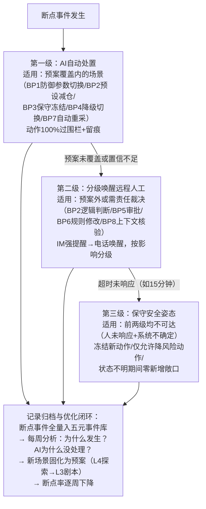
```mermaid
flowchart TD
    X["断点事件发生"]
    L1["第一级：AI自动处置<br/>适用：预案覆盖内的场景<br/>（BP1防御参数切换/BP2预设减仓/<br/>BP3保守冻结/BP4降级切换/BP7自动重采）<br/>动作100%过围栏+留痕"]
    L2["第二级：分级唤醒远程人工<br/>适用：预案外或需责任裁决<br/>（BP2逻辑判断/BP5审批/<br/>BP6规则修改/BP8上下文核验）<br/>IM强提醒→电话唤醒，按影响分级"]
    L3["第三级：保守安全姿态<br/>适用：前两级均不可达<br/>（人未响应+系统不确定）<br/>冻结新动作/仅允许降风险动作/<br/>状态不明期间零新增敞口"]
    LOOP["记录归档与优化闭环：<br/>断点事件全量入五元事件库<br/>→ 每周分析：为什么发生？<br/>AI为什么没处理？<br/>→ 新场景固化为预案（L4探索→L3剧本）<br/>→ 断点率逐周下降"]
    X --> L1
    L1 -->|"预案未覆盖或置信不足"| L2
    L2 -->|"超时未响应（如15分钟）"| L3
    L1 --> LOOP
    L2 --> LOOP
    L3 --> LOOP
```

**设计原则**：兜底的方向永远是"降风险"而非"保收益"——三级兜底的终极姿态是"宁可错过，不可做错"。断点不是失败，而是系统学习的最小单元：每个断点事件都带着完整的五元上下文入库，每周断点复盘会回答三个问题（为什么发生/AI 为什么没处理/如何减少未来断点），把新场景持续固化为 L3 确定性剧本（锚点：runtime 执行面五级）。

## 4.5 人工作业 vs AI 增强流程对比（2 个场景）

### 场景一：美股持仓夜间遭遇财报暴雷

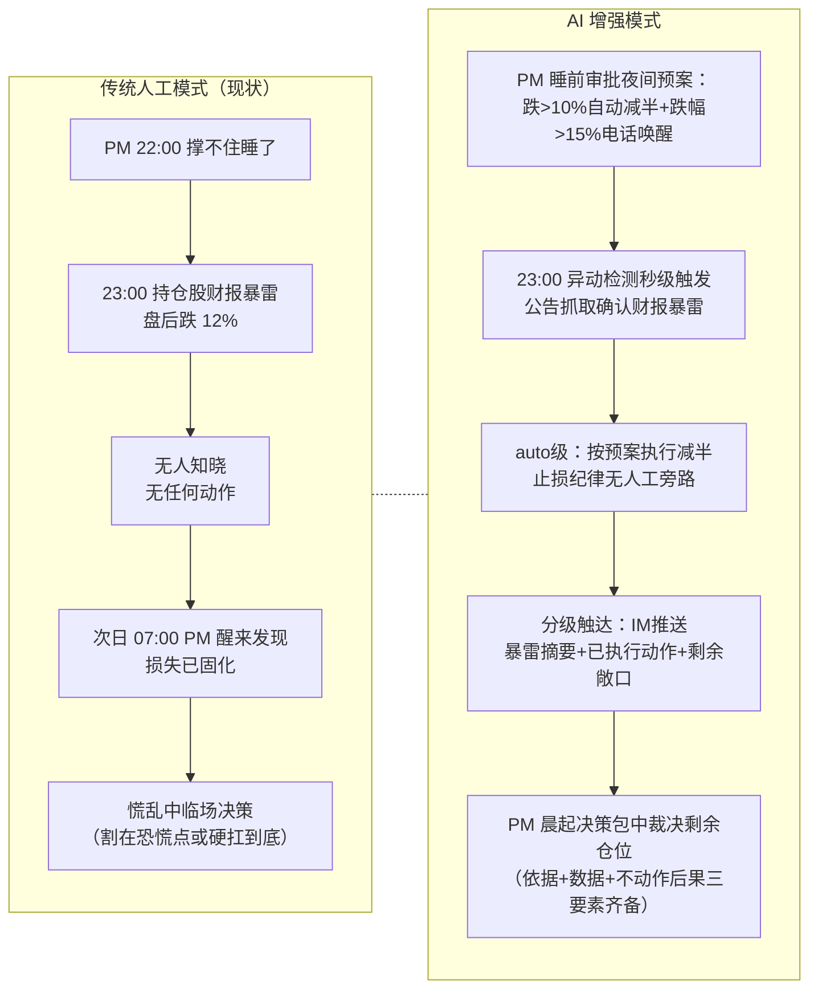
```mermaid
flowchart LR
    subgraph 传统人工["传统人工模式（现状）"]
        A1["PM 22:00 撑不住睡了"]
        A2["23:00 持仓股财报暴雷<br/>盘后跌 12%"]
        A3["无人知晓<br/>无任何动作"]
        A4["次日 07:00 PM 醒来发现<br/>损失已固化"]
        A5["慌乱中临场决策<br/>（割在恐慌点或硬扛到底）"]
        A1 --> A2 --> A3 --> A4 --> A5
    end
    subgraph AI增强["AI 增强模式"]
        B1["PM 睡前审批夜间预案：<br/>跌>10%自动减半+跌幅>15%电话唤醒"]
        B2["23:00 异动检测秒级触发<br/>公告抓取确认财报暴雷"]
        B3["auto级：按预案执行减半<br/>止损纪律无人工旁路"]
        B4["分级触达：IM推送<br/>暴雷摘要+已执行动作+剩余敞口"]
        B5["PM 晨起决策包中裁决剩余仓位<br/>（依据+数据+不动作后果三要素齐备）"]
        B1 --> B2 --> B3 --> B4 --> B5
    end
    传统人工 -.- AI增强
```

**对比量化**：人工模式下该场景损失 = 全额敞口 × 隔夜跌幅 + 次日恐慌执行的额外滑点（经验估计多损 1%-3%）；AI 模式下损失 = 半仓 × 跌幅，且执行在流动性尚存的时点完成。差异的核心不是速度，而是**"睡前写好的预案"替代了"睡梦中的裸奔"**。

### 场景二：周末深度复盘与策略迭代

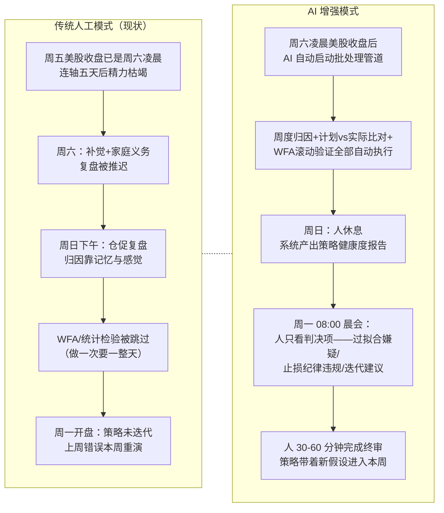
```mermaid
flowchart LR
    subgraph 传统人工2["传统人工模式（现状）"]
        C1["周五美股收盘已是周六凌晨<br/>连轴五天后精力枯竭"]
        C2["周六：补觉+家庭义务<br/>复盘被推迟"]
        C3["周日下午：仓促复盘<br/>归因靠记忆与感觉"]
        C4["WFA/统计检验被跳过<br/>（做一次要一整天）"]
        C5["周一开盘：策略未迭代<br/>上周错误本周重演"]
        C1 --> C2 --> C3 --> C4 --> C5
    end
    subgraph AI增强2["AI 增强模式"]
        D1["周六凌晨美股收盘后<br/>AI 自动启动批处理管道"]
        D2["周度归因+计划vs实际比对+<br/>WFA滚动验证全部自动执行"]
        D3["周日：人休息<br/>系统产出策略健康度报告"]
        D4["周一 08:00 晨会：<br/>人只看判决项——过拟合嫌疑/<br/>止损纪律违规/迭代建议"]
        D5["人 30-60 分钟完成终审<br/>策略带着新假设进入本周"]
        D1 --> D2 --> D3 --> D4 --> D5
    end
    传统人工2 -.- AI增强2
```

**对比量化**：人工模式复盘周耗时 4-8 小时且常被跳过（执行率经验估计 <50%），AI 模式人工投入 0.5-1 小时且执行率 100%（系统无自律问题）；WFA 从"月度奢侈品"变为"周度日用品"。

### 场景三（补充）：A 股止损纪律的日内执行

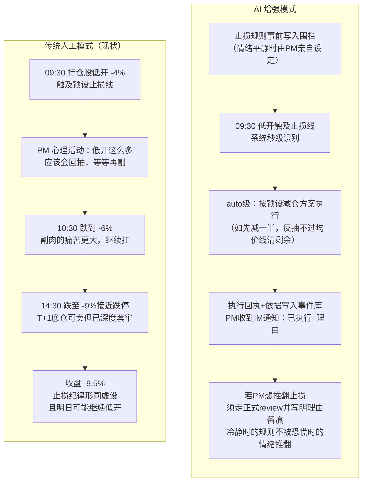
```mermaid
flowchart LR
    subgraph 传统人工3["传统人工模式（现状）"]
        E1["09:30 持仓股低开 -4%<br/>触及预设止损线"]
        E2["PM 心理活动：低开这么多<br/>应该会回抽，等等再割"]
        E3["10:30 跌到 -6%<br/>割肉的痛苦更大，继续扛"]
        E4["14:30 跌至 -9%接近跌停<br/>T+1底仓可卖但已深度套牢"]
        E5["收盘 -9.5%<br/>止损纪律形同虚设<br/>且明日可能继续低开"]
        E1 --> E2 --> E3 --> E4 --> E5
    end
    subgraph AI增强3["AI 增强模式"]
        F1["止损规则事前写入围栏<br/>（情绪平静时由PM亲自设定）"]
        F2["09:30 低开触及止损线<br/>系统秒级识别"]
        F3["auto级：按预设减仓方案执行<br/>（如先减一半，反抽不过均价线清剩余）"]
        F4["执行回执+依据写入事件库<br/>PM收到IM通知：已执行+理由"]
        F5["若PM想推翻止损<br/>须走正式review并写明理由留痕<br/>冷静时的规则不被恐慌时的情绪推翻"]
        F1 --> F2 --> F3 --> F4 --> F5
    end
    传统人工3 -.- AI增强3
```

**对比量化**：处置效应下人类止损平均延迟 1-2 个交易日、多损 2%-5%（经验估计）；本场景中人工路径实际多损约 5%（-4% 时未执行、-9.5% 收盘），且次日低开风险未释放。该场景是"完全替代"分级最有力的论证：止损执行环节里，人类的参与本身就是风险源。

## 4.6 特殊业态价值测算

针对"无交易室"业态的专项测算（1 亿组合，经验估计）：

| 价值项 | 保守 | 中性 | 乐观 |
|--------|------|------|------|
| 夜间值守替代（相当于 1 个夜班交易员+0.5 个夜班风控，人类夜班成本更高按 40-60 万/年计） | 40 万/年 | 60 万/年 | 80 万/年 |
| 夜间流失挽回（跳空/异动未响应，3.2 节流失点 1 的 2.9%-15.5% 中归属夜间的 0.5%-3%） | 挽回 20% = 10-60 万 | 挽回 40% = 20-120 万 | 挽回 60% = 30-180 万 |
| 周末复盘产能（归因+WFA 外包或自研的等价成本） | 10 万/年 | 20 万/年 | 30 万/年 |
| **合计** | **60-130 万/年** | **100-200 万/年** | **140-290 万/年** |

**关键假设**：夜间流失量级按美股持仓占比 20%-40% × 年重大隔夜事件 3-8 次 × 单次 1%-3% 推算（经验估计）；挽回比例取决于客户对预案矩阵的配置深度。**敏感性**：美股持仓占比是最敏感变量——若客户美股敞口 <10%，夜间价值近乎归零，此时"无交易室"叙事应降级为"清晨决策包"轻量方案；若美股敞口 >50%（跨境家办常见），夜间值守是压倒性的第一价值点。

## 4.7 夜间自治的分时段精细设计（合理推演）

美股时段（夏令时北京 21:30-04:00）内部的风险结构并不均匀，自动化策略应分时段差异化：

| 时段（北京） | 市场特征 | 自治策略 |
|--------------|----------|----------|
| 21:30-22:30 | 开盘高波动，隔夜信息集中兑现，流动性充裕 | 执行窗：计划内订单集中执行；异动检测灵敏度最高；新开仓类 review 项允许即时推送（PM 通常仍醒） |
| 22:30-00:00 | 波动收敛，欧洲收盘扰动 | 过渡窗：执行收尾，PM 睡前最后确认自治参数快照 |
| 00:00-04:00 | 纯自治区，PM 睡眠；尾盘 03:00-04:00 波动再起 | 夜班值守窗：只执行防御类动作（止损/减仓/对冲），进攻类动作一律挂起进清晨决策包；唤醒阈值收紧 |
| 04:00-07:00 | 美股盘后+亚洲盘前 | 批处理窗：对账/归因/WFA/研究摘要，谷时算力执行（成本 ≤20%，锚点：model-router 峰谷窗口） |

**唤醒分级矩阵**（BP5 的细化）：

| 级别 | 触发示例 | 触达方式 | 响应预期 |
|------|----------|----------|----------|
| L0 静默 | 计划内执行完成、常规对账通过 | 仅进清晨决策包 | 无需响应 |
| L1 提醒 | 非紧急 review 项、小额异动 | IM 普通消息 | 醒后处理 |
| L2 强提醒 | 持仓跌 7%-15%、时效 <2 小时的审批项 | IM 强提醒+短信 | 醒后优先处理，可睡前预设"我睡觉时此类按 B 方案" |
| L3 唤醒 | 持仓跌 >15%、市场熔断、账户状态不明、保证金预警 | 电话/连续呼叫 | 即时裁决；15 分钟无响应转保守安全姿态（冻结新动作） |

**设计要点**：唤醒是稀缺资源——每周 L3 唤醒超过 2 次，人就会回到"不敢睡"的旧均衡，整个无交易室叙事崩塌。因此唤醒阈值的设计目标不是"不漏报"而是"值得醒的才叫醒"，漏报的尾部风险由保守安全姿态（宁可错过不可做错）兜底。

## 4.8 周末深度复盘的自动化流水线细化（合理推演）

周末 60 小时窗口的自动化流水线分四段：**周五美股收盘后（周六 04:00-10:00）**——周度数据归档、三方对账、周度归因（β/行业/选股/执行/费用五分解）、计划 vs 实际比对（计划外动作率统计）；**周六白天**——WFA 滚动验证批量执行（本周新增/修改的信号全部过 OOS 检验）、持仓逻辑证伪检查（2.1.6 的"三个反面证据"触发线逐条复核）；**周日**——下周事件日历生成（财报/宏观数据/分红除权/解禁）、预案矩阵预填（每个事件对应仓位规则）、LP/委托人周报初稿；**周一 08:00 晨会前**——决策包输出：过拟合嫌疑判决项、止损纪律违规项、下周预案确认项，人工终审 30-60 分钟。

该流水线的 know-how 内核是 2.4.6"三层归因诚实法"的工业化：盈亏归因与对错归因分离、归因落到可检验假设、迭代过统计门槛。周末流水线的价值不在单次省时（每周省 4-8 小时），而在**执行率从 <50% 提升到 100%**——复盘的复利效应只在不中断时才存在。

## 4.9 "无交易室"业态的完整角色包映射

综合本章分析，"无交易室"业态的数字员工配置为：白班班组（研究/简报/执行监督，服务于 A 股+港股时段）+ 夜班班组（夜班值守执行/异动响应/批处理，锚点：night-shift，22:00-08:00 围栏内自治+08:30 清晨决策包）+ 周末流水线（归因/WFA/预案预填）+ 常设巡检（敞口/规则/数据健康只读巡检，锚点：inspection）。人类保留三权：战略配置权、特批裁决权、对外信任权。该配置直接对应 bundles/trading 的 preset 设计：建议 6-8 个 Agent preset（宏观研究/个股研究/情绪监测/执行/风控夜班值守/归因/运营对账/合规文书），每个 preset 安装即绑定围栏（锚点：skills 安装即绑围栏），未声明 fence_bindings 禁止写动作。

**业态成熟度的三阶段路线**（合理推演）：**阶段一"数字夜班值守人"（0-3 个月）**——只上夜间监控、异动告警、自动对账与清晨决策包，全部写动作保持人工，建立信任与数据积累；此阶段系统价值 = 信息价值，客户心理门槛最低。**阶段二"围栏内自治"（3-9 个月）**——止损执行、计划内订单、规则预检转入 auto 级，模拟盘与小资金实盘并行验证，归因数据驱动围栏阈值的首次调校；此阶段系统价值 = 纪律价值。**阶段三"无交易室常态"（9 个月+）**——三班制（白班/夜班/周末流水线）全量运行，人类仅剩战略决策、特批与对外沟通三权；放权节奏由归因证据驱动而非时间表驱动。三阶段的共同纪律是**先模拟盘后实盘、放权可回滚**——任何阶段出现归因无法解释的异常动作，回退到上一阶段重新积累证据。这条路线同时是合规路线：程序化交易的报备、留痕、内控要求在阶段一就已内建，而非事后补票。

---

# 末章 零基线视角——纯需求侧还原

> 本章回答一个问题：**如果没有任何特定的 AI 底座产品，这些从业者和他们的需求本来是什么样？** 本章不引用任何特定产品的概念与能力，只从需求侧还原；任何产品（不限于某一家）都可以本章为输入做"需求×能力"对照。

## 5.1 从业者的真实生存状态（无滤镜版）

**PM（创始人/投资总监）**：白天被 A 股港股两份行情撕扯，晚上被美股拴住睡眠。手机里十几个信息群、三四个行情 App、两个券商终端。决策写在便签、微信对话和脑子里。最怕的不是亏钱，是"睡了一觉醒来世界变了"。他知道纪律重要，但纪律的执行者是他自己——既是运动员又是裁判。他想过雇人，算过账：一个靠谱研究员加一个交易员一年 70 万起，而他的管理费收入可能只有 150 万。

**研究员（如果有的话）**：每天面对 300 条以上信息，真正影响持仓的不到 30 条，但不读完就不知道是哪 30 条。写的东西发在微信里，三个月后想找回来得翻聊天记录。他的观点很少被系统验证过对错，久而久之连自己也不知道自己的命中率。

**交易员（或兼任者）**：每天大量时间花在"等"——等价格到位、等流动性出现。手动下单、手动核对、手工记录。知道有算法交易这种东西，但机构系统买不起，券商提供的条件单功能太简单，第三方工具又怕安全合规问题。

**风控合规官**：制度文本齐全（监管要检查），实际监控手段是"收盘后看一遍持仓"。止损执行靠和 PM 的关系硬度。夜间敞口？不敢想。每年最忙的时候是监管自查和信息披露季。

**归因/复盘者（通常不存在）**：这个职能在 5 人团队里几乎必然缺位。复盘停留在"这周赚/亏了，因为大盘/运气"。知道应该做归因和样本外验证，但没有数据管道、没有方法论、没有时间——三样都缺。

**运营（行政兼）**：每天和三个券商的对账单搏斗，Excel 是核心基础设施。最怕月底：净值、月报、LP 报告三连击。工具链是自己攒的，他请假三天全公司数据瘫痪。

**他们忍在哪**：值得注意的是，这些痛苦中的大部分并不会被从业者主动表述为"需求"。PM 不会说"我需要一个决策留痕系统"，他说的是"唉，当时为什么买它来着"；研究员不会说"我需要观点验证闭环"，他说的是"写完就完了，后面也没看"；风控官不会说"我需要规则硬编码"，他说的是"制度都有，执行靠自觉"。**需求的隐性化是小团队市场的最大认知陷阱**——显性表达出来的需求（更快的行情、更多的资讯、更准的预测）往往是伪需求或已被过度供给，真正的刚需藏在"忍习惯了"的地方。这也是为什么本行业长期存在"工具很多、改变很少"的怪象：供给方在响应显性诉求，而显性诉求指向的是"预测市场"这个谁也无法兑现的方向；真正能兑现的方向（纪律、覆盖、留痕、归因）因为不够性感而少人问津。

**他们现在用什么拼图**：行情终端（Wind/同花顺/券商赠送）、Excel、微信/钉钉群、券商条件单、个人笔记软件、少量自写脚本（如果有量化背景）。这套拼图的共同特征是：**信息进来靠人肉筛、动作出去靠人肉执行、中间没有一条机器可读的纽带把"为什么做"和"做了什么"绑在一起**。

## 5.2 需求分层（产品无关）

按四层框架列出需求项，标注来源人群与证据置信度（A=多来源公开信息直接支持；B=单一来源或公开信息+合理推演；C=主要基于推演）：

**分层的内在逻辑说明**：生存层回答"这份工作为什么让人活不下去"——时间被三市时钟切碎、机械劳动吞噬精力，是从业者每日直接感知的痛苦；效率层回答"小团队为什么长不大"——协同靠吼、知识靠脑、留痕靠自觉，规模每增一人混乱增一倍；经营层回答"业绩为什么原地踏步"——覆盖不足、执行粗糙、错误重复，业绩的天花板其实是方法论的基础设施；安全层回答"为什么一次事故就能清零"——止损靠人性、合规靠记性、极端行情靠运气，小团队的存续高度依赖"还没遇到大事"的侥幸。四层是由下而上的依赖关系：生存层不解，效率层无暇顾及；效率层缺失，经营层是空中楼阁；安全层失守，前三层一夜归零。

```mermaid
graph TD
    subgraph S1["生存层：省力省时"]
        N1["N1 信息过滤：从300条噪音里<br/>捞出30条信号（PM/研究员，A）"]
        N2["N2 夜间三市覆盖：<br/>睡觉时有人盯着（PM，A）"]
        N3["N3 机械执行外包：<br/>下单/核对/对账不做人肉（交易员/运营，A）"]
        N4["N4 报告自动化：<br/>月报/LP报告不熬夜（运营，B）"]
    end
    subgraph S2["效率层：协同与管理"]
        N5["N5 决策留痕：谁基于什么<br/>做了什么可回溯（PM/合规，A）"]
        N6["N6 计划-执行一致性：<br/>动作不偏离计划（PM/交易员，B）"]
        N7["N7 知识沉淀：研究观点不随<br/>离职流失（PM，B）"]
        N8["N8 小团队职能补位：<br/>5个人活出8个人的职能（PM，A）"]
    end
    subgraph S3["经营层：赚钱与增长"]
        N9["N9 研究覆盖扩展：<br/>同样人力覆盖更多标的（PM/研究员，B）"]
        N10["N10 执行质量提升：<br/>降滑点/择时优化（PM/交易员，B）"]
        N11["N11 策略迭代工业化：<br/>归因/WFA日常化（量化，A）"]
        N12["N12 错误不重复犯：<br/>复盘结论进入执行约束（PM，B）"]
    end
    subgraph S4["安全层：合规与资产"]
        N13["N13 止损铁律：规则不被<br/>情绪与推翻（风控/PM，A）"]
        N14["N14 三市规则硬约束：<br/>违规动作物理不可能（风控，A）"]
        N15["N15 监管合规达标：<br/>程序化交易报备/披露/留痕（合规，A）"]
        N16["N16 极端行情安全姿态：<br/>不确定时宁可不做（全体，B）"]
        N17["N17 数据主权与安全：<br/>策略与持仓数据不出私域（家办尤其，B）"]
    end
    S1 --> S2 --> S3 --> S4
```

## 5.3 自然演进推演与结构性真空

**如果没有新的供给范式介入，这些需求会被谁、以什么方式、多快满足？**

- **N1/N9（信息过滤/研究覆盖）**：正被通用大模型工具部分满足（用 AI 读财报、做摘要），速度快，但停留在"个人提效工具"层面——**有摘要无闭环**（观点不落库、不验证、不进入执行约束）。
- **N3/N10（执行外包/执行质量）**：券商与量化平台在提供条件单、网格、TWAP 等工具，但碎片化、黑箱化，且与"计划-归因"链条断裂。
- **N15（监管合规）**：由合规外包、律所、托管服务满足，满足度尚可但价格高。
- **其余需求（N2/N5/N6/N7/N8/N11/N12/N13/N14/N16/N17）**：在现有供给逻辑下**长期不会被满足——这是结构性真空**。

```mermaid
graph TD
    V["结构性真空：<br/>中小主体的机构级<br/>纪律·覆盖·归因能力"]
    W1["真空原因1：经济账算不平<br/>机构级系统（终端+算法+RMS+数据）<br/>年费数十万起，目标客户管理费收入<br/>仅百万级——卖方无法为其降价到1/10，<br/>因为传统软件的成本结构是销售与定制驱动"]
    W2["真空原因2：利益结构错配<br/>券商的激励是交易量而非客户纪律<br/>（客户止损铁律减少交易=券商收入下降）<br/>数据商的激励是按账号收费而非按效果"]
    W3["真空原因3：能力不可拆解<br/>机构能力（研究/交易/风控/归因）<br/>传统上打包在高薪人力与整套系统中<br/>无法按职能零售给小团队"]
    W4["真空原因4：信任与责任无承接<br/>小团队不敢把执行交给黑箱第三方<br/>（策略泄露/资金安全/责任归属不清）<br/>宁可靠人肉硬扛"]
    V --> W1
    V --> W2
    V --> W3
    V --> W4
```

**真空归因的要点**：真空不是因为"技术没到"——大模型读财报、条件单执行、自动对账的技术在 2024-2026 年都已成熟且廉价。真空是因为**利益结构**：传统供给者（终端商/券商/机构软件商）的商业模式建立在"按账号向大机构收高价"之上，为 1-10 人小团队提供"按职能零售、按效果计价、私域部署"的产品与其成本结构和渠道利益根本冲突。谁先解决"经济账"与"信任承接"（可审计、可私有化、责任边界清晰），谁就独占这片真空。

## 5.3.1 四类需求的付费意愿推演

**生存层需求（N1-N4）**：付费意愿最强且最即时——"让我睡个整觉""月底不熬夜"是从业者当下就说得出口的苦。但生存层也是通用工具最容易渗透的一层（AI 摘要、自动报表），差异化壁垒低，会被快速商品化。

**效率层需求（N5-N8）**：付费意愿中等但粘性最高——决策留痕、计划-执行一致性、知识沉淀这些能力一旦嵌入工作流，迁移成本极高。此层是"用的人离不开、不用的人不觉得缺"的典型，需要靠事故场景（亏损复盘时才发现没有留痕）教育市场。

**经营层需求（N9-N12）**：付费意愿表面上最强（都关联赚钱），实际最难兑现——研究覆盖扩展与执行质量提升的价值需要数月才能从业绩中分辨，归因工业化更是"防止未来的错误"而非"制造眼前的收益"。此层最容易被夸大宣传透支信任（"AI 帮你赚钱"），也最忌讳如此宣传。

**安全层需求（N13-N17）**：付费意愿呈两极分化——没爆过雷的客户觉得止损铁律与规则硬约束是"束缚"，爆过雷的客户愿意为之付溢价。合规达标（N15）是唯一有监管外力驱动的确定付费点：程序化交易报备、信息披露、留痕审计都是"不做就不能做业务"的刚需。数据主权（N17）在家办客群中是一票否决项而非加分项。

**推演结论**：自然演进下，生存层需求会被通用工具逐步满足（1-2 年内），安全层中的监管刚需会被合规科技服务商满足，而**效率层与经营层的真空将长期存在**——因为它们要求"把信息、决策、执行、归因串成一条机器可读的链"，这条链跨越多角色、多系统、多时段，单点工具无法生长出来，而愿意为这条链做小团队生意的供给者又被前述利益结构挡在门外。

## 5.4 需求总表（产品无关版）

| 需求项 | 所属人群 | 强度 | 现有供给满足度 | 是否结构性真空 |
|--------|----------|------|----------------|----------------|
| N1 信息过滤 | PM/研究员 | 高 | 部分（通用 AI 工具，无闭环） | 边缘 |
| N2 夜间三市覆盖 | PM | 极高 | 几乎无 | **是** |
| N3 机械执行外包 | 交易员/运营 | 高 | 部分（券商条件单，碎片化） | 部分是 |
| N4 报告自动化 | 运营 | 中 | 低 | 部分是 |
| N5 决策留痕可回溯 | PM/合规 | 高 | 几乎无 | **是** |
| N6 计划-执行一致性 | PM/交易员 | 高 | 无 | **是** |
| N7 知识沉淀不随人流失 | PM | 中高 | 无 | **是** |
| N8 小团队职能补位 | PM | 极高 | 无 | **是** |
| N9 研究覆盖扩展 | PM/研究员 | 中高 | 部分 | 边缘 |
| N10 执行质量提升 | PM/交易员 | 中 | 部分（机构工具用不起） | 部分是 |
| N11 策略迭代工业化 | 量化研究员 | 高 | 几乎无（对个人太贵） | **是** |
| N12 错误不重复犯 | PM | 高 | 无 | **是** |
| N13 止损铁律 | 风控/PM | 极高 | 无 | **是** |
| N14 三市规则硬约束 | 风控 | 高 | 无 | **是** |
| N15 监管合规达标 | 合规 | 高 | 尚可（外包，贵） | 否 |
| N16 极端行情安全姿态 | 全体 | 高 | 无 | **是** |
| N17 数据主权与私域 | 家办/私募 | 中高 | 部分（自建成本高） | 部分是 |

17 项需求中 **10 项属结构性真空**，且集中在效率层与安全层——即"纪律、覆盖、归因、留痕"四类能力。这四类能力的共同点是：不产生直接收入（所以小团队不愿为之雇人）、不产生交易量（所以券商无动力提供）、价值在事故避免与长期复利中体现（所以难以单点售卖）。它们是典型的"重要不紧急直到出大事"型需求。

**真空需求之间的相互依赖关系**也值得记录：N5（决策留痕）是 N11（归因工业化）与 N12（错误不重复犯）的前置条件——没有留痕就没有可归因的素材；N6（计划-执行一致性）是 N13（止损铁律）的一般化——止损只是计划的一种；N2（夜间覆盖）放大 N13/N16 的价值——最严的风控规则在无人时段等于没有。这意味着真空的解法必须是**链条式**的：单点满足任何一项都无法兑现价值（留了痕但没人归因=数字垃圾；定了规则但没人执行=纸面制度），只有"留痕→归因→规则→执行→再留痕"的闭环整体落地，真空才真正被填充。这解释了为什么历史上单点工具（记账软件、条件单、研报工具）层出不穷却都没能改变小团队的生存状态——它们各自优化链条的一环，而链条的价值取决于最弱的一环。

## 5.5 关系声明

本报告前四章是**带滤镜的解法视角**：AI 替代可行性矩阵与围栏分级模型，是相对于某一特定底座当前能力的判断——该底座是持续迭代的变量，其能力边界的变化会使前四章的映射结论随时间漂移。本章是**无滤镜的问题视角**：需求清单与结构性真空分析不依赖任何特定产品，是从业者生存状态的常量。两者互为校验：若前四章识别的"AI 替代机会"与本章识别的"结构性真空"高度重合（本报告中确实如此——夜间覆盖/止损铁律/归因工业化/决策留痕同时出现在替代矩阵的"完全替代"档与真空清单中），则方向置信度高；若出现"底座恰好能做但需求清单中强度不高"的环节，应警惕为用变量度量常量产生的系统性偏差。产品迭代后，只需重做一次"本章需求总表 × 新能力清单"的对照，而无需重做整个调研。最后补充一点使用建议：本章的需求总表可直接作为任何产品路线路的校验清单——每规划一个功能，先回答它命中表中哪一项需求、该需求的强度与真空属性如何；命中"高强度+结构性真空"项的功能优先做，只命中"低强度+已被满足"项的功能坚决不做。这既是对需求侧还原的最终尊重，也是防止产品被自身能力带偏的纪律，应作为每次版本评审的固定环节予以坚持。

---

**（报告完）**
